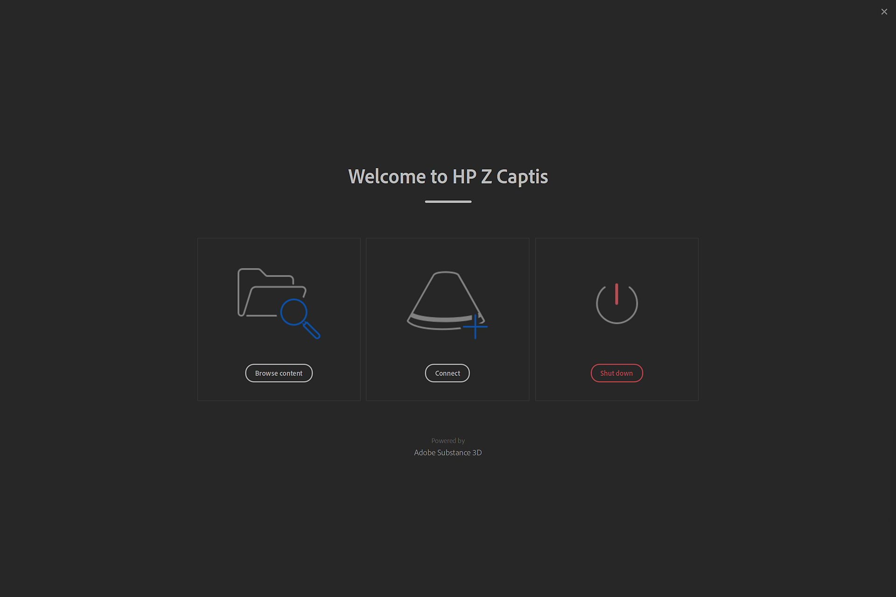
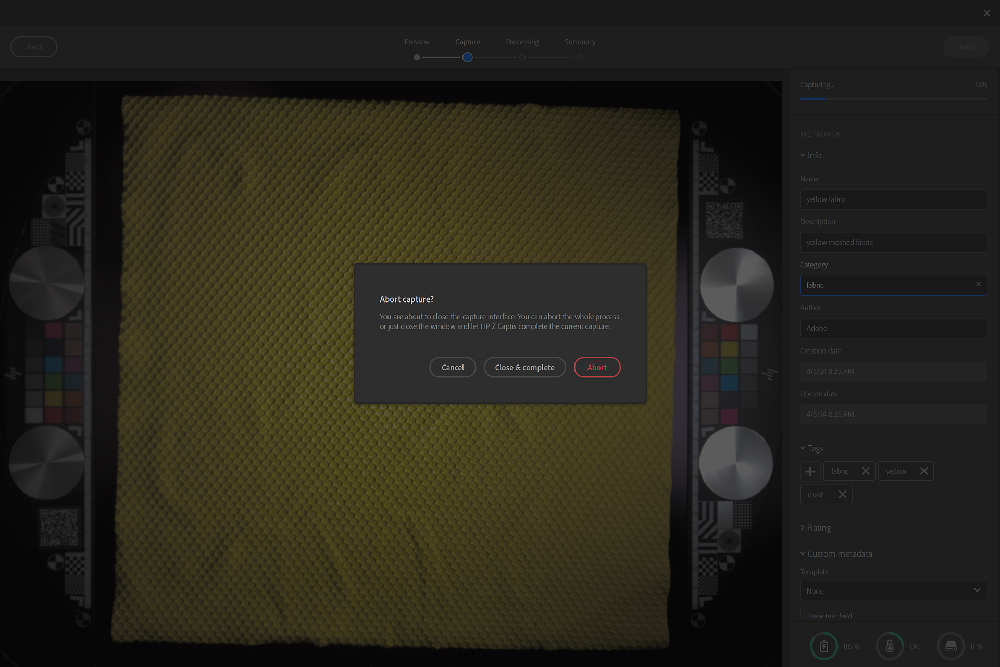
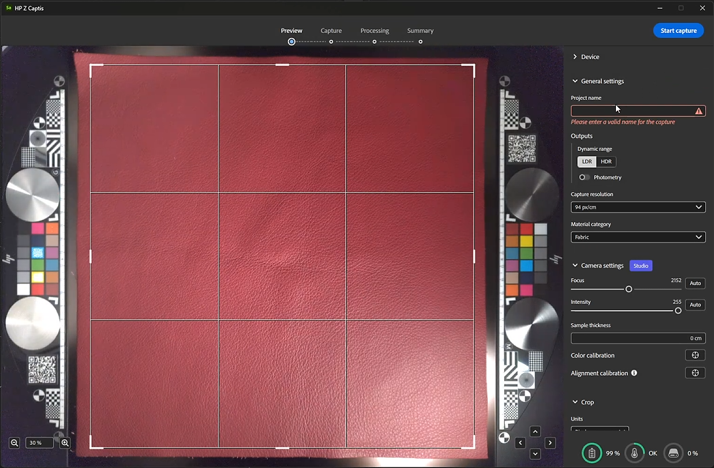
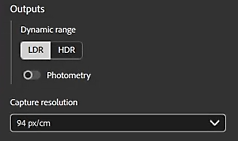
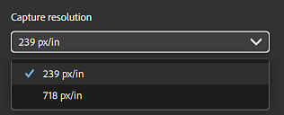
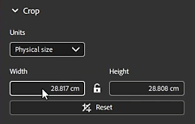
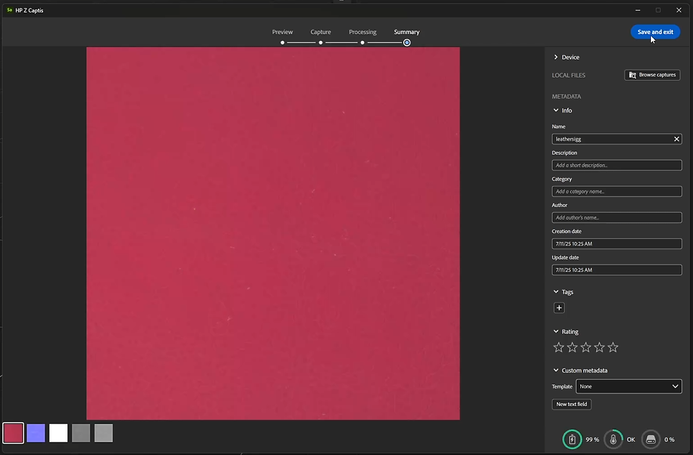

# Launch Sampler and turn on the HP Z Captis

Once Sampler is launched, click on the “<b>+</b>” button on the left bar.

In the Connected Devices list, you should find <b>HP Z Captis</b>. If you do not see any devices listed, please refer to the FAQ.

.png)

After clicking on HP Z Captis, a dedicated window opens with 3 options:

1. <b>Browse content</b>: It will open your file explorer to browse the local storage of your HP Z Captis device.
1. <b>Start scanning</b>: It will initialize HP Z Captis device and start the capture flow.
1. <b>Shut down</b>: It will shut down the device and close the window.

## Closing HP Z Captis window

At any moment if you close the HP Z Captis window you will be asked if you want to <b>continue the process</b> or <b>abort</b>.

If you select continue, the device will proceed with its current task offline and pause at the end of the current step. You can reconnect Sampler later to continue to the next step of the capture session.

## Preview step

Sampler will initialise the Preview of HP Z Captis device. It is recommended to <b>not interact </b>with the view while it is initialising.

<b>Preview interactions:</b>

1. Define the <b>region of interest</b>. It will define the <b>capture area </b>of the sample. The larger the region of interest the higher the quality, but a smaller region of interest will take less time to process.
1. You can <b>zoom in</b> and <b>zoom out</b>.
1. You can <b>pan</b>.

There are several types of settings that can be done during the preview phase.

Some have to be defined for each capture:

<b>Preview settings:</b>

<b>General settings</b>

*Project name*

You can define a project name of your capture and define which type of outputs you want to retrieve.

*Outputs*

* By default only the material PBR channels (Base color, normal, height and opacity) will be saved.  
  You have the possibility to choose the output type between LDR (low dynamic range) and HDR (high dynamic range).

* You can choose to also save the photometry photos (64) used to generate the PBR channels

*Capture resolution*

* 239 px/in - 94 px/cm (Preview: lower quality, quicker scan)

* 718px/in - 283 px/cm (Full resolution)

Note: Only PBR channels will be loaded in Sampler. Photometry photos will be only available on Document/Adobe/Adobe Substance 3D Sampler Beta/&#91;project name&#93;   
The default folder can be modified in the preferences.

<b>Marerial category</b>

Set this to the type of material you are scanning for map genereation fine-tuned to your particular material.  
The default category selected is "Fabric". It will help optimize the result of your roughness channel.

If what you are scanning contains several types of materials, please select the category of the largest one.

<b>Camera settings </b>

* Focus: It will adjust the camera focus.  
  Clicking on Auto will ask you to select where to focus on the preview. It is advised to focus 1/3 out of the center of the material sample.

* Intensity: Adjust the camera exposure.  
  Clicking on Auto will ask you to select the area of the material the intensity calculation must be made on.

You can set both by hand if you prefer.

<b>Other settings</b>

Other types of settings<b> only have to be modified on occasion</b>: the color and alignment calibration.

* Color calibration

Calibrate the color of the base color map thanks to the HP Z Captis technical areas.   
This will result in the final material being the exact same color as the sample you added in the HP Z Captis tray.  
The technical areas with the color swatches are automatically detected and are used for the calibation. They have to be placed in their specific space on each side of the sample.

This is only available in Studio mode. Please make sure to do the focus before this color calibration.

This calibration has to be done <b>every month or couple of month</b>. It is not necessary to do it fo every scan or each time the device is used.

* Alignment calibration

This alignment <b>has to be done</b> the <b>first time you set up your device</b>, every time you physically move it and then every couple of months. It is <b>not necessary</b> to do this process <b>for every capture</b>.

Please make sure to do the focus before this alignment calibration.

To do the alignment please <b>place something with sharp and clear information, like a piece of paper with printed text, in the center of the capture space</b>, close the drawer and click on the alignment button. Once this is done you can make sure everything is in place, with the technical areas in their place on each side of the scanning space, a material placed in the center and if necessary held in place with the magnets supplied with the HP Z Captis device, and you can start scanning your materials.

Once you are all set: <b>start the scan</b>.

<b>Crop</b>

If you don't need to capture the maximum capture zone, you can either define on the preview the size of your selection by dragging the sides or corners, or by defining the crop done in this area.

You can choose between a size in pixels or in physical size of material, and get back to a square resolution.

## Capture and processing steps

Once the scan starts, the preview will display photos taken during the process.

The processing part is split in two parts:

* <b>Capture</b>: Taking all required photos

* <b>Processing</b>: Processing the photos to generate PBR channels (Base color, normal, height, opacity)

While it is capturing and processing, you can add metadata (same metadata that you will find in Sampler metadata panel).

.png)

During the processing, you will see the result is built tile by tile.

## Summary step

At this step you can review the results of the scan. All the created channels are displayed (in Explorer mode, no opacity is created since the explorer ring does not have a backlight).

The “Browse scans” button opens a file explorer in the folder that holds the images (channels only). If you requested photometry at the beginning of the scan, they will be stored in a separate folder.

## Material edition

After exiting HP Z Captis window, the channels (base color, normal, height, roughness and opacity if relevant) will be added as a layer in the Layers panel.

.png)

Note: Verify that output format is correctly set to <b>16bit float</b>

Use Sampler filters (Equalize, Perspective Crop, Tiling, …) to process and clean your material.

Once you are done, you can:

* Save your Sampler project: File &gt; Save as … (Ctrl + S)

* Export your material: File &gt; Export … (Ctrl + E)

.png)
