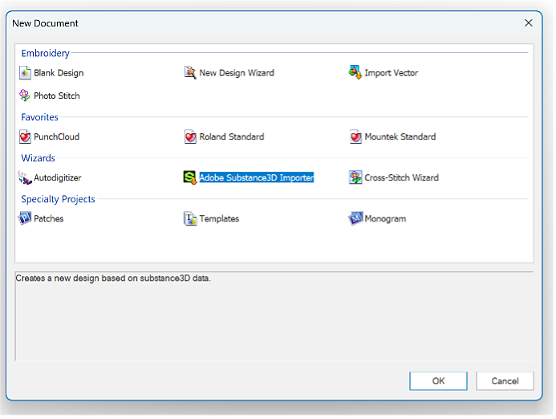
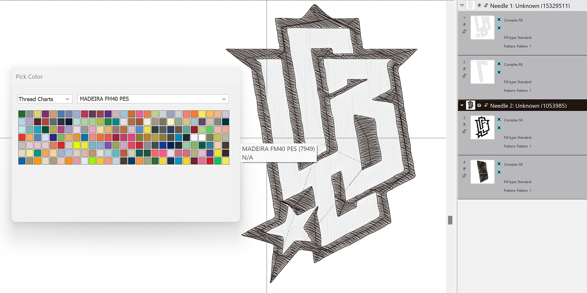
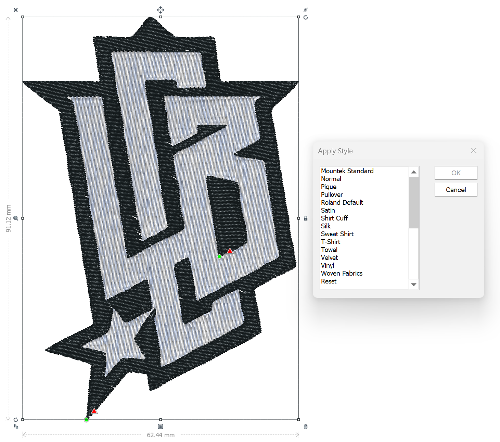
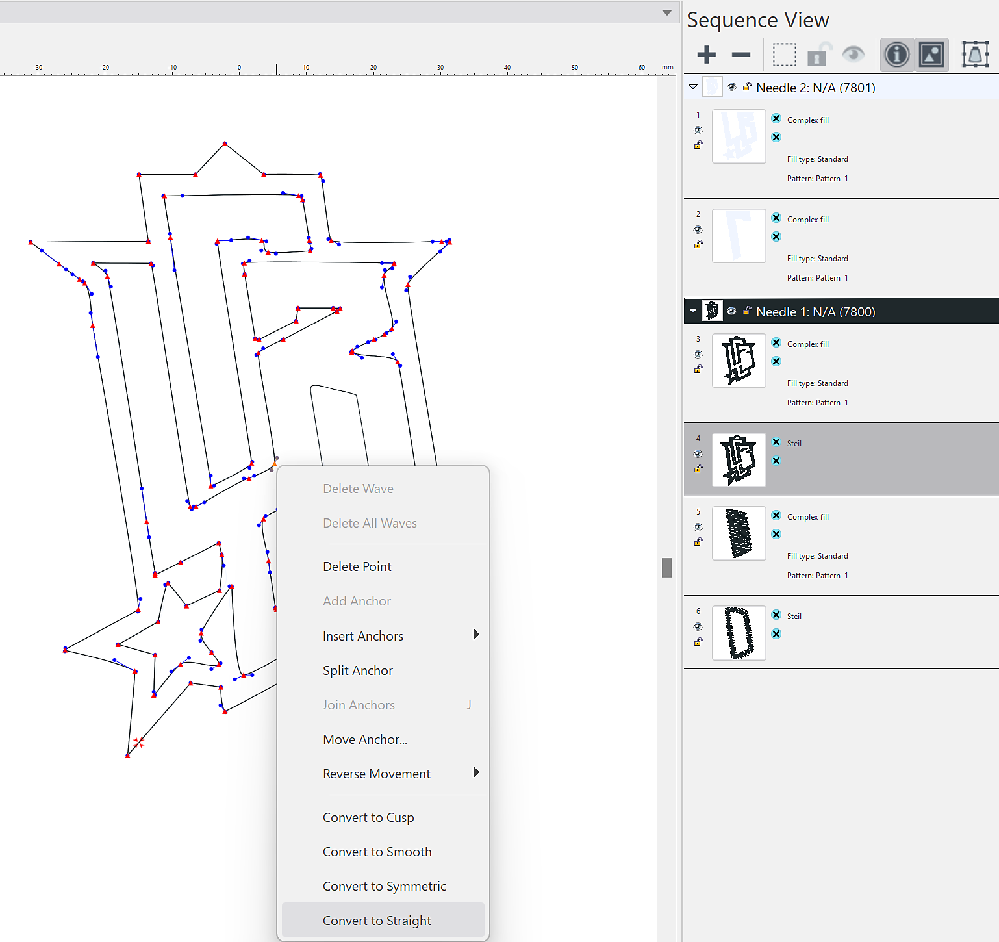

# Tajima Exporter plugin of Embroidery files

With this first proof of concept, you can now transfer their digitally embroidered designs from Adobe Substance 3D directly into <b>Tajima DG17</b> embroidery software—eliminating the need for time-consuming manual digitization.

Let’s see step by step how to use it.

## Download

Download the Sampler Tajima plugin here:

[Download plugin here](https://www.adobe.com/go/sampler-tajima-plugin)

## Installation

*From Sampler UI:*

Go to the Preferences &gt; Plugins &amp; Scripts &gt; Add a plugin

Select the unzip folder of the download

*From your file explorer:*

Go to Documents &gt; Adobe &gt; Adobe Substance 3D Sampler  &gt; Plugins

Copy/paste here the unzip folder of the download

## Installation

Open your Sampler (5.0.3 or after) project with an Embroidery material.

Open Tajima plugin and export to the location of your choice

<b>Tajima software </b>

<b>1</b>- Launch the Substance 3D Wizard

<b>2</b>- Select the appropriate <b>data folder</b> (Sampler export folder)

<b>3</b>- Choose the Embroidery thread chart

<b>4</b>- Apply a style preset for optimal fabric settings

<b>5</b>- Edit shapes as needed to achieve the best results

<b>6</b>- Preview the design worksheet, complete with a machine-scannable barcode

