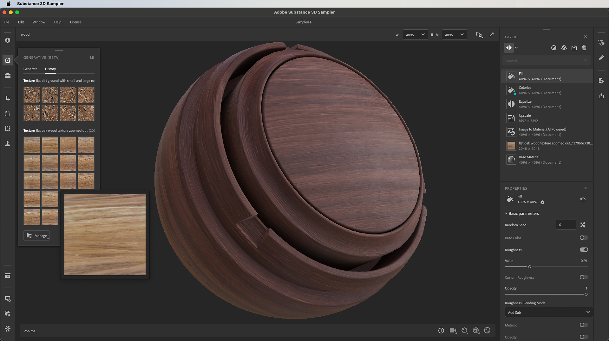

# Betas

This page regroups all the Betas versions of Substance 3D Sampler. To know How to acces the Beta you can go to our [FAQ page](../../help/faq/faq.md).

## 4.4.0 Beta - Text to Texture

We're introducing Text to Texture powered by Adobe Firefly, a new way for artists to source texture imagery using only a description. This new feature expands the artist toolbox beyond importing custom or stock photography by providing a way to generate textures right within Sampler. All Text to Texture images are square and tileable with proper perspective, ready for the material-creation workflow.

<b>4.4.1 Beta Fondue</b>

*(Released: 9 April 2024)*

<b>Fixed:</b>

* &#91;Application&#93; Incorrect application icon in the Windows task bar
* &#91;Application&#93; Panels appear in front of popups
* &#91;Generative AI&#93; Possible crashes when receiving unexpected results from the service

<b>4.4.0 Beta Fondue</b>

*(Released: 18 March 2024)*

<b>Added:</b>

* &#91;Firefly&#93; New Generative (Beta) panel
* &#91;Firefly&#93; Generate tileable textures from a prompt
* &#91;Firefly&#93; Generate more variations after a first generation
* &#91;Firefly&#93; Add a result as a layer or in Your Assets library
* &#91;Firefly&#93; Browse history of your previous prompts
* &#91;Firefly&#93; Generated images contain manifest with provenance
