# Version 2019.1

**Substance Alchemist 2019.1 "Sesame"** lets you share your assets with its new project management. The layer stack has been completely rebuild to improve the workflow. Additional controls and information have been added to the viewport. A new version of our delighter improves the quality and accuracy of your materials.

Release date: *4 November 2019*

>[!NOTE]
>
> **Note:** Content produced with the beta version 0.8.1 or older is not compatible with version 2019.1. However nothing is lost and this data can still be accessed by launching version 0.8.1.

## Major Features

### New Welcome Screen

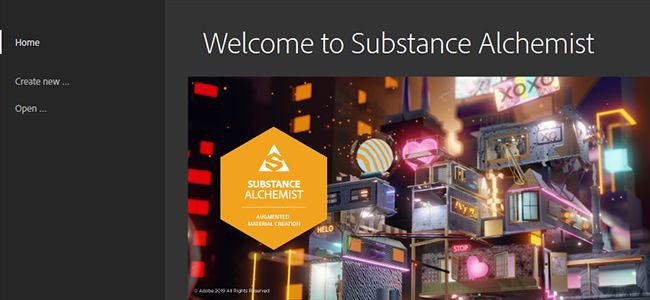

Substance Alchemist now has a welcome screen that allows you to quickly jump on your latest project but also to create new ones. The welcome screen also provides a few links to our existing platforms, such as [Substance Academy](https://academy.substance3d.com/).

### Project Management

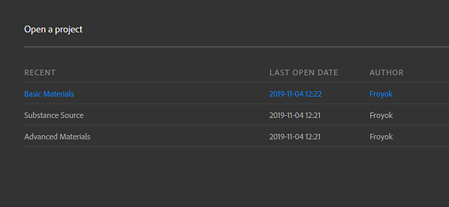

Version 2019.1 introduce the notion of projects, which can gather material collections. Projects can also be exported to be shared to other computers.

To learn more about projects, see: [Project Management](../../../getting-started/project-management/project-management.md).

### New Delighter

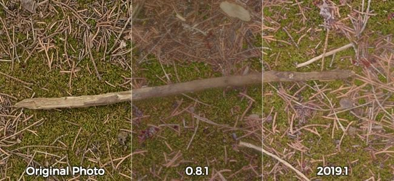

We improved our delighter, which is used to remove shadows from your photos. It now preserves details and the original colors of the various surfaces which should improve the accuracy of the generated materials.

### New Layer Stack

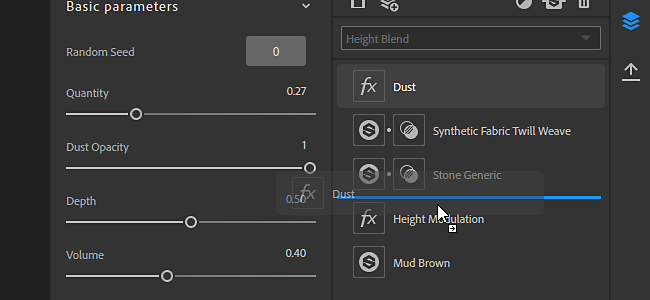

The Layer Stack has been rebuild from scratch to expand its possibilities and actions. Notable changes are:

* **Materials and Masks can now be accessed directly via their dedicated icon**  
  When adding a material in the layer stack, it will now have a new mask icon. Clicking on this second icon will display the blending parameters of the material.

  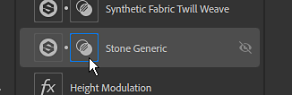
* **Blend mode can be directly changed from the toolbar**  
  From now on, when a Material layer is selected, its blending mode can be changed directly from the Layer Stack toolbar, without the need to click on the mask.

  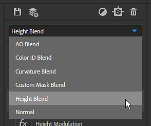
* **Assign bitmap to specific Scan inputs**  
  When imported bitmap to create your materials from scan, you can assign the right usage per bitmap.

  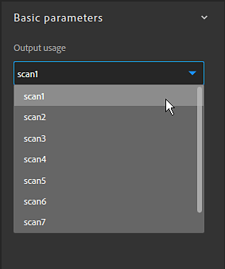

### Viewport Improvements

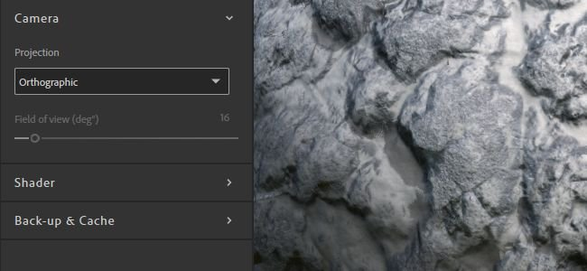

A few new features have been added to the viewport which improve its usage. These new settings can be accessed in the [Viewer Settings panel](https://helpx.adobe.com/substance-3d/unlisted/documentation/sadoc/viewer-settings-188973164.html).

* **Camera mode**  
  The camera projection mode allows to choose between Perspective and Orthographic.

  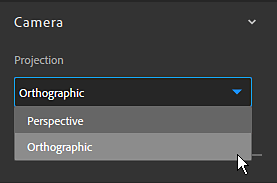
* **Camera field of view**  
  You can now change the viewport's camera Field of View (FOV). Adjusting this value can help the visualizing realistically your materials. The Field of View can only be controlled when in Perspective projection mode.

  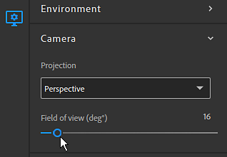
* **Resolution and bit depth per channel**  
  The 2D view now displays the texture resolution and bit depth of each channel.

  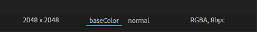

## Release Notes

### 2019.1.4 Sesame

*(Released January 30, 2020)*

**Added:**

* &#91;Resources&#93; Confirmation prompt when clearing a resources folder

**Fixed:**

* &#91;Layers&#93; Move layers to two and more layers below or above
* &#91;Create&#93; Allocation of enough VRAM budget to have good performances

**Known Issues:**

* Importing a lot of resources can really slow down Substance Alchemist
* Content Aware Fill filters are slow in high resolution
* Use of multiple delighters in one material is not recommended
* Delighter crashes with older NVIDIA drivers (Less than 400.x)
* Coma or point can be ignored when typing a specific evalue in a slider
* Normal to Height filter can crash on MacOS

### 2019.1.3 Sesame

*(Released January 28, 2020)*

**Added:**

* &#91;Workflow&#93; Support of multiple workflows
* &#91;Workflow&#93; Support of PBR Specular Glossiness workflow
* &#91;Workflow&#93; New Channel Settings panel
* &#91;Workflow&#93; Workflow selection at project creation
* &#91;Channel Settings&#93; Activate/Deactivate specific channel computation
* &#91;Channel Settings&#93; Display list of custom channels available in the current material
* &#91;Channel Settings&#93; Automatic computation of custom channels when required
* &#91;Channel Settings&#93; Force/Block computation of custom channels
* &#91;Layers&#93; New UI of material input placeholder in Atlas Scatter and Splatter filters
* &#91;Layers&#93; Image Input parameter of a filter can be fed by underneath layers
* &#91;Layers&#93; Display a notification when some layers are out of date
* &#91;Layers&#93; Possibility to update to the latest version of outdated layers via the notification
* &#91;Project&#93; New metadata fields at project creation
* &#91;Inspire&#93; Generated variations are specific to a project
* &#91;2D View&#93; Switch between the Layer inputs, layer outputs, and the material outputs
* &#91;Welcome Screen&#93; Add Import project (.alch) option
* &#91;Preferences&#93; New Preferences window to set cache location and analytics privacy settings
* &#91;UI&#93; New UI buttons
* &#91;Performance&#93; Overall improvement of the parallelization system
* &#91;Performance&#93; Optimization of the number of material computes
* &#91;Engine&#93; Substance Engine update
* &#91;Framework&#93; Upgrade to Qt 5.13
* &#91;MacOS&#93; Global improvements of macOS Catalina support
* &#91;Content&#93; Adjustment filter - Normal intensity and invert parameters

**Fixed:**

* &#91;Layers&#93; Unset Image Input parameter when deleting the layer
* &#91;Layers&#93; Fix a crash when adding a clone patch layer
* &#91;Layers&#93; Fix some crashes when blending layers stack materials in other layer stack materials
* &#91;Export&#93; Channels selection for export is now respected
* &#91;Resources&#93; Do not crash when navigating in the Resources panel
* &#91;Resources&#93; Fix crash when importing corrupted Substance files
* &#91;Resources&#93; Reduce the number of crashes when loading large folders
* &#91;Thumbnail&#93; Thumbnail computation doesn't freeze the interface
* &#91;Image Import&#93; Uniformization of image type supported across the application
* &#91;Preset&#93; Save the description when creating a preset from an SBSAR
* &#91;Inspire&#93; Fix image drag and drop
* &#91;Application&#93; Fix crashes at exit
* &#91;Application&#93; Fix crashes at the exit when exporting materials
* &#91;UI&#93; Fixes and improvements
* &#91;UI&#93; Rename temporary asset to "unsaved material"
* &#91;Content&#93; Global update and cleaning of all filters

**Known Issues:**

* Importing a lot of resources can really slow down Substance Alchemist
* Content Aware Fill filters are slow in high resolution
* Use of multiple delighters in one material is not recommended
* Delighter crashes with older NVIDIA drivers (Less than 400.x)
* Coma or point can be ignored when typing a specific evalue in a slider
* Normal to Height filter can crash on MacOS

### 2019.1.2 Sesame

*(Released December 11, 2019)*

**Added:**

* &#91;Workflow&#93; Support of multiple workflows
* &#91;Workflow&#93; Support of PBR Specular Glossiness workflow
* &#91;Workflow&#93; New Channel Settings panel
* &#91;Workflow&#93; Workflow selection at project creation
* &#91;Channel Settings&#93; Activate/Deactivate specific channel computation
* &#91;Channel Settings&#93; Display list of custom channels available in the current material
* &#91;Channel Settings&#93; Automatic computation of custom channels when required
* &#91;Channel Settings&#93; Force/Block computation of custom channels
* &#91;Layers&#93; New UI of material input placeholder in Atlas Scatter and Splatter filters
* &#91;Layers&#93; Image Input parameter of a filter can be fed by underneath layers
* &#91;Layers&#93; Display a notification when some layers are out of date
* &#91;Layers&#93; Possibility to update to the latest version of outdated layers via the notification
* &#91;Project&#93; New metadata fields at project creation
* &#91;Inspire&#93; Generated variations are specific to a project
* &#91;2D View&#93; Switch between the Layer inputs, layer outputs, and the material outputs
* &#91;Welcome Screen&#93; Add Import project (.alch) option
* &#91;Preferences&#93; New Preferences window to set cache location and analytics privacy settings
* &#91;UI&#93; New UI buttons
* &#91;Performance&#93; Overall improvement of the parallelization system
* &#91;Performance&#93; Optimization of the number of material computes
* &#91;Engine&#93; Substance Engine update
* &#91;Framework&#93; Upgrade to Qt 5.13
* &#91;MacOS&#93; Global improvements of macOS Catalina support
* &#91;Content&#93; Adjustment filter - Normal intensity and invert parameters

**Fixed:**

* &#91;Layers&#93; Unset Image Input parameter when deleting the layer
* &#91;Layers&#93; Fix a crash when adding a clone patch layer
* &#91;Layers&#93; Fix some crashes when blending layers stack materials in other layer stack materials
* &#91;Export&#93; Channels selection for export is now respected
* &#91;Resources&#93; Do not crash when navigating in the Resources panel
* &#91;Resources&#93; Fix crash when importing corrupted Substance files
* &#91;Resources&#93; Reduce the number of crashes when loading large folders
* &#91;Thumbnail&#93; Thumbnail computation doesn't freeze the interface
* &#91;Image Import&#93; Uniformization of image type supported across the application
* &#91;Preset&#93; Save the description when creating a preset from an SBSAR
* &#91;Inspire&#93; Fix image drag and drop
* &#91;Application&#93; Fix crashes at exit
* &#91;Application&#93; Fix crashes at the exit when exporting materials
* &#91;UI&#93; Fixes and improvements
* &#91;UI&#93; Rename temporary asset to "unsaved material"
* &#91;Content&#93; Global update and cleaning of all filters

**Known Issues:**

* Importing a lot of resources can really slow down Substance Alchemist
* Content Aware Fill filters are slow in high resolution
* Use of multiple delighters in one material is not recommended
* Delighter crashes with older NVIDIA drivers (Less than 400.x)
* Coma or point can be ignored when typing a specific evalue in a slider
* Normal to Height filter can crash on MacOS

### 2019.1.1 Sesame

*(Released November 26, 2019)*

**Added:**

* &#91;Blend&#93; New opacity Blend mode
* &#91;Engine&#93; New Substance Engine version

**Fixed:**

* &#91;Layers&#93; Fix crash while deleting a layer that is still computing
* &#91;Layers&#93; Fix crash while removing the bottom layer
* &#91;Layers&#93; Fix crash while the material name contains special characters
* &#91;Layers&#93; Stop computing every filters that use a widget
* &#91;Layers&#93; Avoid crash while using Clone Patch and Content Aware Fill filters
* &#91;Layers&#93; Fix crash while drag and droping a filter in a splatter input slots
* &#91;Resources&#93; Fix crash while linking local folders or importing resources in Substance Alchemist
* &#91;Collection&#93; Fix crash while switching rapidly between materials
* &#91;UI&#93; Fix crash while value is null or not valid in tiling, displacement sliders on the viewport
* &#91;Inspire&#93; Fix crash while accessing the Inspire tab
* &#91;Inspire&#93; Fix crash while inspiring on a just saved layers stack material
* &#91;Performance&#93; Heavy Substance materials and Filters (Tiling) compute faster
* &#91;Help&#93; Fix export log file
* &#91;Content&#93; Randomizer filter works on all channels
* &#91;Content&#93; Multiangle workflow takes all scans into account
* &#91;Content&#93; AO Blend correct blending
* &#91;Content&#93; Curvature Blend correct blending
* &#91;Content&#93; Color ID Blend correct blending
* &#91;Content&#93; Custom Mask Blend correct blending
* &#91;Content&#93; Fix Adjustment filter for roughness modification
* &#91;Content&#93; Fix Base Material filter for custom normal channels upload
* &#91;Content&#93; Fix Custom Import pattern of the Embossing filter

**Known Issues:**

* Use of multiple delighters in one material is not recommended
* Delighter crashes with older NVIDIA drivers (Less than 400.x)
* Coma or point can be ignored when typing a specific value in a slider
* Normal to Height filter can crash on MacOS

### 2019.1 Sesame

*(Released November 04, 2019)*

**Added:**

* &#91;Project&#93; Creation of a project
* &#91;Project&#93; Introduction of the .alch file format that contains project data
* &#91;Project&#93; Export a .alch project containing the collections and their materials
* &#91;Project&#93; Import a .alch project
* &#91;Project&#93; Open recent projects
* &#91;Welcome Screen&#93; A welcome screen is displayed at the launch
* &#91;Welcome Screen&#93; Create a project from the welcome screen
* &#91;Welcome Screen&#93; Access the list of all your projects in the welcome screen
* &#91;Welcome Screen&#93; Quick links to access the documentation, the about popup and license management
* &#91;File Menu&#93; Integration of a file Menu
* &#91;File Menu&#93; Access the project commands from the File tab and the save of the layer stack
* &#91;File Menu&#93; Access the undo and redo commands from the Edit tab
* &#91;File Menu&#93; The previous help menu moved in the file menu under the Help tab
* &#91;Layers&#93; New architecture of the layer stack
* &#91;Layers&#93; New UI of the layer stack
* &#91;Layers&#93; Select the blend mode directly on the toolbar
* &#91;Layers&#93; Access separately the blend parameters and the material parameters
* &#91;Layers&#93; Add materials directly in dedicated inputs of the Splatter filter in the layer stack
* &#91;Layers&#93; Change scan order directly in the Image import layer
* &#91;Viewport&#93; Control of the camera field of view
* &#91;Viewport&#93; Possibility to switch between orthographic or perspective camera
* &#91;Viewport&#93; Display resolution and bit depth information for each channel
* &#91;Resources&#93; Base Materials is opened per default
* &#91;Cache&#93; Locate your thumbnail cache folder
* &#91;Cache&#93; Locate your render cache folder
* &#91;Panels&#93; Material Settings panel is temporarily hidden
* &#91;Workflow&#93; Specular/Glossiness temporarily deactivated
* &#91;MacOS&#93; Catalina OS version notarization
* &#91;Content&#93; New version of the Delighter filter
* &#91;Content&#93; New Image Content Aware Fill filter
* &#91;Content&#93; New Material Content Aware Fill filter
* &#91;Content&#93; Transform filter has a safe transform option

**Fixed:**

* All previous bugs related to Create are invalid today with new UI and architecture release
* Tooltips don't hide the icons in the top bar (3D, 2D, 2D/3D)
* &#91;Content&#93; Splatter filter accepts Atlas with complete height map
* &#91;Content&#93; Transform filter works on images (scan1, scan2,...)

**Known Issues:**

* Use of multiple delighters in one material is not recommended
* Delighter crashes with older NVIDIA drivers (Less than 400.x)
* Coma or point can be ignored when typing a specific value in a slider
* Normal to Height filter can crash on MacOS

**Added:**

* &#91;Blend&#93; New opacity Blend mode
* &#91;Engine&#93; New Substance Engine version

**Added:**

* &#91;Blend&#93; New opacity Blend mode
* &#91;Engine&#93; New Substance Engine version

**Added:**

* &#91;Workflow&#93; Support of multiple workflows

 