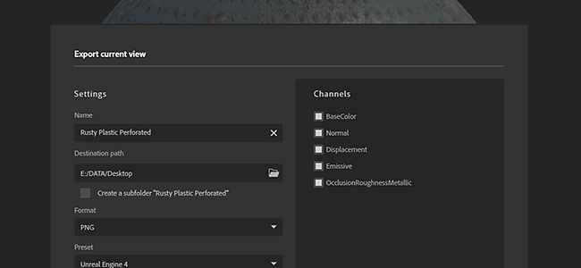
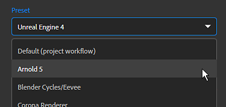
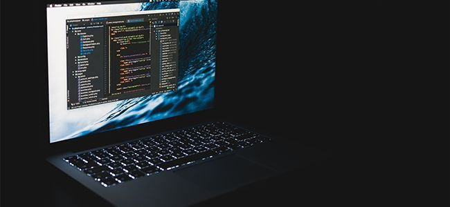
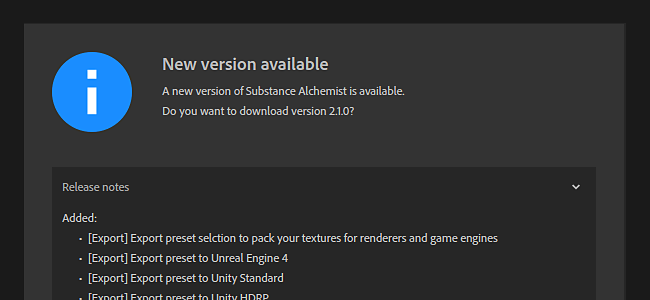
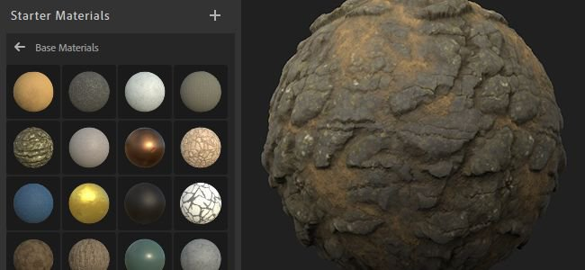

# Version 2020.1 (2.1)

**Substance Alchemist 2020.1 "Tiramisu"** lets you export your materials directly packed for renderers and game engines. By default 15 export presets are available such as Unity HDRP, Unreal Engine 4, Blender, Vray-Next, and more.

It features a new configuration file and controls for the update checker.

Release date: *March 12, 2020*

## Major Features

### New Exporter Window

The export window has been reworked to introduce a new interface which has several new features:

* **Use export presets to pack textures for a specific renderer or game engine** It is now possible to choose during the export process a configuration among a list of export presets that convert, pack and name the textures for a specific 3rd party application. The result of this conversion is displayed in the channel list on the right of the interface.  
  The new exporter includes the following presets by default:

  * Unreal Engine 4
  * Unity Standard
  * Unity HDRP
  * Blender Cycles/Eevee
  * Arnold 5
  * Corona Render
  * Enscape
  * Keyshot 9
  * Redshift
  * Vray Next
  * Lens Studio
  * Spark AR Studio
  * PBR Specular/Glossiness from PBR Metallic Roughness

  
* **Create a subfolder with the name of the material**   
  When exporting multiple materials to a common location, it is now possible to create a subfolder
* **Export settings are saved and restored with the next export**  
  To make things convenient, re-opening the export window will also re-use the previously used export settings. Making it easier and quicker to re-export a material.
* **Create, import and manage custom export presets**  
  It is also possible to create custom export presets. To learn how to create and manage them take a look at the following documentation pages:

  * [Managing custom presets](https://helpx.adobe.com/substance-3d/unlisted/documentation/sadoc/creating-and-importing-custom-presets-188976295.html)
  * [Managing Presets](../../../help/guide/getting-started/export/managing-presets/managing-presets.md)

### Application Configuration

(Photo by [Fabian Grohs](https://unsplash.com/@grohsfabian?utm_source=unsplash&amp;utm_medium=referral&amp;utm_content=creditCopyText) on [Unsplash](https://unsplash.com/?utm_source=unsplash&amp;utm_medium=referral&amp;utm_content=creditCopyText))

It is now possible to configure Substance Alchemist with a configuration file. This makes the setup of the application easier across computers, such as within a studio for example. The configuration files defines the default resources and the list of linked folders.

To learn more how to create and use a configuration file see the dedicated [documentation page](https://helpx.adobe.com/substance-3d/unlisted/documentation/sadoc/resources-configuration-file-188976187.html).

### Miscellaneous Improvements

A few new workflow improvements are available in this release:

* **Focus of 2D view**   
  It is now possible to use the "F" shortcut to reset and center the 2D view, same as with the 3D view.
* **Reopen last project**   
  To make content creation easier and faster, the application now reopens the last used project. The Create lab is now also the default mode when opening the application.
* **Update Checker configuration**   
  Define if you want to be notified if a new version is available. For more information see the dedicated [documentation page](../../../help/guide/technical-support/configuration/update-checker/update-checker.md).

### New Content

We improved some filters and also updated the starter content:

* **New Starter Materials**  
  We replaced a few existing materials by new ones, here is the list of the new materials:
  * Alcantara Microfiber
  * Carpet Floor
  * Cliff Rock
  * Copper
  * Cracked Dirt
  * Roughcast
  * Terracota
  * Wool Fabric
  * Woven Fabric
* **Metallic control with Bitmap 2 Material filter**  
  The Bitmap 2 Material filter has been updated to offer more control over the metallic channel. It is now possible to use a custom bitmap input for it or to define an uniform color.
* **Improved Adjustment filter**  
  The Adjustment filter can now work with project set to use the PBR workflow Specular/Glossiness.
* **New Atlas Scatter parameters**  
  We added a few new parameters to offer better control on how the elements blend with height map of the material below.

## Tutorials

This release comes with a new set of entries in our tutorial to begin with Substance Alchemist:

## Release Notes

### 2.1.0 Tiramisu

*(Released March 12, 2020)*

**Added:**

* &#91;Export&#93; Export preset selction to pack your textures for renderers and game engines
* &#91;Export&#93; Export preset to Unreal Engine 4
* &#91;Export&#93; Export preset to Unity Standard
* &#91;Export&#93; Export preset to Unity HDRP
* &#91;Export&#93; Export preset to Blender Cycles/Eevee
* &#91;Export&#93; Export preset to Arnold 5
* &#91;Export&#93; Export preset to Corona Renderer
* &#91;Export&#93; Export preset to Enscape
* &#91;Export&#93; Export preset to Keyshot 9
* &#91;Export&#93; Export preset to Redshift
* &#91;Export&#93; Export preset to Vray Next
* &#91;Export&#93; Export preset to Lens Studio
* &#91;Export&#93; Export preset to Spark AR Studio
* &#91;Export&#93; Export preset to PBR Specular Glossiness from PBR Metallic Roughness
* &#91;Export&#93; New export UI
* &#91;Export&#93; Remember Export settings
* &#91;Export&#93; Import and manage your custom export presets
* &#91;Export&#93; Delete and replace your custom export presets
* &#91;Export&#93; Rename your custom export presets
* &#91;Export&#93; Set the default export resolution to the current resolution
* &#91;Export&#93; Add the choice to create a subfolder to the export location
* &#91;Export&#93; Warning message before replacing existing files
* &#91;Application&#93; New version numbering scheme
* &#91;Application&#93; Open Create at launch, and change labs order
* &#91;Welcome Screen&#93; New welcome banner
* &#91;Project&#93; Open last project at launch
* &#91;UI&#93; New combo box style
* &#91;2D view&#93; F shortcut to focus in the 2d view
* &#91;Filters&#93; Added support for alchemist::parameterVisibility tag in Substance graphs
* &#91;Filters&#93; Have a global tweak to manage parameter visibility based on your workflow
* &#91;Resources&#93; New command line option to setup resources and linked folders with a configuration file
* &#91;Version checker&#93; Configuration of the version check
* &#91;Content&#93; New starter materials
* &#91;Content&#93; Bitmap to Material - Add the possibility to define the metallic channel (uniform, custom image import, color picking)
* &#91;Content&#93; Adjustment - Add the support of the PBR specular/glossiness workflow
* &#91;Content&#93; Atlas Scatter - New parameters

**Fixed:**

* &#91;Project&#93; Crash when importing the same project twice
* &#91;Project&#93; Fixed crash when importing and opening projects several times
* &#91;Application&#93; Crash when loading an unnamed material
* &#91;Application&#93; Recognize missing files when re-importing them
* &#91;Application&#93; Fix random crash on shutdown
* &#91;Application&#93; Fixed rare crash when unloading an material in Create
* &#91;Application&#93; Fixed random crash when using UI controls
* &#91;UI&#93; Export panel has the wrong size when you open it in Create
* &#91;UI&#93; Open project with a single click
* &#91;UI&#93; Correctly set minimum and maximum slider values
* &#91;UI&#93; Show label of the channel usages instead of ids
* &#91;UI&#93; Clicking a material always opens/closes the tweak panel
* &#91;UI&#93; Fix hidden layers colors
* &#91;UI&#93; Welcome Screen buttons improvements
* &#91;Layers&#93; Less unnecessary recomputes
* &#91;Layers&#93; Crashes when using Clone Patch
* &#91;Layers&#93; Selecting an image import layer no longer triggers a compute
* &#91;Channel settings&#93; Enabling or disabling usages now trigger a rendering
* &#91;Resources&#93; Prevent freeze when mass clicking on a stack in the library
* &#91;Resources&#93; Performance hit when re-adding a previously added linked folder
* &#91;Resources&#93; Fixed a crash when trying to open a deleted .sbsar file
* &#91;Performance&#93; Avoid loading materials to access their parameters
* &#91;Performance&#93; Backup assets only when used in a project or in an authored material
* &#91;Export&#93; Fixed materials in export queue sometimes skipped or exported with wrong parameters
* &#91;2D View&#93; Restored pan and zoom
* &#91;Content&#93; Parquet Pattern takes into account the Ambient Occlusion channel
* &#91;Content&#93; Paint - Display mask input when enabling custom mask
* &#91;Content&#93; Stonewall Pattern - Remove possible banding effects in the normal map
* &#91;Content&#93; Height Modulation - Correct double base color entries in the 2d view

**Known Issues:**

* Content Aware Fill filters are slow in high resolution
* Use of multiple delighters in one material is not recommended
* Delighter crashes with older NVIDIA drivers (Less than 400.x)
* Coma or point can be ignored when typing a specific evalue in a slider
