# Version 2020.2 (2.2)

**Substance Alchemist 2020.2 "Udon"** introduces a new AI Powered Image to Material process to transform a single image input into a fully PBR Material, an improved Material Creation Template, lot of workflow and usability improvements and new content such as new filters.

Release date: *June 15, 2020*

## Major features

### Image to Material (AI Powered)

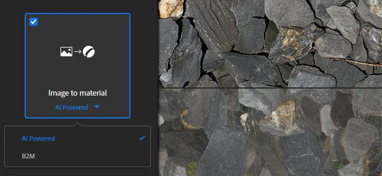

The **Image to Material** template has a new setting named **AI Powered**. This new setting provides better results to generate a high quality PBR material from a single input image.

The AI Powered setting uses machine learning to recognize shapes and objects and accurately generate height and normal information. This setting also includes the delighter filter to remove any shadows and highlights. This new setting works best with outdoor materials, as the algorithm was trained with grounds, pebbles, bark, stones, and other exterior based surfaces lit with natural lighting. Further updates will bring more flexibility and versatility of supported materials. For more details see the [dedicated documentation page](../../../filters/tools/image-to-material/image-to-material.md).

Here is a comparison of the height information generated by the two algorithms with their default values:

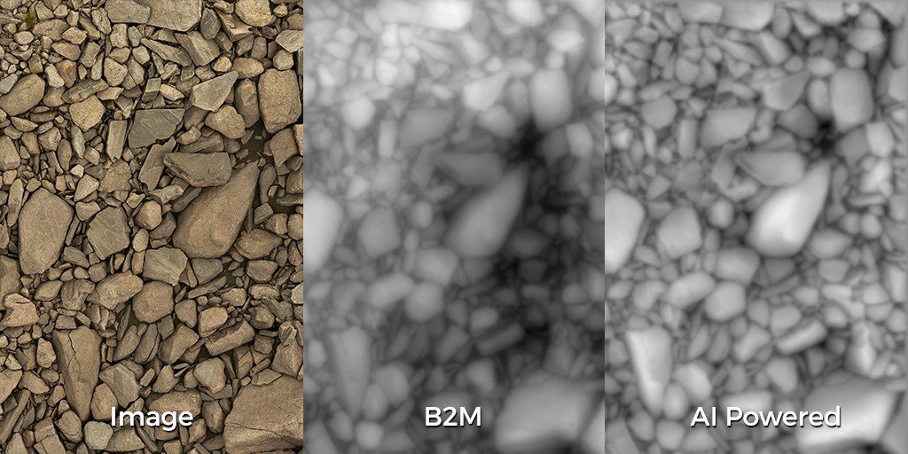{width="800px"}

>[!NOTE]
>
> The AI Powered setting requires specific hardware. It is only available on Windows and Linux with an Nvidia GPU. See the [technical requirements](../../../getting-started/system-requirements/system-requirements.md) for more information.

### New Texture Import Template

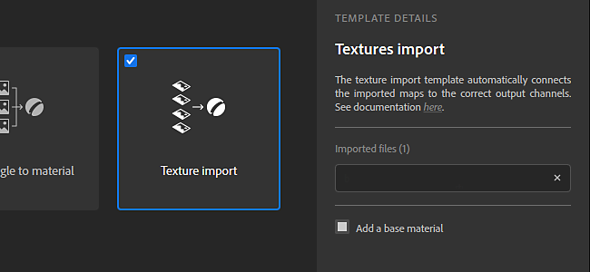

The image import pop-up window has been improved on several aspects. There is also a new type of process available named **Texture Import**.

* **Improved interface**  
  The interface has been updated to make it easier to use and learn, with detailed explanations for each option available.
* **New Texture Import option**  
  A new option named **Texture Import** is now available and allow to import and connect as set of images directly into the right output channels based on their names. It provides an easy way to setup a material from an existing group of images. For more information see the [dedicated documentation page](../../../features-and-workflows/texture-import/texture-import.md).

### New 2D Painting for Filters Mask Inputs

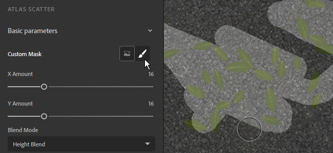

In this version it is now possible to paint and edit filters masks directly in the 2D view without having to import an external image. The painting automatically tiles to make possible the creation of seamless material.

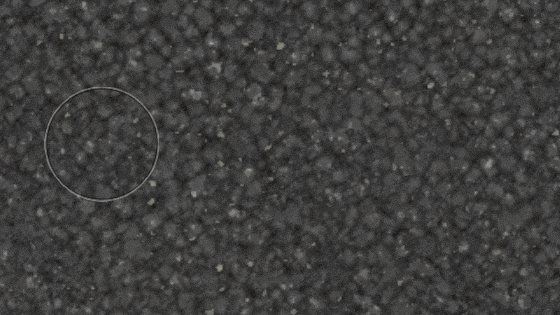{width="450px"}

* **Entering 2D Paint Mode**  
  To start the 2D Paint mode simply click on the brush icon next to the mask name in Filter's properties.

  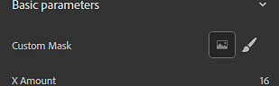
* **2D Paint Toolbar**  
  When inside the paint mode, the 2D view will display a new toolbar at the top with the following functionalities:

  * **Brush color**: adjust the brush grayscale value for painting the mask.
  * **Brush pen size**: adjust the brush size for painting the mask.
  * **Reset mask**: clear the current mask to black, any painting information will be lost.
  * **Stop drawing**: exit the 2D Paint mode.

  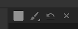
* **Keyboard Shortcuts**  
  The paint mode support the following shortcuts to speed up the painting process:

  * **X**: invert the current grayscale value of the brush.
  * **Ctrl + Mouse Wheel**: change the brush size.
  * **&#91; or &#93;**: change the brush size.

### New Atlases and Decals creation mode shortcuts

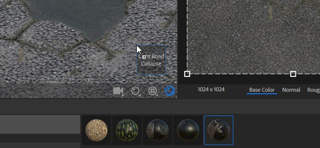

Two new creation modes have been added to take advantage of new types of Substance materials and ease-up their setup in the layer stack:

* **Decal Mode**  
  **Alt + Drag and Drop**: when drag and dropping a material from a collection, press and maintain **Alt** to create the material in decal projection mode automatically.
* **Atlas Mode**  
  **Shift + Drag and Drop**: when drag and dropping a material from a collection, press and maintain Shift to create the material in atlas scatter mode automatically.

### New Perspective Correction Tool

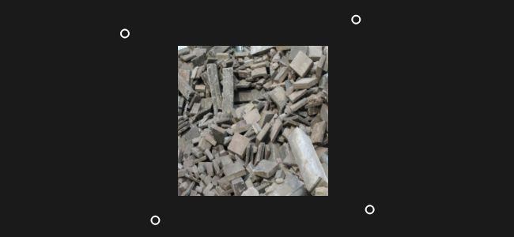

A new tool named **Perspective Correction** has been added to the filters list and allow to adjust or compensate the perspective of an image.

* **Perspective Correction**  
  With this filter it is possible to fix defaults from scans and photography images to make them more suitable to material creation. The filter offers four control points which represent the initial corners of the image. Move the points to adjust/compensate the perspective.

  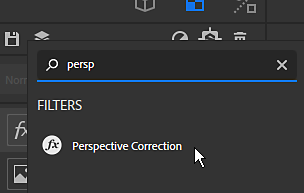

### Improved Color Widget

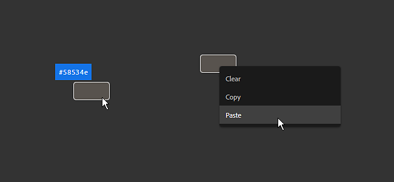

The color widget visible in the parameters panel now offers more controls:

* **Color Value Tooltip**  
  When the mouse is hover a color widget, a tooltip will now appear describing the current color value (hexadecimal format).
* **Right-Click Actions**  
  When right-clicking on a color widget a new contextual menu will appear with the following actions:
  * **Clear**: set the color to black and the alpha value to zero.
  * **Copy**: copy in memory the current color value of the widget.
  * **Paste**: paste into the widget the current color value in memory.

### New Content

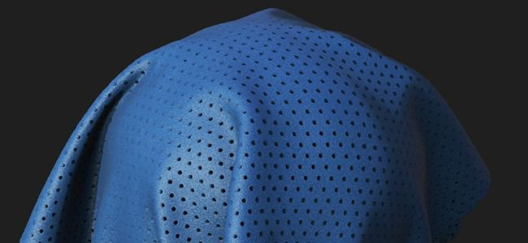

This version brings a lot of new and varied content:

* **New Default Meshes**  
  There are three new meshes available to showcase materials in the viewport:  
  * Shoe Shape
  * Male T-Shirt
  * Female T-Shirt
* **New Filters**  
  There are 5 new filters available in this version:
  * Cracks
  * Moss
  * Quilt Stitches
  * Floor Tiles
  * PBR Validate
* **New Blend Mode**
* Filters and other tool now support a new blend mode named **Per Channel Blend Mode**. When this mode is enabled, it is possible to tweak the blending operation of each channel in the properties panel.
* **Export Presets**  
  This release includes new and updated export presets:  
  * VStitcher
  * CLO
  * DetailMap support in Unity HDRP templates

 