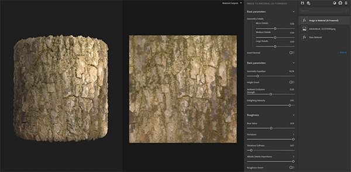
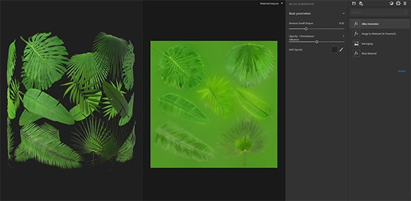
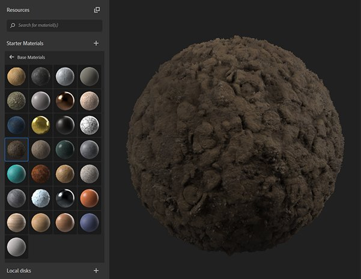
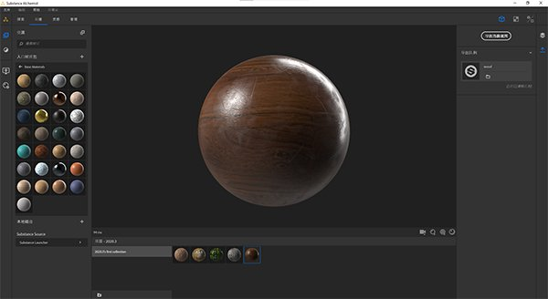

# Version 2020.3 (2.3)

**Substance Alchemist 2020.3 "Vermicelli"** introduces new content and new workflows like the atlas creation from a single image. We also improved the thumbnail quality of our materials and have the interface localized in Chinese.

Release date: *October 26, 2020*

## Major features

### Image to Material (AI Powered)

* New parameters
  * Refine your geometry (normal and height channels) by adjusting the different level of details (micro, medium, and large)
  * Adjust the delighting intensity to keep some information in your base color
  * Variation and softness parameters are available to generate a more accurate roughness channel
* Nvidia RTX 3000 series support

### Atlas Creation workflow

With the addition of two new filters, the atlas creation from a single image is simplified within Substance Alchemist.

Atlas generator: The filter generates automatically, from the base color, an opacity channel. It creates color diffusion too on the base color. It is recommended to use an image with a uniform background.

Atlas splitter: The filter allows you to isolate a specific element of your atlas and re-size it.

### Thumbnails

The thumbnails are now generated using the PBR Render node of Substance Designer with the new environment map Studio\_06.

If the thumbnail is embedded in the Substance archive file (\*.sbsar), Substance Alchemist will now read the thumbnail and not re-generate it.

A new parameter in the preferences is available to change the thumbnail quality to save time. By default, the quality is set to high.

### Chinese Localization

Substance Alchemist is now localized in Chinese. You can change the interface language in the Preferences.

### New and updated content

* **Technical filters**

Warp: Warp your material to break patterns or make your material more vivid.

Surface relief: Add relief and variation on your material (replace the height modulation filter)

Invert: Invert the channel(s) of your choice

* **Weathering filters**

Scratches: Add scratches on your material. Useful on woods and metals for example.

Fingerprints: Add fingerprints on metals or shiny materials.

Discarded gums: Scatter old gums on a ground

* **Color filters**

Colorize: Tint a part or all your material

Color Variation: It allows you now to select how to segment your material. In addition to the base color, you can use the height, ambient occlusion, metallic, and roughness.

Replace color: Pick a color on your 2D view and select a new one.
