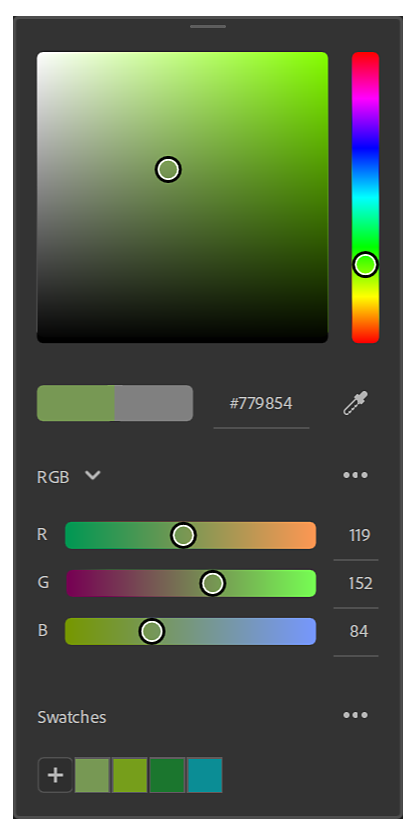
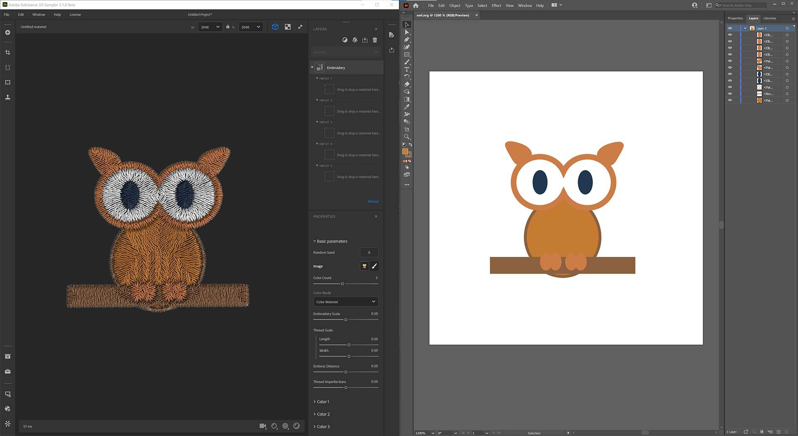
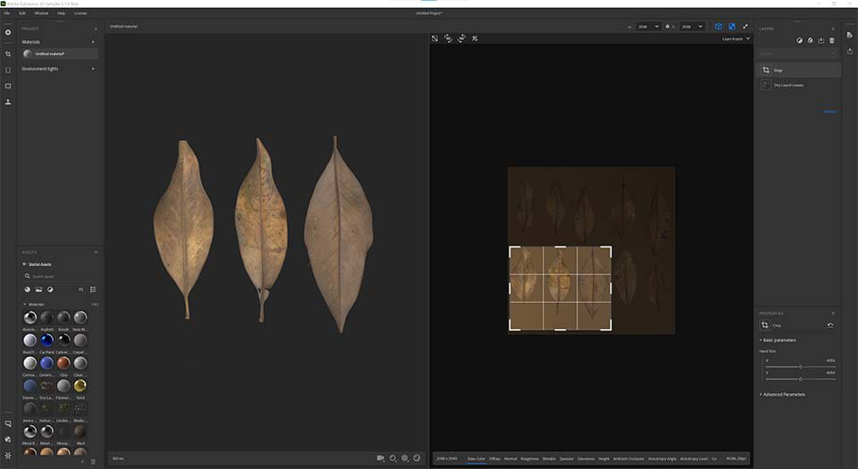
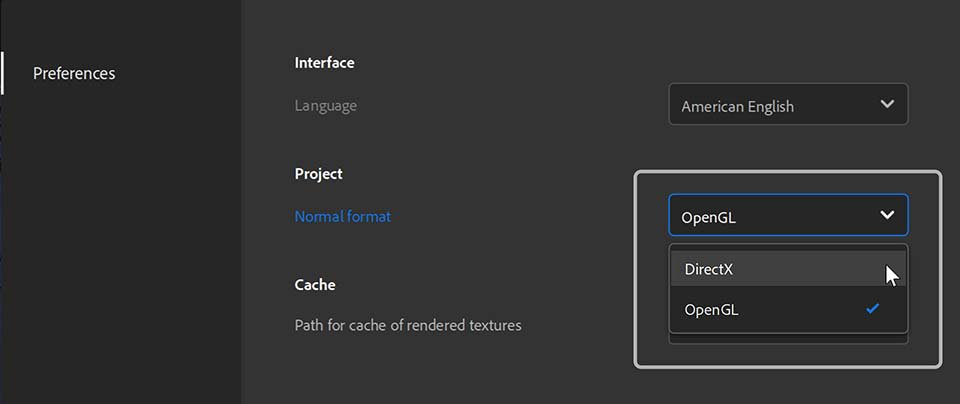
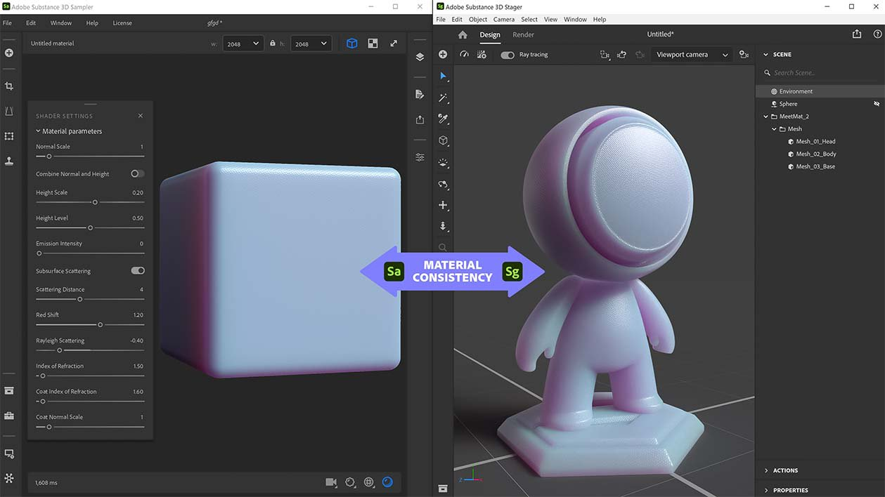

# Version 3.1

Adobe Substance 3D Sampler 3.1 introduces a new color picker, support for SVG files, and improved interoperability with Stager, Photoshop and Illustrator.

Release date: *September 28, 2021*

## Major Features

### Color Picker

This release adds a new [Color Picker](../../../interface/tools-and-widgets/color-picker/color-picker.md) that includes an eyedropper and support for swatches.

The Color Picker appears whenever you need to select a color. It can be moved anywhere on your screen(s).

{width="250px"}

### SVG support

Sampler now supports SVG files. You can import them in your assets, directly in the layer stack or in an image input of layer.

{width="500px"}

### Edit in Illustrator

A new “edit in” feature brings huge flexibility to updating imported images. If you want to tweak your SVG file, you can simply edit the file straight in Illustrator. Sampler will instantly update your visual with the new SVG.

### New Crop UX/UI

Sampler now gets a proper and revamped Crop widget to easily define the cropped area. You will also get not stretched results when cropping non-square images into square textures.

{width="500px"}

### Normal Format

Edit your Preferences to set the [normal format](../../../interface/preferences/normal-format/normal-format.md) you need for your workflow. Your normals will be imported, displayed and exported in the format you select in preferences.

{width="250px"}

### Material Properties Export in SBSAR

All material parameters of the Shader settings (normal scale, height scale, height level,...) will be exported in the SBSAR file to be read in Substance 3D Stager for a perfect material match.

{width="500px"}

## Release Notes

### 3.1.0 Xocoalt

*(Released September 28, 2021)*

**Added:**

* &#91;Color Picker&#93; New Color Picker UI
* &#91;Color Picker&#93; Preview the current and previous colors side by side
* &#91;Color Picker&#93; Input your color in Hexadecimal
* &#91;Color Picker&#93; New eyedropper with color preview
* &#91;Color Picker&#93; The eyedropper can pick a color outside of Sampler
* &#91;Color Picker&#93; Tweak your color in RGB or HSV color spaces
* &#91;Color Picker&#93; Save and manage Swatches
* &#91;Interoperability&#93; Edit images in Illustrator from Image Import layer or Image parameters
* &#91;Interoperability&#93; Edit images in Photoshop from Image Import layer or Image parameters
* &#91;Widget&#93; New Crop Widget
* &#91;Widget&#93; Press Enter to validate your crop
* &#91;Widget&#93; The Crop widget reads the image size to fit the widget and keep the ratio when resizing
* &#91;UI&#93; New gresycale slider UI
* &#91;Application&#93; Add normal format selection in preferences
* &#91;Application&#93; The normal format in Image Import layers follows the default normal format set in the preferences
* &#91;Application&#93; In the 2D view, the normal is displayed following the normal format set in the preferences
* &#91;Application&#93; The normal is exported in the normal format set in preferences
* &#91;Export&#93; Add normal format parameter to SBS and SBSAR file exports
* &#91;Export&#93; Add shader settings to SBS and SBSAR file exports
* &#91;Export&#93; Set the default resolution of exported SBS graphs
* &#91;Compound Filters&#93; Package SSA filters with 7z
* &#91;Compound Filters&#93; Add category metadata in compound filters
* &#91;Compound Filters&#93; Compound Filters can have an embedded thumbnail
* &#91;Compound Filters&#93; Added Compound Filters extension (.ssafilter) to the Get Content's file dialog
* &#91;Compound Filters&#93; Import Compound Filters (.ssafilter) in the Assets panel
* &#91;Engine&#93; Update substance engine to v8.2.0

**Fixed:**

* &#91;Application&#93; Connected local folders may hang
* &#91;Application&#93; Crash at exit
* &#91;Application&#93; Crash when launching two instances of Sampler
* &#91;Content&#93; Crop filter has a random seed tweak
* &#91;Content&#93; Some Substance materials are sometimes not upgraded
* &#91;Export&#93; Crash when exporting with a newly added custom preset
* &#91;Export&#93; Estimated size of package is missing in export popup
* &#91;Export&#93; Fix memory leak when exporting SBS and SBSAR files
* &#91;Compound Filters&#93; Compound filters may have duplicated inputs
* &#91;Compound Filters&#93; Crash if a filter has unmet references
* &#91;Compound Filters&#93; Crash when reordering a layer stack with a compound filter in it
* &#91;Compound Filters&#93; The render sometimes hangs
* &#91;Image Import&#93; Importing an image triggers multiple renderings
* &#91;Layers&#93; Crash on undo/redo
* &#91;Layers&#93; Crash when adding a Base Material
* &#91;Layers&#93; Crash when using an invalid image as environment light
* &#91;Layers&#93; Fix duplicate import when inserting a filter with several graphs
* &#91;Layers&#93; Reordering layers doesn't always work
* &#91;Project&#93; Crash when loading an incomplete project file
* &#91;Project&#93; Crash when opening a corrupted project
* &#91;Project&#93; Some assets can disappear from a project
* &#91;Properties&#93; Fix missing filter's presets
* &#91;UI&#93; Angle parameters cannot be set
* &#91;UI&#93; Filters metadata display in Asset panel
* &#91;UI&#93; Grouping by category hides filters
* &#91;UI&#93; Scroll issue in the Asset panel
* &#91;UI&#93; The export panel now has a scrollbar
* &#91;UI&#93; The thumbnail is not displayed for some image formats in image picker

**Known Issues:**

* &#91;Realtime Engine 2021&#93; Heavy computation can crash the application
* &#91;Realtime Engine 2021&#93; Realtime Engine 2021 will crash on a Windows machine with both AMD CPU and Nvidia GPU installed
* &#91;Color Picker&#93; Picking a color on a second monitor with a different resolution may not work
