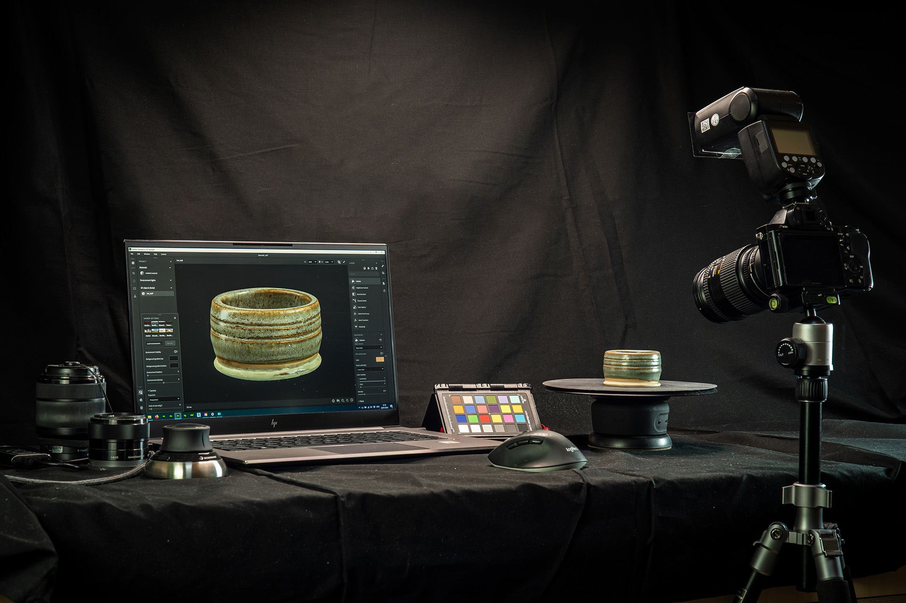
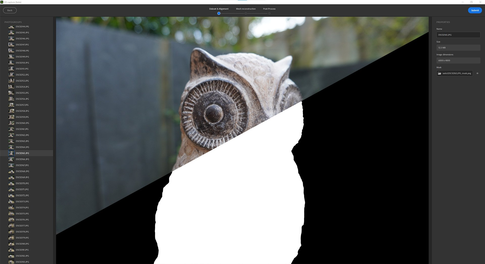
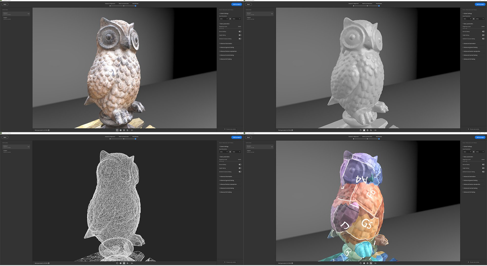
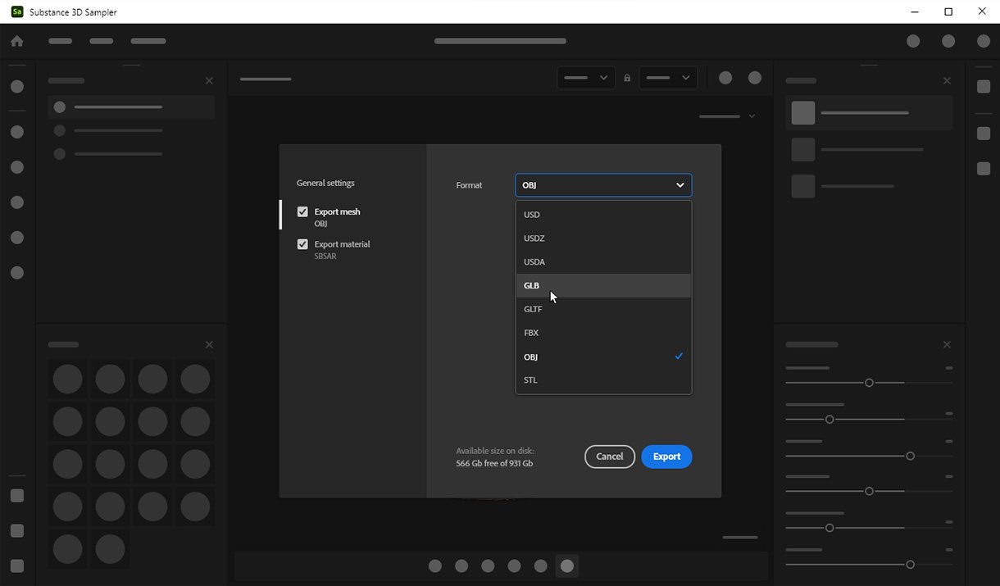

# Version 4.0

With **Substance 3D Sampler 4.0**, you can use real-world images to create 3D objects with automatic subject masking, texture mapping, and geometry decimation. This version introduces some UX improvements as new possibilities in the Python API.

*Release date: 31 January, 2023*

## 3D Capture

With Substance 3D Sampler 4.0, you can now create 3D objects from images.

We have integrated photogrammetry capabilities. Photogrammetry is the technical process of taking measurements from images. It is how Sampler creates 3D meshes from a series of photographs.

All you need to start is a series of photos which capture the visible surfaces of an object - a smart phone or DLSR camera works great.

Discover the step-by-step workflow [here](../../help/features-and-workflows/3d-capture/3d-capture.md).

## Highlights

### Auto-masking

Remove the background of the object you wish to 3D capture. Create an auto-generated mask of the object after importing your images via the Mask tab.

Using masks has many advantages. It allows to detect features and reconstruct only non-masked areas.

{width="500px"}

### Define your reconstruction area

Toggle Region of interest to activate a bounding box after aligning your images. Set and align the precise area you want to reconstruct.

{width="500px"}

### Connected post-processing

Once your 3D object is reconstructed, optimize the result with automatic decimation, UV unwrapping and baking.

The post-processing helps you to adapt and optimize your mesh and textures to your needs and how you want to use it.

The result of the reconstruction can generate a mesh with millions of polygons and up to 16K textures. This often won’t be optimized for rendering, real-time or AR experience.

The post-processing step chains 4 steps automatically:

* Decimation
* UV unwrap
* Reprojection
* Baking

{width="500px"}

### Export to major file formats

Export your reconstructed 3D objects in all standard file formats so you can use them wherever you need.

{width="500px"}

## Viewport

2D and 3D viewports can be resized, swapped and stacked vertically.

{width="500px"}

## Scripting

We splitted the export function into 4:

* export materials: `export_material`
* export environment lights: `export_environment_light`
* export mesh with or without textures: `export_mesh` or `export_3d_object`

We added a new function to import textures with a specific usage: `import_textures`

Sampler will now load at startup script and plugins stored on paths defined by two environment variables:

* `SAMPLER_PLUGIN_PATH`
* `SAMPLER_SCRIPT_PATH`

## Tutorials

## Release note

1. **0.0 Banana**

   *(Released 31 January, 2022)*

   **Added**

* &#91;3D Capture&#93; Create 3D objects from images
* &#91;3D Capture&#93; Dedicated 3D Capture wizard
* &#91;3D Capture&#93; Import or generate black and white masks on your dataset
* &#91;3D Capture&#93; Alignment result - view all matched features as a point cloud
* &#91;3D Capture&#93; Alignment result - view and interact with cameras associated with each aligned photo
* &#91;3D Capture&#93; Define the reconstruction area with a bounding box widget
* &#91;3D Capture&#93; Scale, translate, and rotate on all axes the bounding box widget
* &#91;3D Capture&#93; Define the geometry precision for the reconstructed mesh
* &#91;3D Capture&#93; Optimize your mesh and textures by creating a new version
* &#91;3D Capture&#93; Each of the versions is automatically decimated to the target faces number set
* &#91;3D Capture&#93; The post-process step automatically unwraps, re-projects textures, and then bakes the normal height and AO information from the high-poly mesh
* &#91;3D Capture&#93; Add the original result or a version to the Sampler project
* &#91;3D Capture&#93; New Mesh Post-Process layer to automatically decimate, unwrap, reproject textures, and bake details of the underlying mesh layer
* &#91;3D Capture&#93; New Mesh Transform layer to scale, rotate, or translate the underlying mesh layer
* &#91;Export&#93; New Export window
* &#91;Export&#93; Dedicated settings and UI depending on the asset type (material, environment light, mesh)
* &#91;Export&#93; Export the mesh as USD, USDA, USDZ, glTF, glb, obj, fbx, stl
* &#91;Export&#93; Define the material type when exporting Substance files (SBSAR, SBS)
* &#91;UI&#93; Move cache settings to a new tab in the Preferences popup
* &#91;Application&#93; 2D and 3D viewports can now be resized, swapped, and stacked vertically
* &#91;Application&#93; New SAMPLER\_RESOURCES\_PATH environment variable to add extra starter assets
* &#91;Scripting&#93; Added SAMPLER\_PLUGIN\_PATH and SAMPLER\_SCRIPT\_PATH environment variables to import plugins and scripts at startup
* &#91;Scripting&#93; Added export functions for materials, environment lights, and 3d objects
* &#91;Scripting&#93; Added identifier, default value, min and max values, labels, and enum values to parameters
* &#91;Scripting&#93; Added import\_textures function to enter a customized usage while importing images

**Fixed**

* &#91;Application&#93; Crash when opening a recent project and saving in confirmation dialog
* &#91;Application&#93; File dialog prevents opening .ssa files
* &#91;Application&#93; File dialogs can appear on a background window on macOS
* &#91;Application&#93; Potential crash when opening 3.2 projects
* &#91;Application&#93; Selecting a file closes the File dialog before displaying warnings
* &#91;Exposed Parameters&#93; Exporting parametric environment lights does not work
* &#91;Layers&#93; "Click here to browse" link in layer stack doesn't work anymore
* &#91;Layers&#93; Painting several images within the same layer sometimes does not work
* &#91;Layers&#93; Setting an image in the layer properties does not update the image picker thumbnail
* &#91;Layers&#93; Tweaking a Sampler asset added as a layer does not work
* &#91;Project&#93; Unwanted asset update when opening a project
* &#91;Scripting&#93; Browse to plugin folder sometimes fails on Windows
* &#91;Scripting&#93; Crash when using 'open\_project()' in a Python script
* &#91;Scripting&#93; JPEG export is missing from the API
* &#91;Scripting&#93; The log panel is not read-only
* &#91;Scripting&#93; image\_picker parameter value does not work
* &#91;UI&#93; Missing asset icon for environment lights in the Project panel
* &#91;UI&#93; Send to Designer Format Dropdown in the Preferences popup can be empty
* &#91;UI&#93; Some buttons have an incorrect style
* &#91;UI&#93; The label overlaps the buttons in Button Group widgets
* &#91;UI&#93; Tooltip position is wrong for "Tools" in Set the physical size menu
* &#91;UI&#93; When changing language, File menu is misaligned

**Known issues**

* &#91;3D Capture&#93; When using masks, the texture projection may be broken
* &#91;3D Capture&#93; Small artefacts may appear on your object if your scale in the Mesh transform is too small
* &#91;3D Capture&#93; The exported mesh may be really small. Reset the scale of the Mesh transform and re-export
* &#91;Color Picker&#93; Picking a color on a second monitor with a different resolution may not work
* &#91;Content&#93; Shape light widget is not working in spherical projection mode
* &#91;Interoperability&#93; Material with displacement sent to Stager will lose displacement controls
