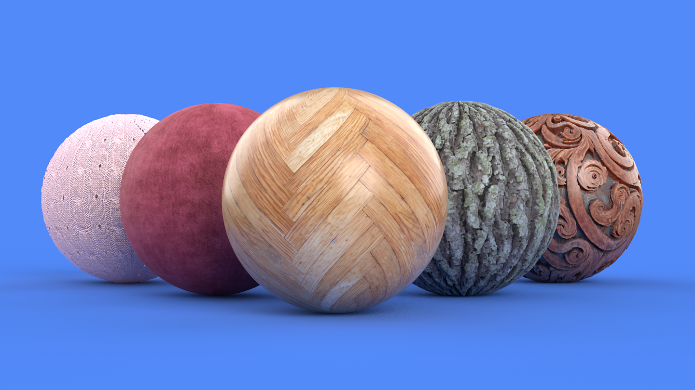
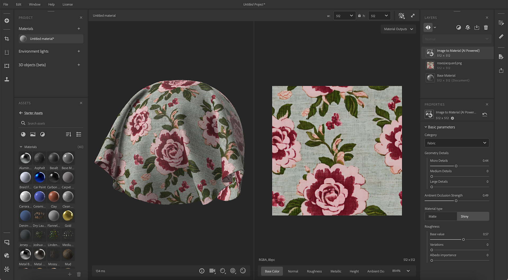
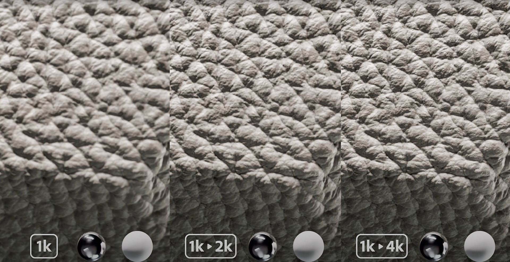
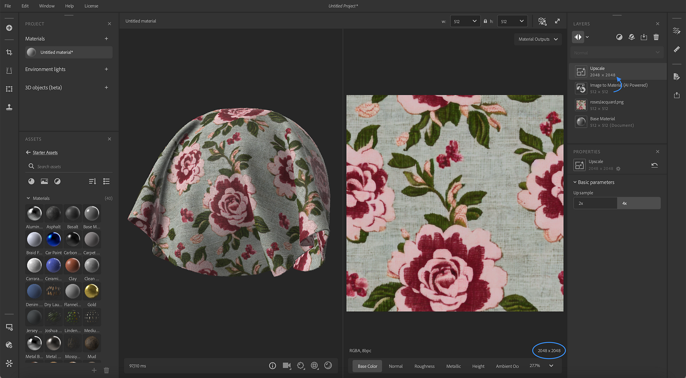
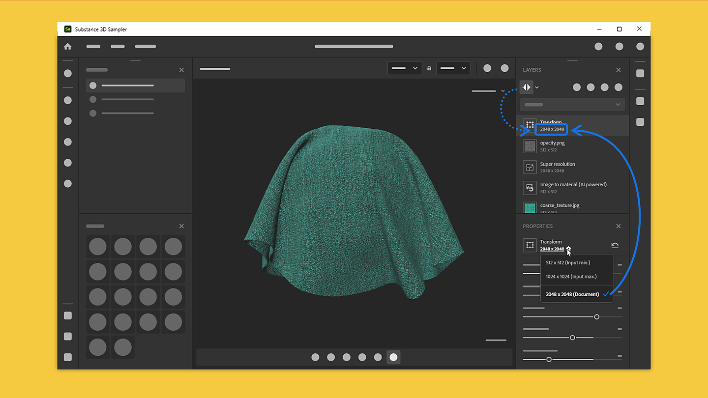

# Version 4.2

<b>Substance 3D Sampler 4.2</b> introduces a new AI powered version of <b>Image to Material</b> and a new <b>AI Upscale</b> feature. This version includes complete control of the resolution per layer.

*Release date: 05 September 2023*

## Image to Material – New Version

Image to Material generates material channels (base color, roughness, normal, displacement and metallic) for you from a single image.

The updated version of Image to Material improves the material generation and the range of materials supported.

Now, Image to Material has been trained on all material types, generating better results for Fabric, plastic, wood, etc.

The updated version has a new parameter to select the material type to generate accurately all channels and automatically adjust the range.

## AI Upscale

Thanks to the new Upscale layer, Sampler enhances features of your material or image by multiplying by 2 or by 4 the resolution of your asset (material or image).

This allows to increase the quality and the level of details of low-resolution textures maintain feature coherency between maps during textures enlargement.

The Upscale filter enhances base color, normal, height, roughness, and metallic channels of your material.

To maximize the results quality, the Upscale filter should be used on data (material and image) at their original resolution without previous resolution change.

## Layer Resolution

The new system of Layer Resolution lets you have full control over the resolution of each layer. A layer takes the resolution of your document size or the resolutions of the layer below.

The resolution is displayed on each layer to easily visualize the impact of your work on the resolution of your material.

This allows you to increase the quality of your materials, but also performance while working on your assets.

## Tutorials

## Release Note

<b>4.2 DORAYAKI</b>

*(Released: 05 September 2023)*

<b>Added</b>:

* &#91;Content&#93; Vastly improved Image to Material (AI) and Delighter filters
* &#91;Content&#93; New Upscale filter
* &#91;Content&#93; The Crop filter now has dynamic output resolution.
* &#91;Material Creation Template&#93; Add Document size setting.
* &#91;Material Creation Template&#93; New "Add a crop" toggle button.
* &#91;Material Creation Template&#93; New "Upscale Material" toggle
* &#91;Material Creation Template&#93; Display imported image size
* &#91;Material Creation Template&#93; Give feedback when some imported images cannot be used
* &#91;Material Creation Template&#93; Warn when image sizes are inconsistent
* &#91;Material Creation Template&#93; New warnings and tooltips
* &#91;Layers&#93; Display the resolution of the layers in the layer stack
* &#91;Layers&#93; Layer compute resolution can now be either set to Document size or Input size
* &#91;Layers&#93; Show layers resolution in the layer stack
* &#91;Layers&#93; Switch a layer resolution policy to Document or Layer Input when applicable
* &#91;Layers&#93; Warn the user when an Upscale filter is added manually and provide some documentation
* &#91;Layers&#93; Warn the user when doing a linear upscale, and offer to use the Upscale filter instead
* &#91;Layers&#93; Computing an Image to Material (AI) layer can now be cancelled quicker, to improve rendering times when tweaking the layer stack
* &#91;Layers&#93; Computing an Upscale layer can now be cancelled quicker, to improve rendering times when tweaking the layer stack
* &#91;Export&#93; Allow overriding resolution of exported textures
* &#91;Export&#93; Channels to export list is now sorted
* &#91;Export&#93; Display channel resolution in the channels to export list
* &#91;Application&#93; New preference to enable or disable GPU accelerated neural networks
* &#91;UI&#93; Improved resolution dropdowns
* &#91;UI&#93; New icons for Mesh Transform, Mesh Post Process and Weave filters
* &#91;UI&#93; Rename "Share" panel to "Export"
* &#91;Scripting&#93; Add layer output resolution support to the export API
* &#91;Scripting&#93; Added Crop, Upscale and Document size to the image import API
* &#91;Onboarding&#93; New tutorials
* &#91;Onboarding&#93; Update Welcome and What's New screens content
* &#91;Engine&#93; Update Substance Engine to version 9.0.1

<b>Fixed:</b>

* &#91;3D Capture&#93; Improve Precision options naming in Alignment settings parameters
* &#91;Application&#93; Importing images with non-multiple of 16 dimensions can lead to a crash
* &#91;Application&#93; Crash when duplicating an asset in the Project panel
* &#91;Application&#93; Crash when switching assets in the Project panel
* &#91;Content&#93; Painting a custom mask for the Snow filter does not work properly
* &#91;Exposed Parameters&#93; Exposed parameters changes can be lost when switching materials
* &#91;Interoperability&#93; Sending a Material from the Export panel can lead to a crash
* &#91;Layers&#93; Content-Aware Fill stops computing when switching from a single image input to a material input
* &#91;Layers&#93; Crash after duplicating an Environment Light that contains a material
* &#91;Layers&#93; Image import layer displays wrong image name in the Properties panel if the image file was renamed
* &#91;Layers&#93; Sometimes a spinner is displayed on an inactive layer
* &#91;Layers&#93; Sometimes changing the output usage of an image in an Image import layer does not work
* &#91;Layers&#93; Typos in the Creation Template Window
* &#91;UI&#93; 3D viewport onboarding tooltip has focus issues
* &#91;UI&#93; Image name can overflow if file name is too long
* &#91;UI&#93; Minor brush toolbar layout issues when using the eraser
* &#91;UI&#93; Strings are truncated in some languages in the Viewer Settings panel
* &#91;UI&#93; While the viewport tooltip popup is displayed, pressing "space" creates a new project
