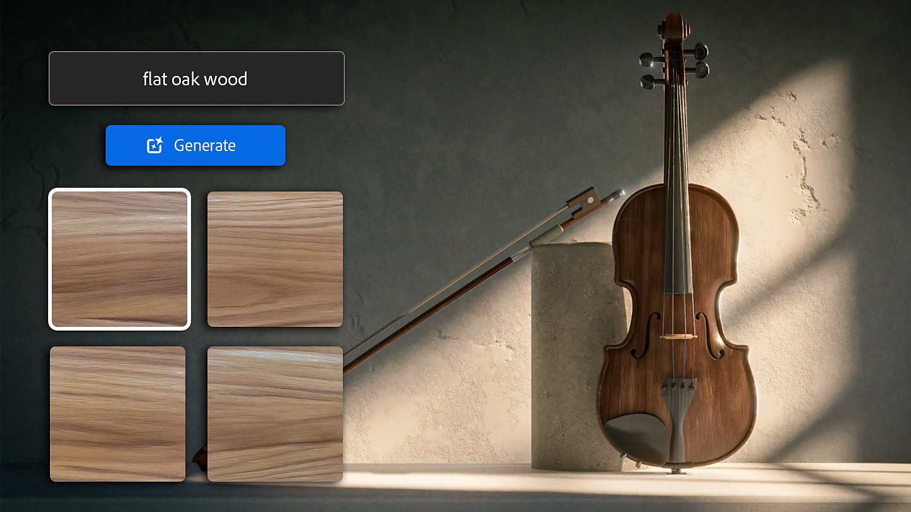
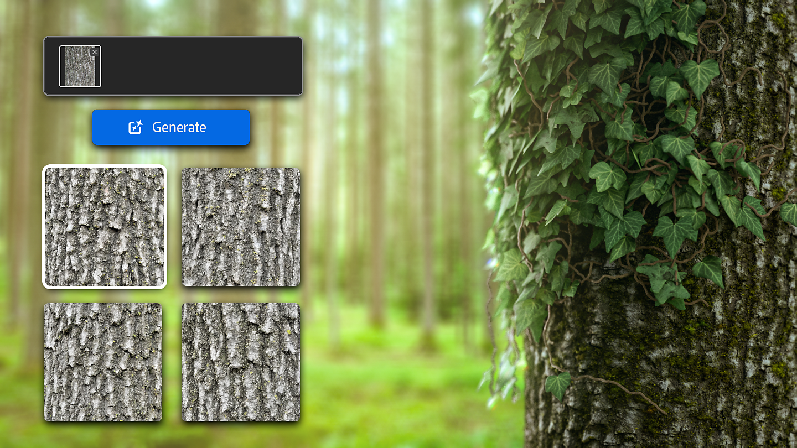
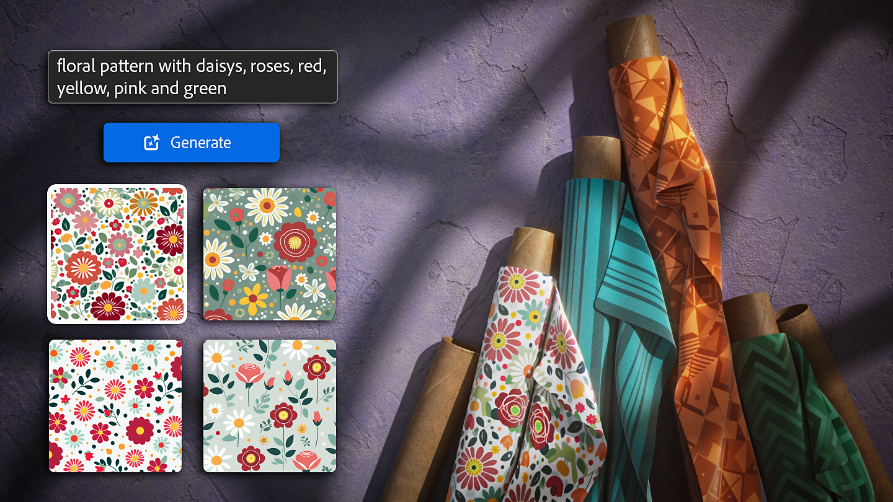

# Version 4.4

<b>Substance 3D Sampler 4.4</b> introduces three new generative workflows as beta: Text-to-texture, Text-to-pattern and Image-to-texture.

<b>Generative AI features are only available on Adobe version</b> as it requires an Adobe account. Therefore, these features are <b>not available on Steam</b>.

*Release date: 23 May 2024*

## Text-to-texture

Text-to-texture allows you to explore a new way of creating materials with a <b>text prompt</b>. You can generate a tiled texture from a detailed text description, and keep building on the result via Image-to-material or any Sampler filter to make it uniquely yours.

## Image-to-texture

With Image-to-texture you can create tiled square textures from <b>your own reference image</b>, no matter if it is non square and non tiling. This gets you closer to your desired results without needing to write the perfect prompt.   
Image-to-texture can also help you save time by creating variations from content you have already created.

## Text-to-pattern

The Text-to-pattern feature will use your<b> text prompt</b> to generate a square tiling pattern. You can then use it as the base color with a Cloth Weave filter to create an original fabric material, use it as in input of a Pattern filter and more!

## Release Note

*(Released: 23 May 2024)*

<b>Added</b>:

* &#91;Application&#93; 3D Capture cache is now stored in a separate sub-folder
* &#91;Generative AI&#93; Image to Texture (Beta)
* &#91;Generative AI&#93; Text to Pattern (Beta)
* &#91;Generative AI&#93; Text to Texture (Beta)
* &#91;Scripting&#93; Assets now have a 'resource' property
* &#91;Scripting&#93; Layers now have a 'output\_usages' property

<b>Fixed:</b>

* &#91;Application&#93; Crash when opening corrupted project file
* &#91;Application&#93; Crash when project contains corrupted assets
* &#91;Application&#93; Crash when unplugging a monitor on Windows
* &#91;Application&#93; Incorrect application icon in the Windows task bar
* &#91;Application&#93; Main configuration file corruption can lead to files deletion
* &#91;Application&#93; Panels appear in front of popups
* &#91;Content&#93; Texture generators have blurry thumbnails
* &#91;Export&#93; Opacity channel generated from an imported image breaks when exporting a .sbs/.sbsar
* &#91;Filters&#93; Upscale can crash depending on its input layers
* &#91;Generative AI&#93; Possible crashes when receiving unexpected results from the service
* &#91;Scripting&#93; Crash when autoloading a plugin from environment variable
* &#91;Scripting&#93; Possible crash when assigning Output Usage with the API
