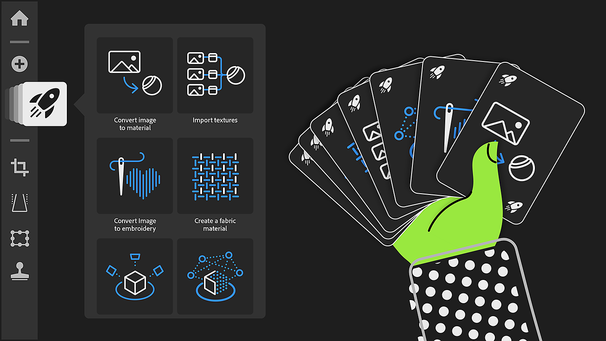
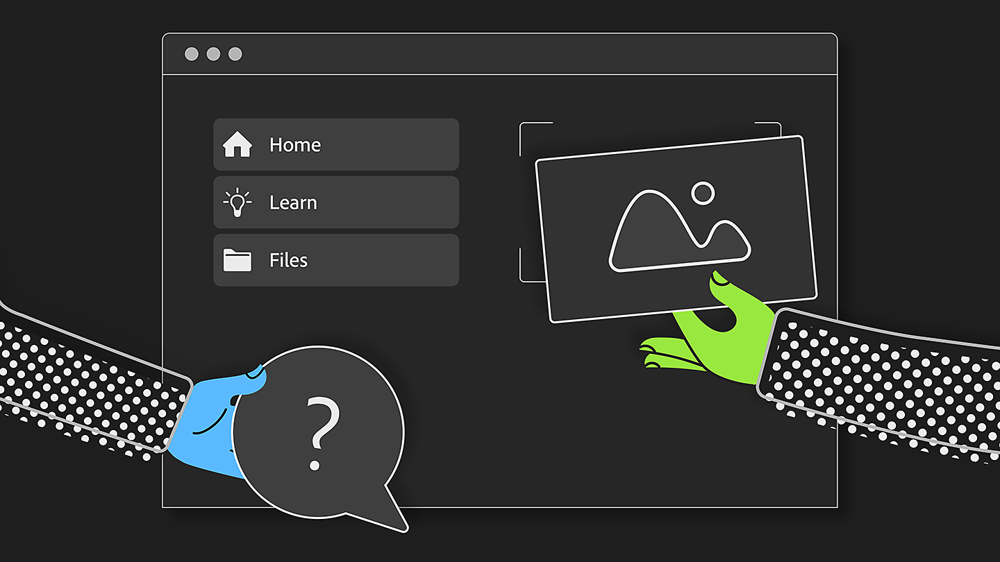
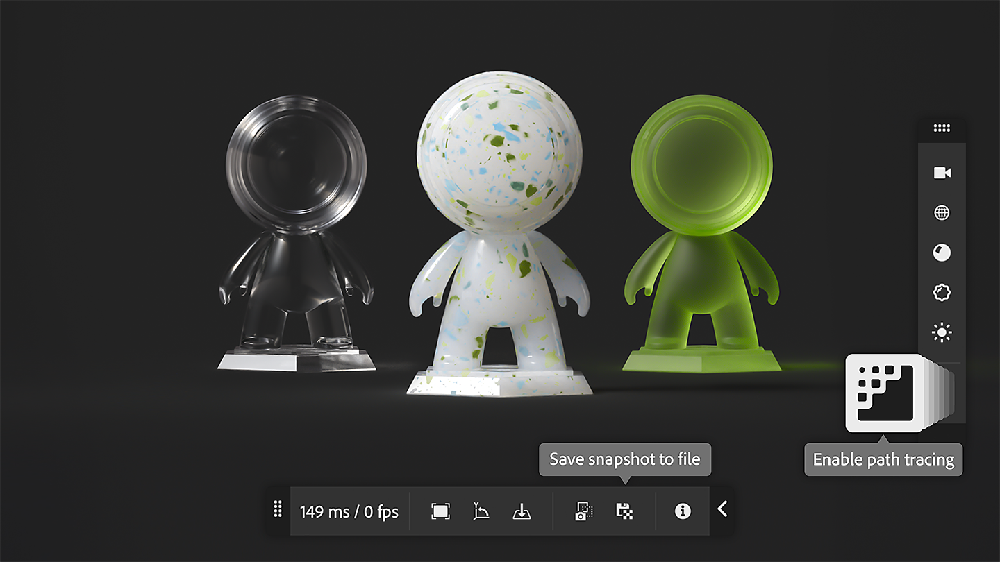
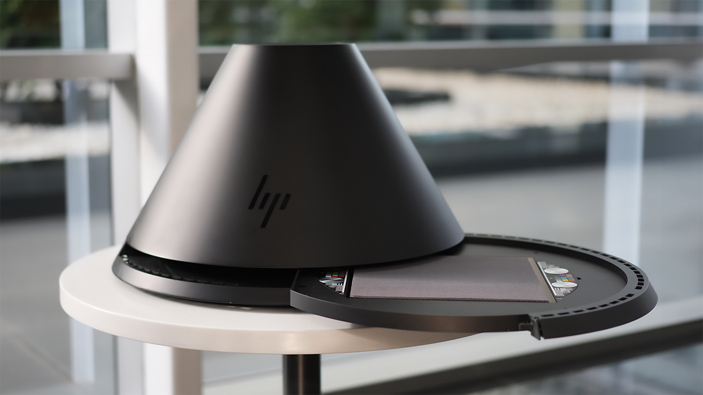

# Version 5.0

<b>Substance 3D Sampler 5.0</b> introduces easier ways to get into material digital twin with higher quality scans and renderings.

The main new features include:

## Quick actions

Start all the main workflows of Sampler in one click and have the layer stack made ready for you!

More info *[here](../interface/panels/quick-actions-panel.md)*.

## New home screen layout

Find all your projects, tutorials and start your work directly from the home page.

More info *[here](../interface/the-home-screen.md)*.

## New renderer

Choose between realtime and path-tracing improving visual consistency and support new material properties. Save snapshots of your work directly from the 3D view.

More info *[here](../interface/2d-and-3d-viewport.md)*.

## HP Z Captis integration

With HP Z Captis and Substance 3D Sampler, bring real-world materials into digital in minutes.

Feature available for Enterprise, Teams, and Education accounts.

More info *[here](../pipeline-and-integrations/hp-z-captis-support/hp-z-captis-support.md)*.

## V5.0 Release Notes

*(Released: February 20th, 2025)*

<b>Added</b>:

* &#91;Onboarding&#93; New Homepage with quick access to learning content, sample project, quick actions and recent projects.
* &#91;Onboarding&#93; Get started quickly with the new Quick Actions, accessible from the homepage and from dedicated panel
* &#91;Onboarding&#93; &#91;Content&#93; Quick Actions are predefined workflows that populate the layer stack with most used layers
* &#91;Onboarding&#93; Possibility to create a new project via a new Quick start menu, via quick actions or Custom Project
* &#91;Onboarding&#93; Possibility to create empty project directly from homepage via dedicated button
* &#91;3D View&#93; New advanced rasterizer and pathtracer bringing new rendering capabilites (properties such as coating, sheen, translucency, subsurface scattering) and visual consistency across Substance ecosystem
* &#91;3D View&#93; Viewer settings are now accessible directly in the 3D view
* &#91;3D View&#93; Possibility to save a render snapshot in clipboard or in files
* &#91;3D View&#93; Display a grid to visualize the scene origin
* &#91;3D View&#93; Enable the ground plane to catch shadows and reflections
* &#91;3D View&#93; Control how reflective and opaque is your ground plane
* &#91;3D Capture&#93; Position mesh on ground
* &#91;Application&#93; Check hardware compatibility on application startup
* &#91;Application&#93; Crash reporting window now opens right after a crash occurs
* &#91;Content&#93; Open a sample project to easily get started
* &#91;Export&#93; Export Adobe Standard Material shader in USD files
* &#91;Generative AI&#93; Check "Do not infer" tag when using image as an input in Image to Texture workflows
* &#91;Project&#93; Thumbnails are stored within the project file for faster opening of projects
* &#91;Project&#93; Setting in the preferences to store cache data within the project file, with different modes (no cache, light cache, full cache)
* &#91;Scripting&#93; &#91;Breaking change&#93; Qt migration to Qt6.15 - impact compatibility of existing plugins
* &#91;Scripting&#93; Default plugins and script folder are now in the Documents folder
* &#91;Scripting&#93; New UI for plugins for visual consistency with main Sampler panels
* &#91;Scripting&#93; Access 2 plugin examples to discover Sampler plugin capabilities
* &#91;Scripting&#93; New open\_3d\_catpure() function
* &#91;Scripting&#93; When inserting a layer, control if it is inserted above or below the target position

<b>Fixed:</b>

* &#91;3D Capture&#93; Crash if Object Capture cannot be started on macOS
* &#91;Application&#93; Crash at exit
* &#91;Application&#93; Hang at exit while adding assets to the project panel
* &#91;Application&#93; Renaming a project asset does not work unless you press enter
* &#91;Application&#93; Undo and redo menu entries are not disabled when they should be
* &#91;Assets&#93; Unable to delete assets from the All Libraries section of the Assets panel
* &#91;Content&#93; Atlas creator - Use existing opacity map if present
* &#91;Content&#93; Color ID Blend - Fix color picking in the basecolor
* &#91;Layers&#93; Avoid useless computation when using generators
* &#91;Layers&#93; Tweaking a generator may lead to triggering too many computes
* &#91;Performance&#93; Improve GPU memory management
* &#91;Performance&#93; Render cache may not be used when restarting the app
* &#91;Resources&#93; Read only files are not visible in the Assets panel
* &#91;Scripting&#93; Allow reusing a layer after adding another layer
* &#91;Scripting&#93; Changing the layer stack structure several times in one script may fail

<b>Removed:</b>

* &#91;Application&#93; Remove support for .dng and .nef image files
