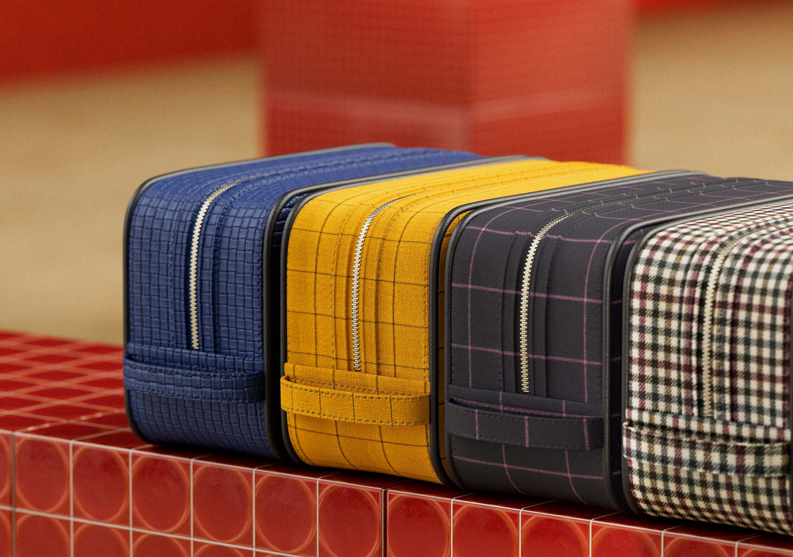
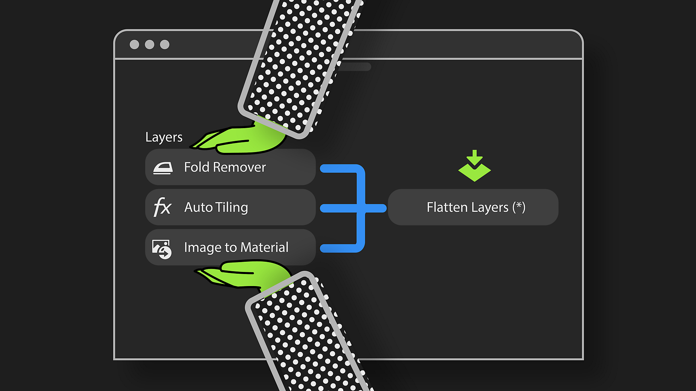
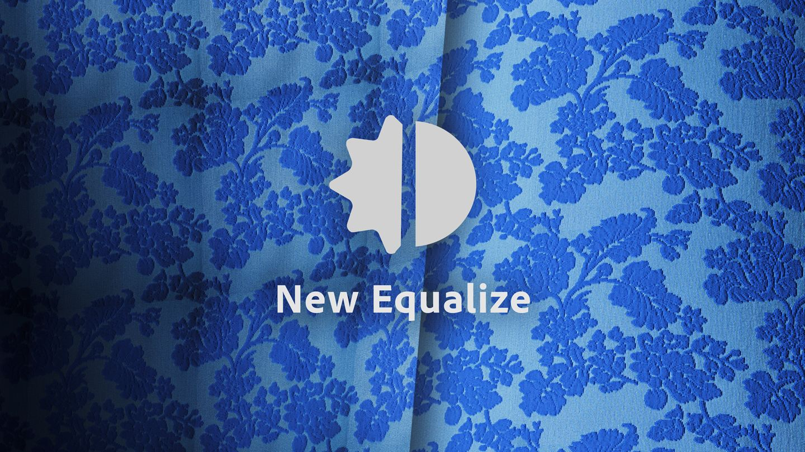
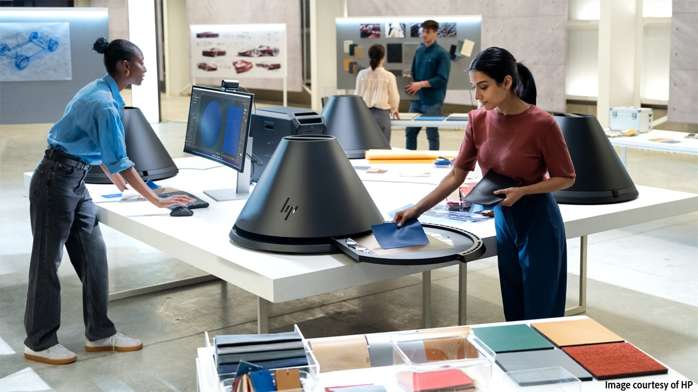

# Version 5.1

Spend less time between capturing your materials and exporting their digital twins with new and improved tools in <b>Substance 3D Sampler 5.1</b>!

The main new features include:

## Tile automatically structured materials

Save time processing structured or patterned materials—like fabrics—by automatically generating seamless tiles.

More info *[here](../../filters/tools/auto-tiling/auto-tiling.md)*.

## Efficient layer workflows

Boost performance and reduce computation time with the Flatten layer by transforming stacked layers results into a single set of maps within one unified layer. Rename and duplicate them for more efficiency!

More info *[here](../../features-and-workflows/flatten-layers/flatten-layers.md)*.

## Powerful tools for scan processing

With enhanced Equalize and Clone Stamp filters, plus a new automatic fold removal feature for fabrics, you can achieve perfect scans in just a few clicks—no matter how complex the material.

## Enhanced HP Z Captis support

Now with Roughness map generation and automatic physical size detection in Studio mode, you get a more detailed and accurate material digital twin than ever before!

## V5.1 Release Notes

*(Released: August 7th, 2025)*

## Added:

* &#91;2D View&#93; Brush size now adapts to the current texture resolution
* &#91;3D View&#93; Toggle Native Display Scale for 3D Rendering in the preferences
* &#91;Application&#93; Rendering engine update
* &#91;Captis&#93; Add "make square" possibility during preview
* &#91;Captis&#93; Automatic physical size detection
* &#91;Captis&#93; Capturing a new material will create a new asset
* &#91;Captis&#93; Change resolution selection in dropdown to pixel per inch or centimetre instead of pixel resolution of maximum area
* &#91;Captis&#93; Contextual help on alignment calibration
* &#91;Captis&#93; Generate roughness map
* &#91;Captis&#93; Warn the user if the default calibration files are missing
* &#91;Filters&#93; Auto Tiling filter for structured materials and scans
* &#91;Filters&#93; New Fold Remover filter
* &#91;Filters&#93; New features within the Clone Stamp filter
* &#91;Filters&#93; New features within the Equalize filter
* &#91;Layers&#93; Ability to flatten layers
* &#91;Layers&#93; Context menu when right-clicking on a layer to rename, duplicate, delete or flatten the layer
* &#91;Onboarding&#93; Update Welcome and What's New screens content
* &#91;Performance&#93; Better performance when using the Crop filter
* &#91;Performance&#93; Improve memory usage for the 3D View
* &#91;Performance&#93; Updating the 3D view is quicker
* &#91;Physical Size&#93; Enable "display with physical ratio" when working on Substance filters when Physical Size is enabled
* &#91;Physical Size&#93; When importing images in an empty stack, propose a resolution that is more coherent with the image ratio
* &#91;Quick Actions&#93; 3 new quick actions for scan processing
* &#91;Scripting&#93; API to flatten layers
* &#91;Scripting&#93; Get the filename of each image of an image import layer
* &#91;Scripting&#93; New function to activate/deactivate a given channel of an asset
* &#91;UI&#93; Rework icons and buttons in the Layers panel to accommodate for the new features
* &#91;UI&#93; Warn about environment light authoring deprecation

## Fixed:

* &#91;2D View&#93; Selecting 'display with physical ratio' might not work when using Substance filters
* &#91;3D Capture&#93; Svg files are listed in the file picker but not supported
* &#91;3D View&#93; Emission intensity parameter in the Shader Settings does not work
* &#91;3D View&#93; Sometimes the mesh position is incorrect when creating a new asset
* &#91;3D View&#93; Switching to Path Tracing rendering crashes on unsupported hardware
* &#91;Application&#93; Application hangs when closing the manual measure popup without setting a size
* &#91;Application&#93; Crash
* &#91;Application&#93; Freeze on Windows when displaying the desktop (Windows key + D keyboard shortcut)
* &#91;Application&#93; Possible crash when switching language
* &#91;Captis&#93; Crash when the preview data is not valid
* &#91;Captis&#93; Impossible to fully zoom out after zooming in
* &#91;Captis&#93; Missing localization on some wizard steps
* &#91;Captis&#93; Possible crash at exit when using Captis
* &#91;Captis&#93; Scanning does not work if the device is missing calibration files
* &#91;Filters&#93; Brush preview when using the Clone Stamp filter may be wrong depending on the texture and brush sizes
* &#91;Filters&#93; Erroneous output size after using the Upscale filter
* &#91;Filters&#93; Missing icons for Environment Rotation and Stylization filters
* &#91;Filters&#93; Updating some filters may lead to incorrect rendering
* &#91;Layers&#93; Incorrect first render when blending two materials
* &#91;Layers&#93; The button to update layers shows "Update All" even when there is only one update
* &#91;Layers&#93; Unnecessary computations when importing images in the layer stack
* &#91;Performance&#93; Improve normal map format handling to reduce rendering times
* &#91;Physical Size&#93; Manual measurement popup only works after doing an auto-measure
* &#91;Physical Size&#93; Wrong export resolution in the Export popup when Physical Size is enabled
* &#91;Quick Actions&#93; Missing localization on generated asset names
* &#91;UI&#93; Asset preview on hover may not show
* &#91;UI&#93; Clicking the Reset to default value button might break some of the controls
* &#91;UI&#93; Error messages are not cleared when switching projects
* &#91;UI&#93; Make sure material name in viewport &amp; properties panel are empty when there is no asset
* &#91;UI&#93; Reset to default value button for the Point of View parameter does not work
* &#91;UI&#93; Reset to default value button overlap
* &#91;UI&#93; Some buttons are not clickable when a panel is undocked
* &#91;UI&#93; Texture tilling V Parameter partially hidden in Viewer Settings and 3D View

## Removed:

* &#91;3D Capture&#93; Remove 3D Capture support
* &#91;Application&#93; Remove macOS x86 support
