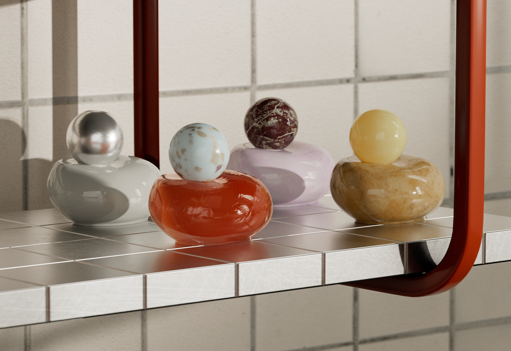
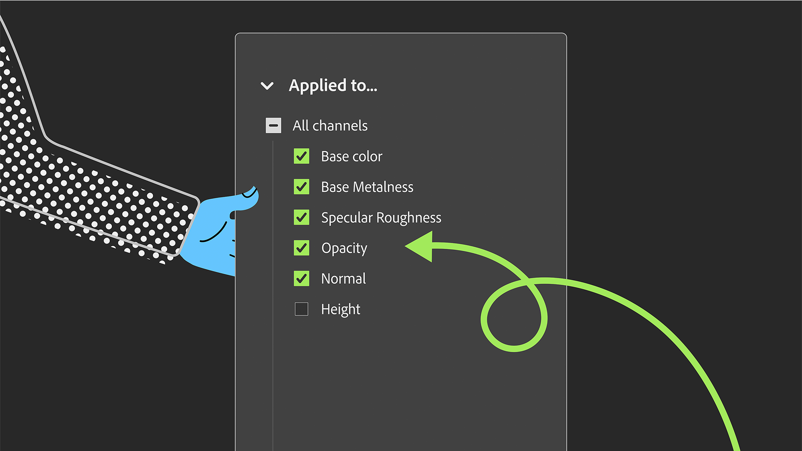

# Version 6.0

Jalapeño

This update introduces industry-standard OpenPBR support, Material presets for faster creation of advanced materials, and a redesigned Properties panel for more flexible authoring.

The main new features include:

## OpenPBR at the heart of the Substance ecosystem

Sampler 6.0 adopts OpenPBR, the industry's unified material model. Build materials that are natively understood across the wider 3D ecosystem: one standard, endless compatibility.Design once, eliminate guesswork, and accelerate your workflow with a model built for seamless interoperability across tools.

More info *[here](../features-and-workflows/openpbr.md)*

## Complex materials in a click

Create richer and more complex materials instantly. New templates like fuzz, translucency, and clear coat let you add advanced physical effects without the complexity. Just pick a template, and go!

More info *[here](../interface/tools-and-widgets/material-creation-presets.md)*

## Built for material creation

Sampler 6.0 refines the entire experience around what matters most: creating high‑quality digital twin materials. Every update and new feature is designed to remove friction, save you time, and let you focus on the parts of your workflow that truly add value.

## A new layer stack made for control

Take charge of your materials. With the redesigned property panel, you can target filters per channel, giving you precise edits without extra steps.

More info *[here](../interface/panels/properties-panel.md)*

## Capture materials faster than ever

Sampler now lets you launch an HP Z Captis capture in a single click, with the region of interest detected automatically, rotatable on demand, and smart automation for focus and light intensity, so you get sharp and consistent maps with less setup.

More info *[here](../pipeline-and-integrations/hp-z-captis-support/your-first-capture-step-by-step.md)*

## V6.0 Release Notes

*(Released: April 16th, 2026)*

## Added:

[3D View] Provide default meshes in USD format
[Application] Detect usages in a material that are not available in current material model
[Application] Read material model tag from SBSAR files
[Captis] Allow rotation of the region of interest and new 4K resolution
[Captis] Check Captis OS version and warn user to update if relevant
[Captis] Keep scan parameters between successive scans
[Captis] New autofocus system
[Captis] One-Click Scan
[Captis] Show a notification when capture ends
[Captis] Various UI/UX improvements
[Channel Settings] Redesigned channel settings panel for OpenPBR
[Channel Settings] Support for switching between OpenPBR and ASM material models
[Export] Enable exporting materials as USD, USDA or USDZ
[Export] Support OpenPBR channels in export channel selection
[Export] Use project path as default export path
[Filters] Allow updating from static to dynamic compound filters
[Filters] Allow upgrading from static to dynamic filters
[Filters] Dynamic versions of Auto Tiling, Content Aware Fill, Height Blend, Normal Blend
[Filters] Hide static version of a filter when dynamic version is present
[Filters] New Fill experience
[Filters] New OpenPBR & ASM compatible Base Material
[Image Import] Importing images now proposes to add usages to workflow
[Image Import] Improved usage picker
[Layers] Default asset size is now 2K
[Layers] Enable a per-layer output usage selection
[Preferences] Add a default material model preference
[Preset] Default preset now uses OpenPBR material model
[Rendering] Enable 8K rendering
[Rendering] Handle OpenPBR shader in USD scene
[Rendering] Render images at document size when not exporting
[Scripting] Handle material model for asset creation in Python API
[Scripting] New MaterialModel property on asset
[UI] Add a category to Quick Actions and hide environment/mesh filters
[UI] Display template window when stack contains just a base material
[UI] Implement fuzzy search in quick accessor
[UI] Integrated template selection into material creation dialog
[UI] Material creation from quick start
[UI] Material creation workflow with templates
[UI] New style for floating action bars
[UI] Notify user when a material needs additional usages
[UI] Propose new material name with incremented number
[UI] Rename "Create empty project" into "Quick Start"
[UI] Revamped 'Get content' panel
[UI] Search implementation in channel list edition
[UI] Show a notification when saving a snapshot to file

## Fixed:

[2D View] Order 2D view according to result usage index in specification
[Application] Fix a crash at start
[Application] Fix wrong logic for workflow usage filtering with OpenPBR
[Application] Known version list is now read when searching for an update
[Application] Prevent a concurrent access crash
[Application] Prevent a double computation when importing images with base material
[Application] Prevent a potential crash at exit
[Application] Prevent crash when clearing a mask twice
[Application] Prevent usage conversion that loses original case
[Application] Prevent useless computation of invisible outputs
[Application] Replace spaces with underscores when creating usage ID from name
[Application] Various update fixes
[Captis] Device not detected after updating the security policies
[Captis] Fix FTP protocol errors
[Captis] Fix crop
[Captis] Focus on a technical area before doing color calibration
[Captis] Keep crop ratio when resolution is locked
[Captis] Prevent freeze when hitting 'send results to sampler' multiple times
[Captis] Raise Captis window when clicking on Captis menu and it is minimized
[Captis] Swap two sections in the preview UI
[Captis] The final asset's metadata is not set
[Captis] Various bugfixes
[Captis] Wrong crop size
[Channel Settings] Mask channels in panel if they are invisible
[Export] Opening a folder with special characters works correctly
[Export] Prevent crash at export when tree has been unloaded
[Export] Selected outputs are not persistent in the export dialog
[Filters] Exporting a tree with images breaks dynamic image resolution
[Filters] Fix C++ filter availability
[Filters] Fix Clone Stamp dynamic filter detection
[Filters] Fix UID counter initialization when filling dynamic usages
[Filters] Fix colorspace in AutoTiling wizard
[Filters] Fix crop output sizes
[Filters] Make updating filter with pinned parameter work
[Filters] Prevent a crash on macOS in AutoTiling wizard
[Filters] Prevent crash in upscale when an input is missing
[Filters] Prevent crash when loading a compound filter with no file name
[Filters] Target mask tweak was duplicated in PatchMatch
[Image Import] Fix auto-manual measure for physical size
[Image Import] Proper SVG rasterization size when used as tweak
[Layers] Assigning a usage to an image by typing it does not work
[Layers] Avoid crashes when adding layers to the stack
[Layers] Exposed parameters that did not need to be updated were removed
[Layers] Fix adding texture generator as map
[Layers] Fix flatten
[Layers] Flatten substack in input size, not document size
[Layers] Prevent crash when flattening a stack containing flattened layers
[Layers] Prevent rendering optimization message from being displayed with Base Material
[Layers] Updating a filter to a unique-output-filter was not updating the UI correctly
[Preferences] Fix changing the Preferences
[Project] Fix import of .alch projects
[Project] Saving no longer fails silently
[Rendering] Avoid crash on macOS by keeping scheduling mode to automatic
[Rendering] Changing V component of texture tiling had no effect
[Rendering] Fix missing rendering and thumbnails
[Rendering] Prevent simultaneous accesses to output values
[Rendering] Properly handle output values from a tree in the renderer
[Rendering] Stop recreating tree structure at each render
[Scripting] Fix a crash in get_project_assets
[Scripting] Prevent crash in flatten from Python API
[UI] All dividers in properties panel now have the panel width
[UI] Avoid displaying auto tiling internal usages as custom ones
[UI] Fix broken contextual menu
[UI] Fix context menu for generator tweaks
[UI] Fix loading of fonts
[UI] Fix material preset button with long names
[UI] Fix multi slider tweak bindings
[UI] Fix rare small size buttons in dialog box
[UI] Fix tweak value change at component creation
[UI] Fix variable input display and remove incorrect phantom command
[UI] Fix view settings panel update when asset context changes
[UI] Fix word wrapping mode of unified picker
[UI] Forbid adding special characters in the name field of metadata
[UI] Physical size measure tool display is broken
[UI] Prevent crash when opening the channel settings panel
[UI] Prevent crash when using 'Reset to default layout'
[UI] Prevent update notification in tree panel from disappearing
[UI] Prioritize dynamic filter when searching by name
[UI] Scroll in the properties panel to use tweaks
[UI] Update channel settings when tweaking usage of an image
[UI] Update wording in Material model conversion popup

## Removed:

[UI] Remove 3D capture menu item
[UI] Remove Generative AI panel
[UI] Remove shader settings
