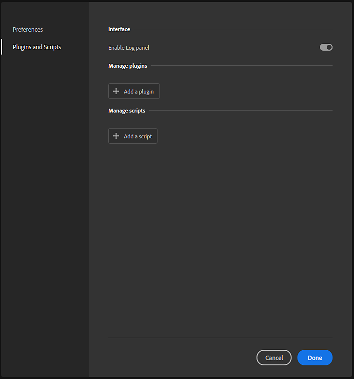
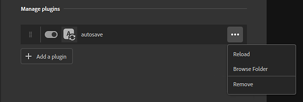
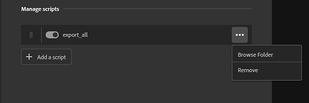

# Manage installed plugins and scripts

To install, modify, or remove plugins use Edit &gt; Preferences, and then select Plugins and Scripts.

From the Plugins and Scripts panel you can enable the Log panel which displays output from plugins. This can be useful for troubleshooting and debugging. Once enabled, you can open the Log panel from the right bar in Sampler's main interface. The Log panel can be docked just like other Sampler panels.

## Plugins versus Scripts

The primary difference between plugins and scripts is that plugins include UI elements where scripts do not. Plugins require at least a PY and a QML file. The QML file defines the UI elements, while the PY file defines the behavior of the plugin. Scripts, on the other hand, only consist of a PY file.

The UI elements of a plugin mean that the behavior of the plugin can be modified through the use of parameters. For example, the example autosave plugin has controls that allow to modify the time between autosaves. Plugins become part of the Sampler interface and can be docked and moved around like standard Sampler panels.

Scripts don't allow for this level of flexibility but instead perform a given task. For example, the Export all script will always behave the same way whenever it is called. Scripts can be accessed from the top menu bar - the Script menu only becomes available once scripts have been added to Sampler.

## Manage plugins

By default, the only available option is to "Add a plugin". This opens a file explorer where you can select a PY file to load.

>[!NOTE]
>
> Plugins require both a PY and a QML file to work. When you select a PY file to import, Sampler will search the folder for a QML file. If no QML file is found, plugin loading will fail.

Once a plugin is installed, a few options become available:

* Plugins can be reordered by dragging the handle on the left side of the plugin.
* Toggle plugins on or off with the toggle switch.
* Use the menu button on the right of each plugin to reload, remove, or open the folder location of the plugin.

Installed plugins will initially appear in the right bar of Sampler's main interface. From there you can open, dock, and move the plugin panel just like standard Sampler panels.

## Manage Scripts

Scripts can be managed similarly to plugins.

Once a script is installed a few options become available:

* Reorder scripts with the handle on the left side of the script.
* Toggle the script on or off with the toggle switch.
* Use the menu button on the right of each script to remove the script, or open the folder location of the script.
* When imported, scripts are copied in **%\AppData\Roaming\Adobe\Adobe Substance 3D Sampler\scripts**
* To edit the script, you should modify the one copied by Sampler
