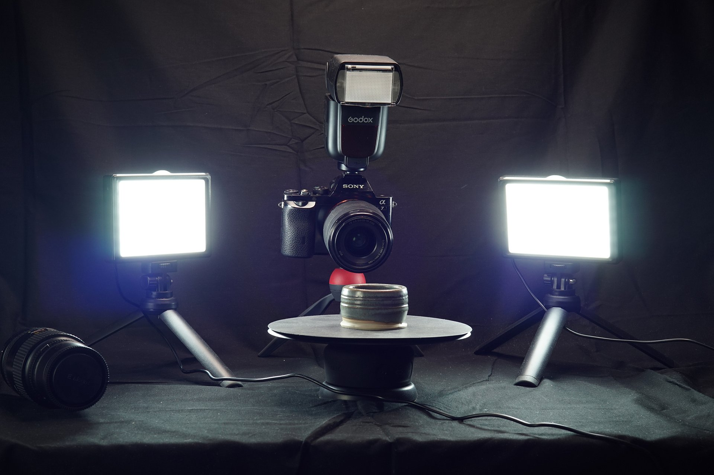

# 3D Capture Lighting

>[!WARNING]
>
> Support for 3D Capture has been removed as of Sampler version 5.1.

## Lighting

If you prefer to learn more about the lighting set up for 3D capture in a video tutorial you can find it [here](https://youtu.be/7mgpmlq6xAc?si=_ubOyBsNFAPrPEmD "lighting for 3D capture video tutorial").

Photogrammetry requires uniform, even lighting.

That isn’t always possible to achieve: if you’re counting on outdoor lighting you could have a bright sun with no clouds, or it could even be raining. Even on a cloudy day you will still get some shadows and light on your object, which can cause issues when flipping an object over. Taking control of your lighting can eliminate these issues. And when you’re using controlled, studio lighting, you won’t just get better models, but also better, more even textures.

## Types of lights

There are many ways to achieve even lighting. The best way is probably to use a<b> powerful ring-flash</b>. These flashes form a ring around your lens, and ensure everything the camera sees is evenly lit. They’re not as common as standard top-mount flashes, and cheaper models can have disadvantages, such as not being able to mount filters, which we’ll talk about in the next part. Big, powerful ring flashes are also very expensive, but some of them are so strong you can even use them in daylight, as they will overpower ambient light.

Instead, we can make do with a combination of a <b>standard flash</b> and some inexpensive <b>continuous video-lights</b>. Standard top-mount flashes are cheaper and easier to find, and still allow for lens filters. Simple video lights are also inexpensive and make it easier to focus and set-up your camera settings. Some brands use different flash connectors, so make sure to choose the right one for your camera.

For video lights there are plenty of inexpensive choices. You shouldn’t go too big, but you do want something that outputs a decent amount of light. It’s also important to get at least 2 lights, as you want to light your object from 2 sides. An inexpensive LED light set with stands can make a good choice here.

You could also skip the flash completely if you get 3 to 4 lights, allowing you to cover more angles. This depends on the complexity of your object, the more holes and crevices it has, the more lights at different angles you might need to fill these evenly.

The ideal setup almost tries to mimick a ring-light: the flash lights from the top, the video lights from the left and right, next to the lens, just out of view.

One more thing that can help achieve even lighting is <b>adding diffusers to your lights</b>. Diffuser can be paper, plastic sheets or caps, that go over your lights. They spread the light out in a more even way, softening shadows. Most flash gun sets come with some kind of diffuser, usually video lights have a diffusing sheet as well. If not, you can always use tracing paper, scissors and sticky tape. It’s not an exact science!

You need to <b>adjust your camera’s exposure settings</b> for the amount of light available to get a properly lit photo. Just like exposure settings are balanced, you can balance your lights too. Low exposure might require more light, and light is generally easier to tweak than camera settings.

## Using a combination of lights

It’s worth pointing out that a flash, is a short, strong flash of light, while video lights emit less light, but they do it non-stop. A flash can be very precisely tweaked, but because your camera can not see the flash’s light until it fires, focusing and tweaking settings is a bit tricky: your display will not show a 100% correct representation of the final photo, as the camera might be increasing the ISO or shutter time, as a preview to mimic the exposure of the final photo.

Because a flash fires for such a short time, it’s also not affected much by shutter time; even if your shutter is open for 1 seconds, the flash only fires for a few milliseconds.

If you’re using a combination of flash lighting, and continuous video light, you can <b>tweak all settings to even lights out</b>. Your flash will probably easily overpower the video lights, so you can tone its strength down. You can also increase the effect of your video light, by increasing shutter time, as they will keep adding light the longer a shutter is open.

There’s not one solution here it will be needed to experiment for your exact case and equipment. The end goal is to simply have <b>uniform, even lighting with a minimum of visible shadows</b>. The automatic photogrammetry system will have an easier time aligning photos, and your textures will come out more even and uniform, like a true PBR basecolor texture.
