# 3D Capture

## Getting Started

## What is photogrammetry?

Sampler is using photogrammetry to transform images into a mesh with textures. Photogrammetry is the science of making measurements from images. It is used to extract information from photographs, to create 3D models and textures. The process involves taking multiple photographs of an object from different angles, and then processing the images to extract information about the shape and location of features in the images.

The goal is to match corresponding features between the images to establish the relative positions of the camera for each image. From the matched features, a 3D model of the object is reconstructed. The final step is to project the textures onto the 3D model.

## Hardware requirements

The 3D Capture is available on Windows and MacOS Monterey or Ventura.

Windows/Linux

We recommend:

* GPU with 8Gb of VRAM
* 16Gb of RAM. Ideally, 32Gb and 64Gb.
* Minimum of 10Gb of disk space

[Linux configuration](https://helpx.adobe.com/substance-3d/unlisted/documentation/sadoc/3d-capture-set-up-on-linux-255426606.html)

Mac

* Apple Silicon devices are strongly recommended (M1 or M2)
* Intel-based and AMD GPU with at least 4Gb of VRAM and raytracing support

## Start a new 3D capture

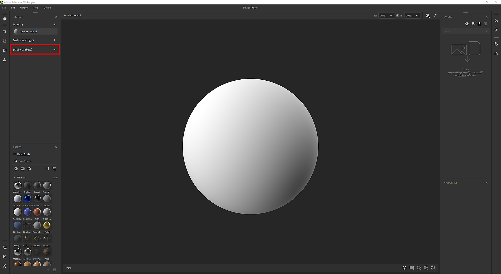

## Import your dataset

## Dataset Preparation

Drag and drop your photos or click to browse your OS explorer.

>[!NOTE]
>
> **Dataset recommendations**
> 
> We recommend to have a dataset that contains at least <b>20 images</b> for the 3D Capture to run smoothly.

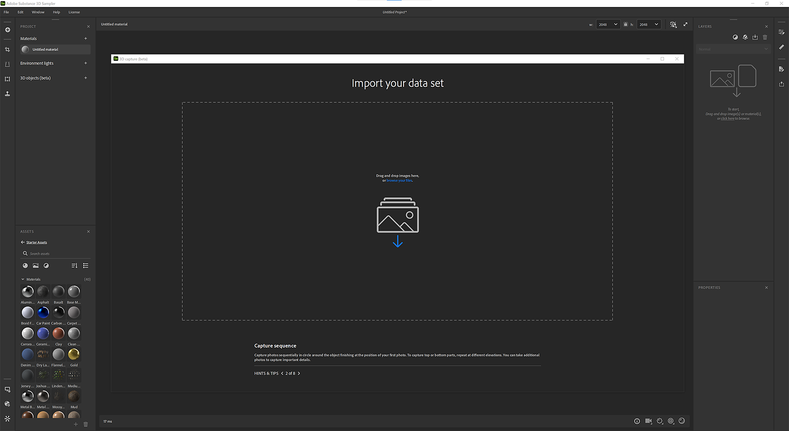

For iPhone users, .HEIC format is not yet supported. You can use Lightroom to convert to .jpeg.

On MacOS, you can use [Quick Actions](https://support.apple.com/en-gb/guide/mac-help/mchl97ff9142/mac) to convert your images.

For cameras RAW formats, we recommend to use Lightroom to convert your photos into .jpeg.

>[!NOTE]
>
> **Dataset limitations**
> 
> **Windows**: Your dataset has to be smaller than 6G pixels (6 000 000 000 pixels) in total. It represents 500 photos of 12M pixels

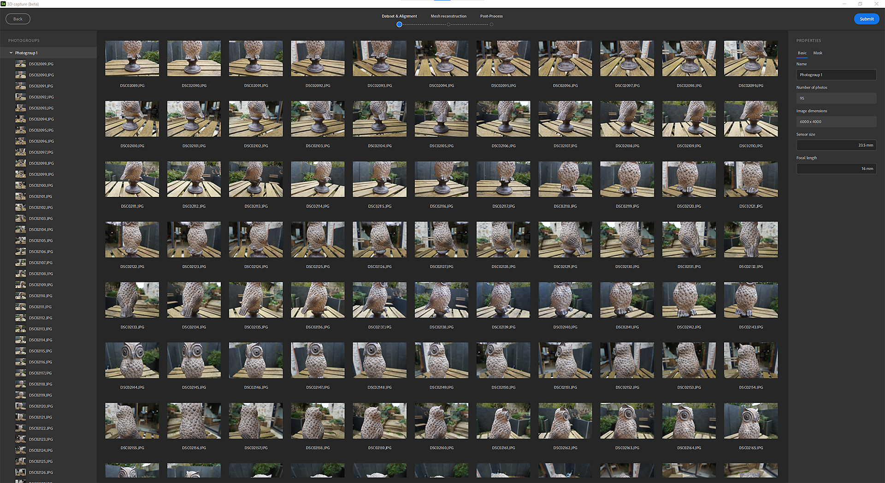

Once the photos are imported, you can click on a photo to see it in full.

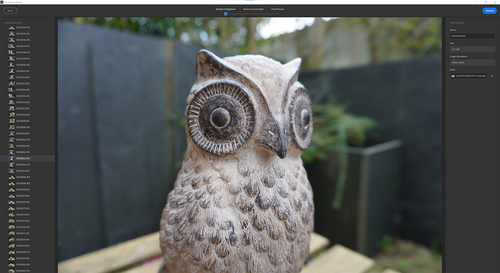

Photogroup definition:

Your dataset can be splitted in several photogroups. Photogroups group photos by properties (sensor size, focal length, rotation,…)

## Masking

Using masks has many advantages. It allows the photogrammetry process to detect features and reconstruct only non-masked areas.

This allows also to move the object during the capture as the masks will hide background in all photos.

To use masks, select a photogroup and open the **Mask** tab on the right.

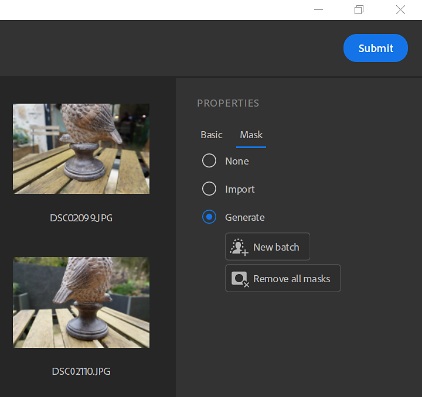

You can import masks by respecting a naming convention:

* &#91;image\_name&#93;.file\_extension
* &#91;image\_name&#93;\_mask.file\_extension

You can automatically generate masks by photos using our AI-powered technology.

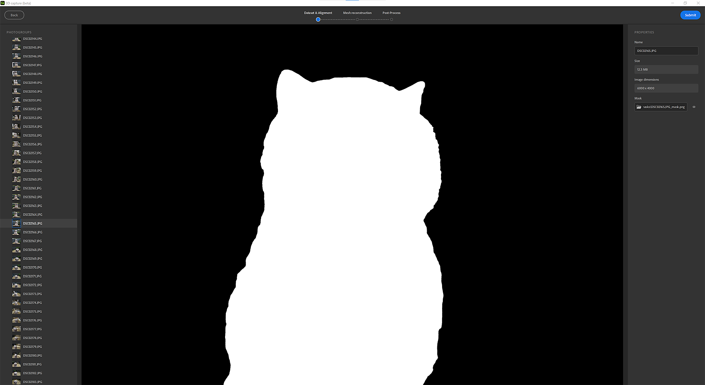

## Alignment

The alignment is to process all images to extract and match corresponding features to establish the relative positions of the camera for each image.

## Settings

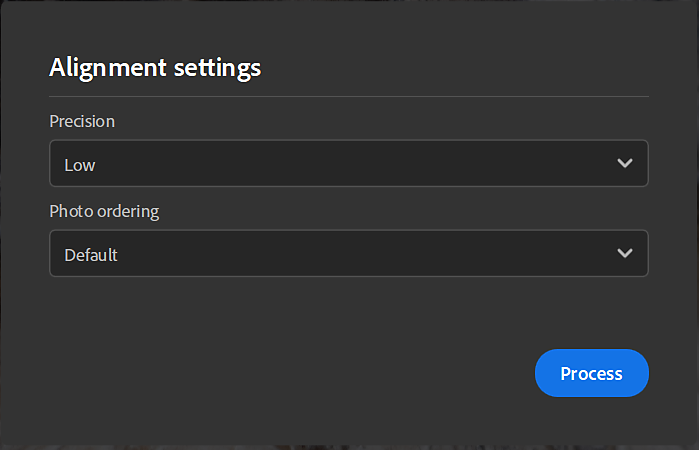

Precision

There are two options, low and high.

* Low: advised for most datasets.
* High: increase the number of points, advised to match more photos in cases where the subject has insufficient texture or the photos are small. This setting makes the processing slower. We recommend you to try low option first.

Photo ordering

There are two options, default and sequence.

This may be computed using different feature matching algorithms:

* Default: selection is based on several criteria, among which similarity between images.
* Sequence: use only neighbor images within the given distance, advised for processing a single sequence of photos if the Default mode has failed. The photo insertion order must correspond to the sequence order.

## Points cloud and cameras position

The result of the alignment step is a sparse point cloud with all features detected and the position of all cameras.

If the image outline is green, the image was correctly aligned.

If the image outline is orange, the image was not correctly aligned and no feature was extracted from this image.

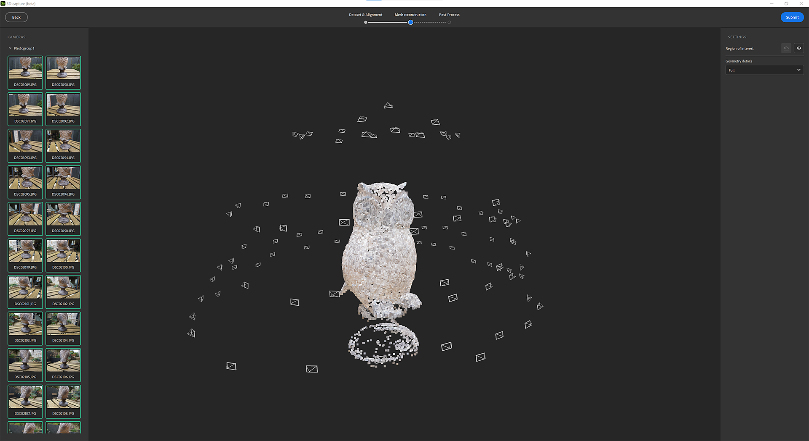

You can click on image on the left panel to frame the points cloud on the associated camera.

You can click on a camera to frame the points cloud on it.

## Reconstruction

The reconstruction step generates a 3D model of the object from the matched features as projecting the textures onto the 3D model.

## Setting

Geometry details This option specifies the precision level in input photos, which results in more or less detail in the computed 3D model.

## Region of interest

Before generating the 3D model, you can set the region to reconstruct around the point cloud with the bounding box.

You can translate, scale and rotate the box in the 3 axis.

By pressing Shift while scaling, you will scale the box from the center.

<table>
<tr style="border: 0;">
<td style="border: 0;" valign="top">

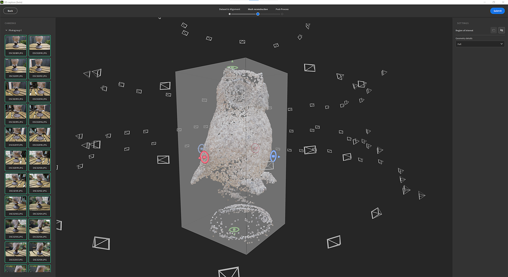

</td>
<td style="border: 0;" valign="top">

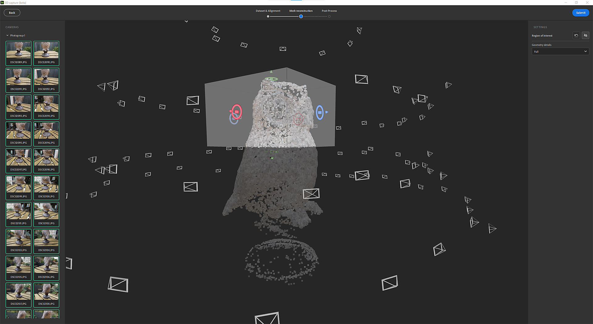

</td>
</tr>
</table>

## Post-processing

The post-processing helps you to adapt and optimize your mesh and textures to your needs and how you want to use it.

The result of the reconstruction can generate a mesh with millions of polygons and up to 16K textures. This often won’t be optimized for rendering, realtime or AR experience.

You will need to post-process the result to reduce the number of polygons without losing details.

The post-processing step chains 4 steps automatically:

* Decimation: Reduce the number of polygons by defining the number of faces you want
* UV unwrap: Automatically defines seams, unwrap and package UVs of the decimated mesh
* Reprojection: Reproject the color texture of the photogrammetry mesh onto the decimated mesh
* Baking: Bake normal, height and AO details from the photogrammetry mesh onto the decimated mesh. This will ensure to transfer all mesh details lost during the decimation into texture maps.

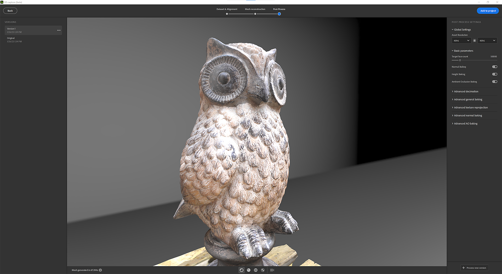

## Version

To easily iterate and test different post-process options, you can create several versions and select the one to add to your project.

To help you, you can visualize the mesh in different mode.

Solid mode

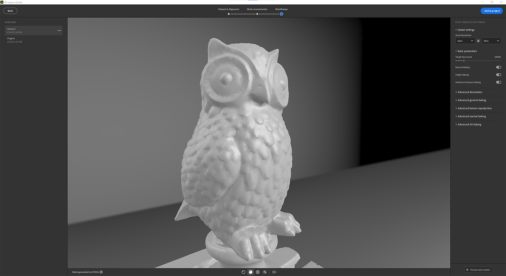

Wireframe mode

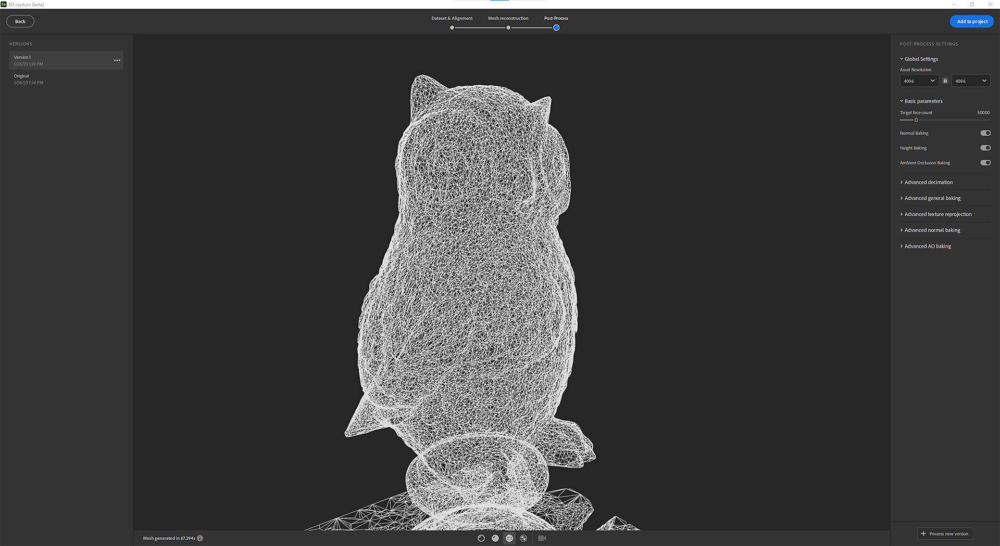

UV Grid mode

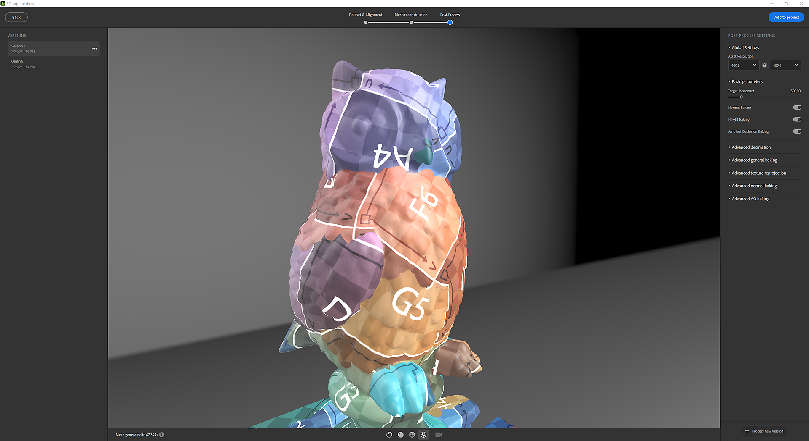

## Non-destructive workflow

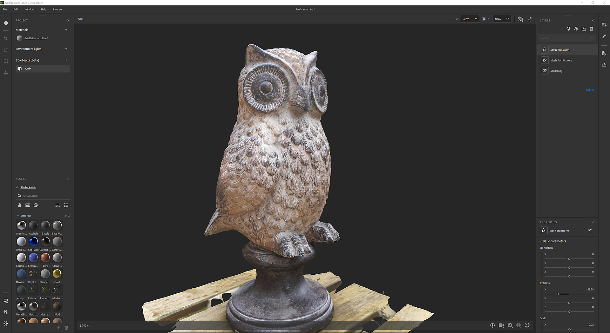

Once a version added to the project, a layer stack is created with several layers.

The first layer is the reconstruction result.

The second layer (if you did some post-process) is the mesh post-processing layer with the values defined in the 3D Capture window. You can still edit the parameters at this step if you want to use other settings.

The third layer is a mesh transform layer to scale, translate and rotate your 3D object.

At this stage, you can add filters you’re used to apply on materials to edit the textures on the 3D object.

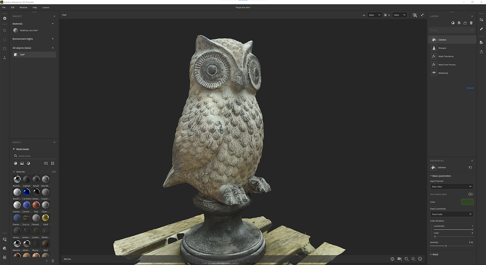

## Export

In the export window, you can define the mesh format and material settings (same settings when you export a material).

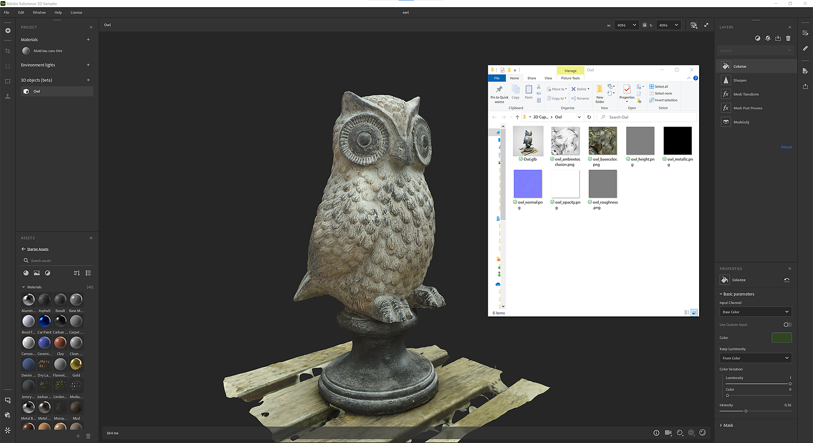

## Tutorials

[Go to Advanced Tutorials](https://substance3d.adobe.com/tutorials/courses/Advanced-3D-Capture/youtube-f8iCtZ3Gmzs)

## FAQ

**What are the best capture conditions for photogrammetry?**

For photogrammetry to produce accurate results, it's important to follow certain best practices when capturing images.

1. Lighting: Photogrammetry works best when images are captured in good lighting conditions. Avoid taking images in low light or high contrast lighting, as these can make it difficult to accurately extract features from the images. The best lighting conditions for photogrammetry are overcast days or shaded areas.
1. Overlap: To ensure that there is enough information in the images to accurately extract features, it's important to capture images with significant overlap. A general rule of thumb is to have at least 60% overlap between images, both horizontally and vertically.
1. Camera: Use high-resolution camera and lens which good image quality and sharpness. Avoid using cameras with fish-eye lens or wide angle lens as it can cause geometrical distortion which can affect the final results.
1. Orientation: When taking images, try to keep the camera level and perpendicular to the ground. Images taken at an angle can make it difficult to accurately extract features and may lead to distorted results.
1. Camera calibration : Make sure the camera is calibrated prior to taking images. This process allows to correct lens distortion, and other errors that can affect the accuracy of the final results.

**How does it work for specular and reflective objects?**

Photogrammetry can be challenging when working with highly specular or reflective objects, as the bright reflections can make it difficult to extract features from the images. Here are a few strategies that can be used to overcome these challenges:

1. Lighting: When capturing images of highly reflective objects, try to avoid direct sunlight and instead capture images in overcast or shaded conditions. This can help to reduce the intensity of reflections and make it easier to extract features from the images.
1. Matte finish: Applying a matte finish to the reflective surfaces can help to reduce the intensity of reflections and make it easier to extract features from the images.
1. Capture multiple images: Capturing multiple images of the same object from different angles can help to reduce the impact of reflections and increase the chances of being able to extract features from at least some of the images.
1. Image editing: In post-processing, certain image editing software like Lightroom can be used to reduce reflections and enhance features in the images, such as increasing the contrast, or color correction.

Keep in mind that reflective objects may need more elaborate setup and treatments, and it may not be possible to get perfect results in all cases. It's a good idea to experiment with different techniques.

**What is the recommendation between a mobile phone and DSLR camera for photogrammetry?**

Both mobile phones and DSLR cameras can be used for photogrammetry, but they have different strengths and weaknesses. Here are a few things to consider when deciding which type of camera to use:

1. Resolution: DSLR cameras typically have much higher resolution than mobile phones, which can lead to more detailed and accurate results. However, with recent advancement in mobile phone camera, some high-end mobile phone cameras have comparable resolution and image quality to some lower-end DSLR cameras.
1. Camera calibration: Photogrammetry relies on accurate camera calibration, which is typically more difficult to achieve with mobile phone cameras than with DSLR cameras. Some mobile phone camera have built-in calibration parameters that you can use, but it may not be as accurate as a proper calibration of a DSLR camera.
1. Battery life and storage : Mobile phone cameras have a more limited battery life compared to DSLR cameras. Therefore, you'll have to plan on charging the phone or carrying extra batteries while working. Additionally, you need to make sure that the phone has enough storage capacity to handle large image files.
1. Cost: DSLR cameras are generally more expensive than mobile phones, and they also require additional accessories, such as tripods and external flash units.
1. Portability: A mobile phone is more portable than a DSLR camera, and it's more likely that you'll have your phone with you when you come across an interesting object or scene that you want to capture for photogrammetry.

In summary, it really depends on your specific needs and the characteristics of the project. For lower resolution projects, a mobile phone may be sufficient. However, if high accuracy and high resolution is needed, a DSLR camera may be a better choice. Additionally, if you are planning to take photos on a regular basis or for a long-term project, investing in a DSLR camera may be a more cost-effective solution in the long run.

**How should I calibrate my camera to limit the blur on my object ?**

Camera calibration is an important step in the photogrammetry process that helps to correct for lens distortion and other errors that can affect the accuracy of the final results. Here are a few steps you can take to calibrate your camera and limit blur on your object:

1. Use a tripod: To keep the camera stable and reduce blur, it's important to use a tripod when capturing images for photogrammetry. This will ensure that the camera is in the same position for each shot and will help to minimize camera movement.
1. Use a remote shutter release: To further reduce camera movement, you can use a remote shutter release or self-timer function on the camera to take the images. This will help to minimize any camera shake caused by pressing the shutter button.
1. Adjust the shutter speed: To reduce blur caused by camera movement, you should use a fast shutter speed. A general rule of thumb is to use a shutter speed that is at least as fast as the reciprocal of the focal length of the lens. For example, if you're using a 50mm lens, you should use a shutter speed of at least 1/50th of a second.
1. Use a high ISO: In low light conditions, you may need to use a higher ISO to maintain a fast shutter speed and reduce blur. However, keep in mind that a high ISO can also increase noise in the image, which can affect the accuracy of the final results.
1. Use a flash: In some situations, using a flash can help to reduce blur caused by low light. Keep in mind that flash can also cause reflections and other issues in some cases, so be sure to experiment with flash and non-flash shots to see which works best for your specific application.

Remember that calibration is an iterative process and might require multiple attempts to achieve good results.

**Can I move the object during the capture for photogrammetry?**

In most cases, it is not recommended to move the object during the capture for photogrammetry. The process of photogrammetry relies on the object being in a fixed position for each image, as the software uses the relative positions of features in the images to reconstruct a 3D model of the object.

If the object is moved during the capture, it will appear in a different position in each image, making it difficult for the software to match corresponding features between images. This can lead to inaccuracies in the final 3D model and can also make the image matching step difficult or impossible.

However, there are some cases where moving the object can be beneficial. For example, in the case of small objects, where it is difficult to take images with significant overlap, it's possible to use a turntable and rotate the object to ensure that all features are captured from multiple angles.
