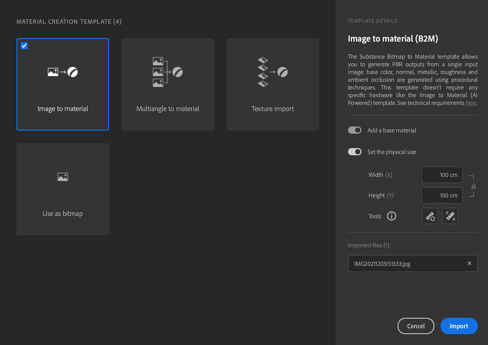
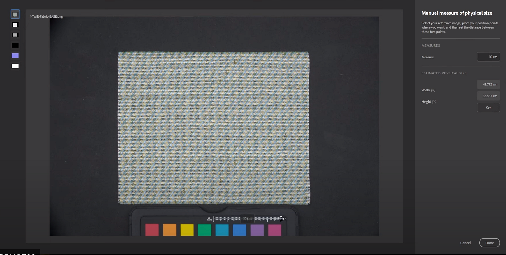

# End to end Physical Size Workflow

Match the real-life physical size of your scanned samples and images in a digital context to create physically accurate visuals across applications.

## Import scans

1. Select the material creation template.
1. Check physical size check box.

   
1. Two approaches to set the Physical Size:

   3a. Click manual measure - Measure tool allows you to calibrate the physical size between 2 features of the sample.  
    Track between two points -&gt; enter

   

   3b. Auto measure - Auto measure tool allows you to get an estimated physical size of your sample based on the image metadata (dpi). It is faster but works only with scans, as it uses the stored dpi to calculate a precise starting size.

   <b>You can now process the scans</b>
1. Add a crop and adjust it to the sample. You can see the physical size displayed at the bottom right corner of the 2D Viewport updated.

   Display with physical ratio in the 2D viewport to see accurately the maps you are working on.  
   You can set the 2D view to fit physical size so the DPI of your screen ratio will match your material scale. In other words, you can put your real sample next to your screen to verify the dimensions.

   
1. Add an Equalize to get rid of any gradients.
1. Add Tiling to correct the tiling seems
1. If needed warp transform is useful to realign only parts of the map.

   <b>Ready to export</b>
1. Export as

   Select Sbsar format, Sampler will put Physical Size into it, as a metadata. It will allow other applications to read and use this information too.  
   You can also export images; it will respect the physical size ratio.

   If you need to use the physical size at any point, use the *Physical size Panel*.

   When exporting as images, it is now possible to force the size of the images to respect the physical size ratio.

## Video Tutorial

You can also find video tutorials to help you get through this feature:
