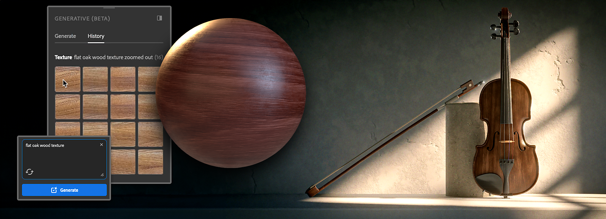

# Generative workflows

Substance 3D Sampler helps you iterate quickly and try out new ideas easily with three generative features currently in beta, Text-to-Texture, Text-to-Pattern and Image-to-Texture.

## Text-to-Texture

Text-to-Texture allows you to quickly try out ideas you have in order to generate textures from a text prompt.

To use Text-to-Texture:

1. Open the <b>Generative (Beta) </b>panel from the left-hand toolbar.
1. Choose “<b>Texture</b>” in the Type dropdown list.
1. Write a text prompt that describes the texture you want to create.
1. Use <b>Generate</b> to begin generating textures. Each use of the feature will generate four variations.
1. You can either drag-and-drop the result you want in the 3D or 2D views to open the <b>material creation template</b> or <b>add it to the layers</b> via the dedicated button. You can also add the result to your <b>Assets</b> to find it easily later.

You can then use the result as you would with any other texture, for example run Image-to-Material and add additional filters on top of it.

### Text-to-Pattern

Text-to-Pattern allows you to quickly generate patterns from a text prompt, so they can be applied on any surface you like.

To use Text-to-Pattern:

1. Open the <b>Generative (Beta) </b>panel from the left-hand toolbar.
1. Choose “<b>Pattern</b>” in the Type dropdown list.
1. Write a text prompt that describes the pattern you want to create.
1. Use <b>Generate</b> to begin generating patterns. Each use of the feature will generate four variations.
1. You can add it as an input of a <b>pattern filter</b> or directly to the <b>layers</b> via the dedicated buttons. You can also add the result to your <b>Assets</b> library to find it easily later.

#### Image-to-Texture

<b>Image-to-Texture</b> creates four propositions of <b>square and tiling textures</b> from any <b>reference image</b>, no matter the ratio. It can allow you to <b>generate variations</b> of textures you already have, or to create ready-to-use textures from reference images you own.

To use Image-to-Texture:

1. Open the <b>Generative (Beta) </b>panel from the left-hand toolbar.
1. Choose “<b>Texture</b>” in the Type dropdown list.
1. Drag-and-drop your <b>image in the text field</b> or click on the “Add image” icon to open your file explorer and select the image you want to use as reference.
1. Use <b>Generate</b> to begin generating textures inspired by your reference image. Each use of the feature will generate four variations.
1. You can either drag-and-drop the result you want in the 3D or 2D views to open the <b>material creation template</b> or add it to the <b>layers</b> via the dedicated button. You can also add the result to your <b>Assets</b> to find it easily later.

## Tips for writing texture or pattern prompts

Add to the input field <b>words or expressions</b> that describe the <b>texture</b> or <b>pattern</b> you want to generate. Being specific will give you more control over the generated results.

To <b>exclude</b> one or several specific prompts, you can add up to 10 words or expressions to avoid while processing your prompt. Write “<b>--no</b>” before the words or expressions you want to exclude. 

You can also use the <b>Samples</b> in the Generative (Beta) panel to get started exploring prompt ideas.

## Generative credits

The Sampler generative features do not use credits while the features are in beta.

Please see the <b>generative credit FAQ</b> for the latest information on how generative credits work across Adobe tools.
