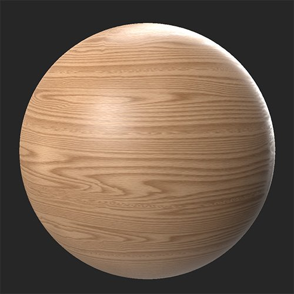
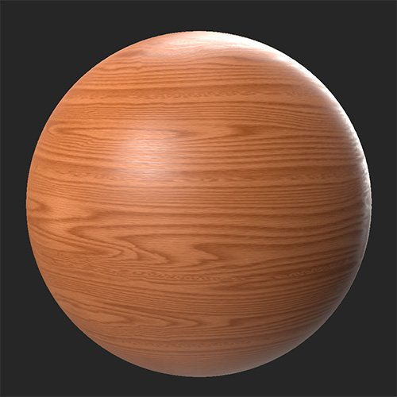

# Colorize

<table>
<tr style="border: 0;">
<td width="41.60%" style="border: 0;" valign="top">

**In:** Adjustments

</td>
<td width="58.30%" style="border: 0;" valign="top">

## Description

Colorize lets you add color to a selection of channels without losing detail.

>[!NOTE]
>
> While the Colorize filter lets you modify the normal channel, it's not a good idea to do so unless you have a good understanding of how the normal channel works and what the impact will be on your material. This is an advanced function that should generally only be needed in specific circumstances.

In these images the **Colorize filter** has been used to adjust the base color to produce a much richer wood material.

<table>
<tr style="border: 0;">
<td style="border: 0;" valign="top">

{width="200px"}

</td>
<td style="border: 0;" valign="top">

{width="200px"}

</td>
</tr>
</table>

</td>
</tr>
</table>

## Parameters

**Basic parameters**

The parameters available in this section change based on **Channel Selection**.

* **Channel Selection**:  
  Select the channel that the filter will affect. It's a good idea to view the selected channel in the 2D view to directly see the results of the filter.  
  * ***Base Color/Emissive options***
    * ***Channel Name*** **- Color**: color select  
      Select the color used to colorize the channel
    * ***Channel Name*** **- Keep Luminosity**: toggle  
      If enabled, the Lightness or Luminosity values from the original colors will be maintained
    * ***Channel Name*** **- Intensity**: 0-1  
      Adjust the strength of the Colorize effect.
  * ***Normal Channel options***
    * **Normal - Slope Angle**: 0-90  
      Modify the gradient of the normal
    * **Normal - Direction**: 0-360  
      Adjust the direction the normal faces
    * **Normal - Keep Luminosity**: toggle  
      If enabled the luminosity from the original normals will be maintained
    * **Normal - Intensity**: 0-1  
      Adjust the strength of the Colorize effect.
* **Custom Mask**: toggle  
  Enable or disable the use of a custom mask. If enabled the following parameters appear:
  * **Mask**: image/brush  
    Select an image to use as a mask or use the brush to paint a custom mask directly in the 2D view
  * **Custom Mask - Blur**: 0-1  
    Blur the mask
  * **Custom Mask - Invert**: toggle  
    Invert the mask
