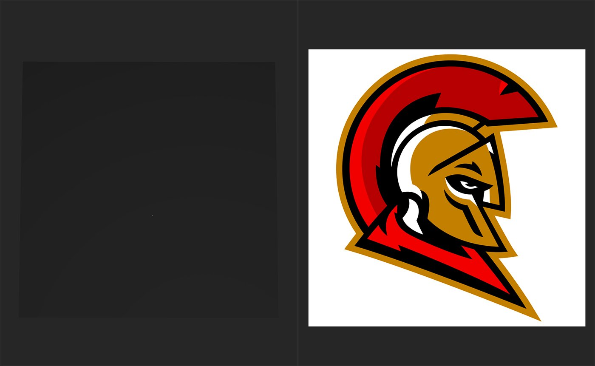
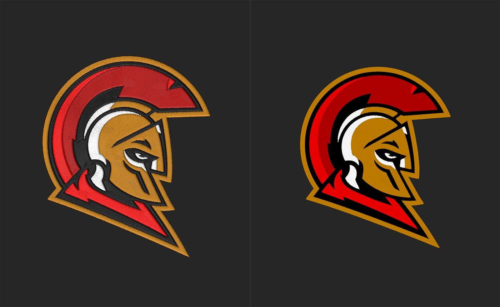

# Embroidery

<table>
<tr style="border: 0;">
<td width="41.60%" style="border: 0;" valign="top">

**In:** Generators

</td>
<td width="58.30%" style="border: 0;" valign="top">

## Description

The Embroidery filter allows you to quickly convert images into embroidered patches. You can customize the patches appearance, and use the color management tools to act as a mask for multiple materials.

The images below shows the **Embroidery filter** in action.

In the image above, the source image has been imported. Note that the image is opaque and has a white background.

In the image above, the **Embroidery filter** has been added to the layer stack and has converted the source image into an embroidered patch. Note that while the source image was opaque, the output of the **Embroidery filter** has transparency.

</td>
</tr>
</table>

## Tajima embroidery plugin

Interested in trying out the Tajima embroidery plugin?   
Learn more about it [here](../../../pipeline-and-integrations/tajima-exporter-plugin/tajima-exporter-plugin.md).

## Parameters

<b>Basic Parameters</b>

* <b>Random Seed</b>:  
  The random seed that all other random parameters in this filter is based on.
* <b>Image</b>: image/mask  
  Select an image from your system, or paint a custom mask.
* <b>Color Count</b>: 1-8  
  The embroidery filter will try to break up imported images into separate colors - modify this value to change the number of colors used.
* <b>Density</b>: 80-300  
  Select the density of fibers.
* <b>Design</b>: Fill, Outline, Fill + Outline, Topstitch  
  Select the embroidery mode: *Fill* fills all the color zone, *Outline* creates an outline of the color zone, *Fill + Outline* create both on each color zone and *Topstitch* creates a toptstich outline of the color zone.
* <b>Fill/Outline: </b>0-1  
  Change the way the fibers are distributed in the color zone.
* <b>Thread</b>:  
  Adjust the Thickness and length of threads.
* <b>Smooth Areas: </b>0-1  
  Even out the color zones and impact the threads behaviour.
* <b>Imperfections</b>: 0-1  
  Add imperfections to the thread to help break up the pattern

<b>Color 1</b>

Use the controls to adjust each color zone individually.

* <b>Fill</b>: toggle  
  Make the color zone visible or unvisible.
* <b>Height</b>:   
  Offset the orientation of the threads

<b>Stitch Finish</b>

* <b>Custom Color:</b>  
  Customize the color of the whole Embroidery
* <b>Roughness: </b>0-1  
  Change the Roughness value to make the Embroidery rough or glossy.
* <b>Metallic: </b>0-1  
  Change the Metallic value to add a metallic feel to the threads.
* <b>Anisotropy Level: </b>0-1  
  Change the Anisotropy Level to accentuate the Metalness.

<b>Advanced</b>

* <b>Normal Intensity</b>: 0-1  
  Adjust the strength of the normals.
* <b>Height Range:</b> 0-1  
  Adjust the Height position of the Embroidery on the base material.
* <b>Height Position:</b> 0-1  
  Adjust the Height position of the Embroidery on the base material.

## Usage Guide

The Embroidery filter can be a little confusing at first, but with just a few important parameters to get started you'll be adding patches to your materials in no time.

>[!NOTE]
>
> If you've used the [Weave ](../weave/weave.md)filter before, the Embroidery filter works in a similar way.

To use the Embroidery filter:

1. Add the Embroidery filter to your layer stack.
1. Use <b>Basic parameters &gt; Image</b> to add an image to the filter, or add an image to the layer stack underneath the Embroidery filter (not in one of the input slots). If an image is not added to <b>Basic parameters &gt; Image</b>, the filter automatically picks up images from the Scan channels if available.
1. Adjust <b>Basic parameters &gt; Color Count </b>until the color balance looks correct for your image. With a limit of 8 colors, enable or disable colors to isolate the colors you need.  
   The Embroidery filter works best with flat colors and illustrated images.
1. Adjust other parameters to fine tune the appearance of your patch.

It's possible to use transparent images in the Embroidery filter, but by default these will also impact the opacity map of your material - transparent parts of the image will make the material transparent too. To create a patch with the Embroidery filter and have it sit on top of the layers below it, use the Decal filter.

1. Create a Decal filter.
1. Add the Embroidery filter to the Decal filter's input slot.
1. Follow the normal steps to adjust the Embroidery pattern.

The Decal layer converts the Embroidery input into a Decal - so the Embroidery layer's transparency tells the decal layer how to mask out the Embroidered pattern. With the Decal layer you can also move the pattern around on your material or enable functionality like tiling.
