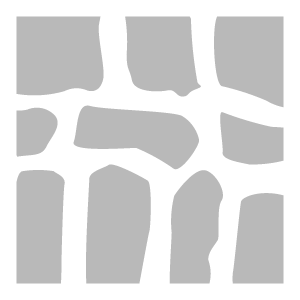

# Stonewall

<table>
<tr style="border: 0;">
<td width="41.60%" style="border: 0;" valign="top">

**In:** Generators

</td>
<td width="58.30%" style="border: 0;" valign="top">

## Description

Use the Stonewall filter to quickly embed your material into an old stone wall.

</td>
</tr>
</table>

## Parameters

**Basic parameters**

* **Random Seed**:   
  The random seed that all other random parameters in this filter is based on.
* **Stone Pattern**:   
  Select which pattern is used to arrange the stones
* **Stones Amount**: 4-18  
  Adjust the number of stones to break the material into
* **Stone Roundness**: 0-1  
  Control the wear of the stone's edges
* **Stones Flatten Amount**: 0-1  
  Adjust the relative height of the stones to the mortar between the stones
* **Mortar Thickness**: 0-1  
  Adjust how much space there is between stones
* **Mortar Height**: 0-1  
  Increase or decrease the height of the mortar between stones
* **Mortar Color**: color select  
  Adjust the color of the mortar between stones
* **Grime Amount**: 0-1  
  Change the amount of grime and dirt applied to the material
* **Grime Color**: color select  
  Select the color of the grime

**Advanced Parameters**

* **Normal Intensity**: 0-3  
  Control the strength of the normals for the entire material.
