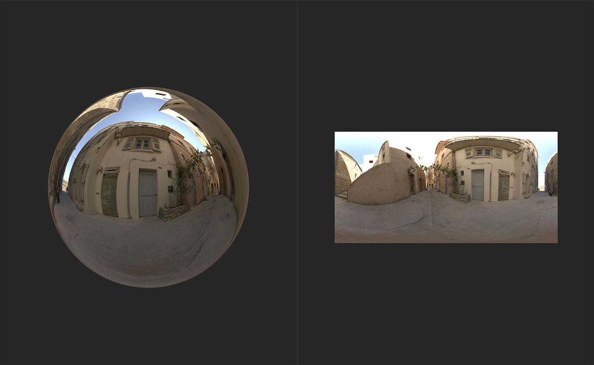

# Exposure

<table>
<tr style="border: 0;">
<td width="41.60%" style="border: 0;" valign="top">

**In:** HDRI Tools

</td>
<td width="58.30%" style="border: 0;" valign="top">

## Description

Modify the exposure of your environment light.

The images below show how the **Exposure filter** can be used to adjust your environment lights.

The image above shows the environment light before the **Exposure filter** has been added.

With the **Exposure filter**, the exposure of the environment has been increased, making it appear much brighter. As a result more light reflects off the sphere in the **3D view**.

</td>
</tr>
</table>

## Parameters

**Basic parameters**

* **Exposure (EV)**: -8 to 8  
  Adjust the exposure of your environment light. EV stands for Exposure Value, and is a photography term used to represent the combination of shutter speed and aperture.
