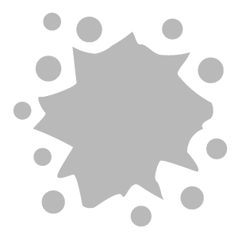
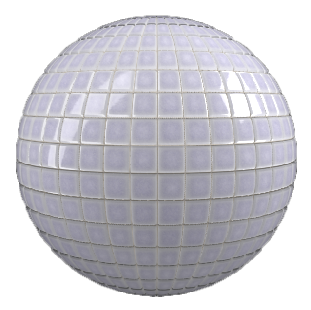
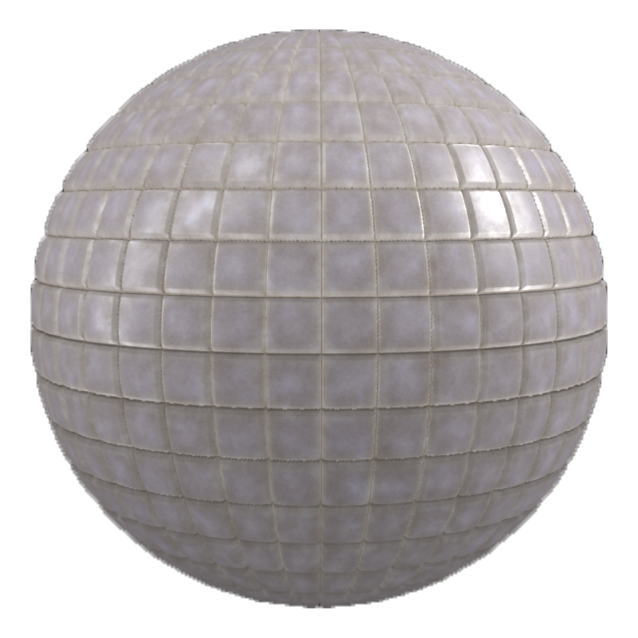

# Dirt

<table>
<tr style="border: 0;">
<td width="41.60%" style="border: 0;" valign="top">

**In:** Wear and Finish

</td>
<td width="58.30%" style="border: 0;" valign="top">

## Description

Use the **Dirt filter** to add dirt on top of a material. The **Dirt filter** is great for making materials seem older and uncared for.

Compare the clean tiles above with the dirt filter applied to them below.

</td>
</tr>
</table>

## Parameters

<b>Basic parameters</b>

* <b>Random Seed</b>:   
  The random seed determines the random values of other parameters that use randomness in this filter.

* <b>Dirt Spread</b>: 0-1   
  Controls the extent of the surface area covered by dirt

* <b>Top Dirt Spread</b>: 0-1  
  Controls the top surface covered by dirt, with no focus on the creases of the material

* <b>Dirt Contrast</b>: 0-1   
  Adjust the level of contrast between the different dirt specks in order to control how the dirt blends with the underlying material.

* <b>Dirt Opacity</b>: 0-1   
  Controls the level of transparency of the dirt in the base color channel. 1 is completely opaque.

* <b>Dirt Color</b>: 0-1   
  Select the color of the dirt.

* <b>Dirt Roughness</b>: 0-1   
  Adjust how light scatters across the surface of the material

* <b>Dirt Metallic</b>: 0-1   
  Define how reflective the surface of the dirt is

* <b>Dirt Height</b>: 0-1   
  Controls the impact of the dirt on the Height map

* <b>Dirt Normal Intensity</b>: 0-1   
  Controls how much the level of dirt impacts the Normal map

* <b>Use Surface Imperfections</b>: toggle   
  Enable or disable the use of a surface imperfection. If enabled, an additional control appears:

  <b>Surface Imperfections</b>: image   
  Import an image to use as a surface imperfection or use one of the texture generators available by default in the Sampler asset library such as “Stain” or the “Bnw Spots”
