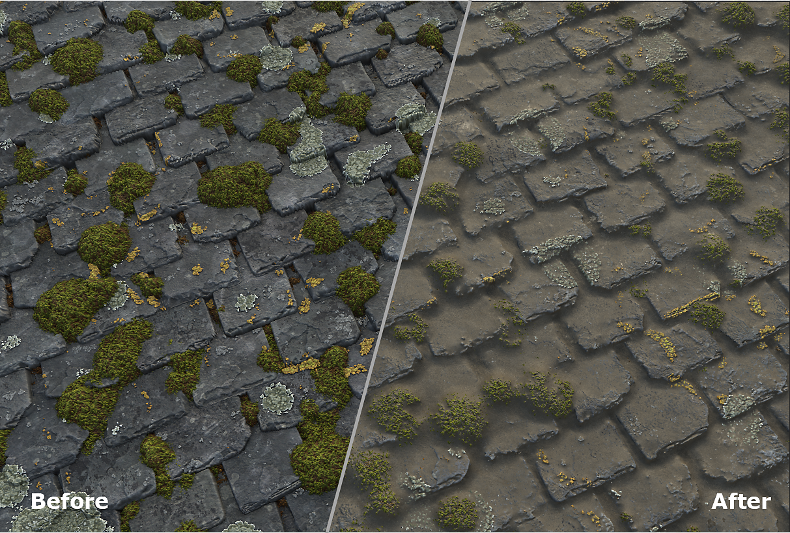
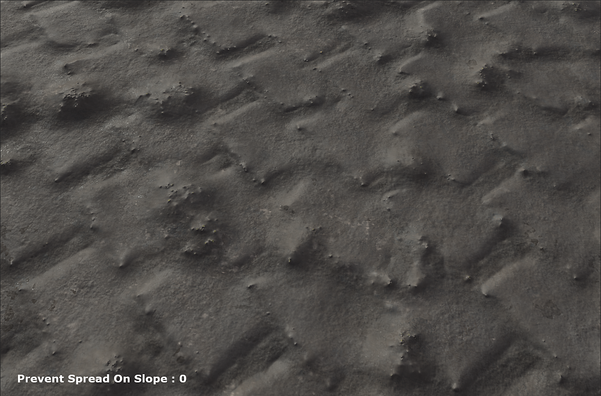
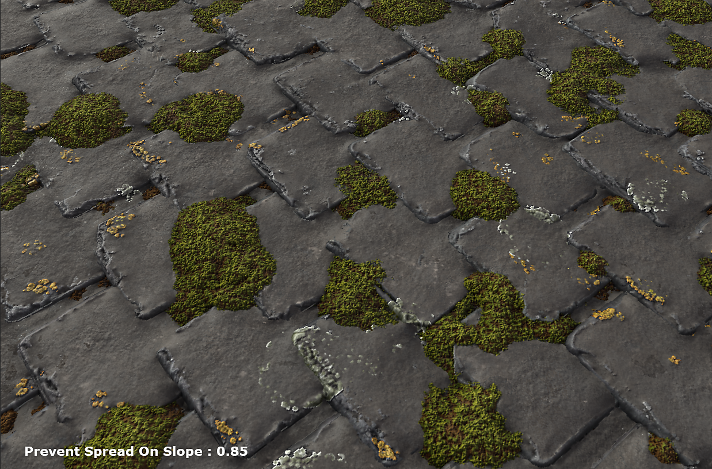

# Dust

## Presentation

The Dust Splatter Layer is used to add dust to a material and define how the dust spreads.

## Usage

### How to use it?

* Add a Dust Splatter Layer
* Set the quantity, the spread contrast and the color to get the desired effect

#### When to use it?

The Dust Splatter can be added on top of a material. You can use it to smooth the cavities or make the different elements of a material work together.

#### Parameters

* Dust quantity: Defines the quanityt of dust you will add
* Dust Depth: Define the depth of the dust
* Spread Contrast: Defines the sharpness of the dust transition.
* Prevent Spread on Slope: Prevents the Dust from being spread on slope

<table>
<tr style="border: 0;">
<td style="border: 0;" valign="top">

</td>
<td style="border: 0;" valign="top">

</td>
</tr>
</table>
