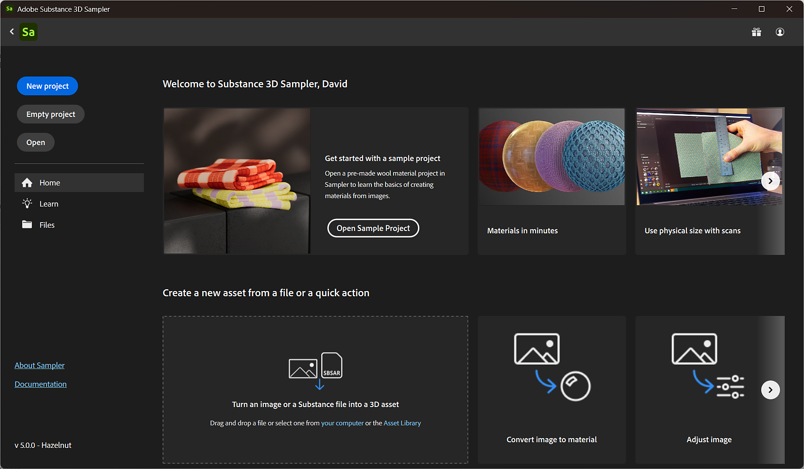

# The Home Screen

When you open Sampler, the <b>Home Screen</b> will appear. The <b>Home Screen</b> has a number of options to help you get started with a new or existing Sampler project.

1. <b>New project</b>: Create a new project by importing a file and choosing from a collection of Quick actions.
1. <b>Empty project</b>: Create a new empty project.
1. <b>Open</b>: Open a project with your system's file browser.
1. <b>Home</b>: Access recommended tutorials, create a new project, or view a list of recent projects.
1. <b>Learn</b>: Access Sampler's video tutorials and learning content.
1. <b>Files</b>: View a list of recently opened projects.
1. <b>About Sampler</b>: Find out more about your version of 3D Sampler.
1. <b>Documentation</b>: View the documentation and expand your abilities.

When you open or start a new project, the <b>Home Screen</b> will disappear so you can start creating assets. You can open the <b>Home Screen</b> again from the <b>File menu</b>.
