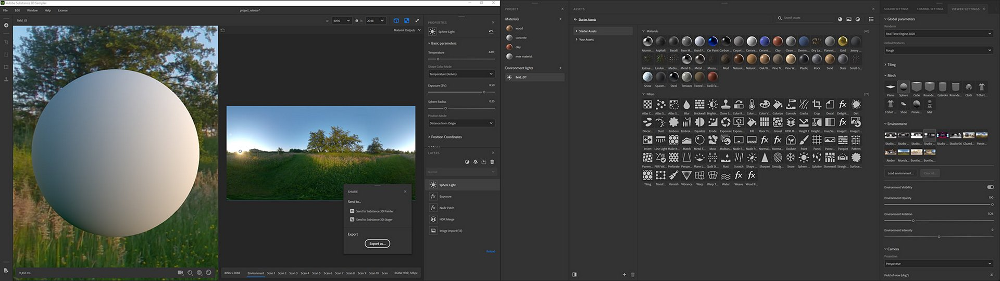
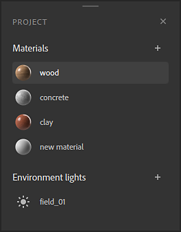
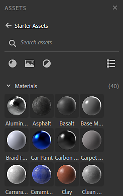
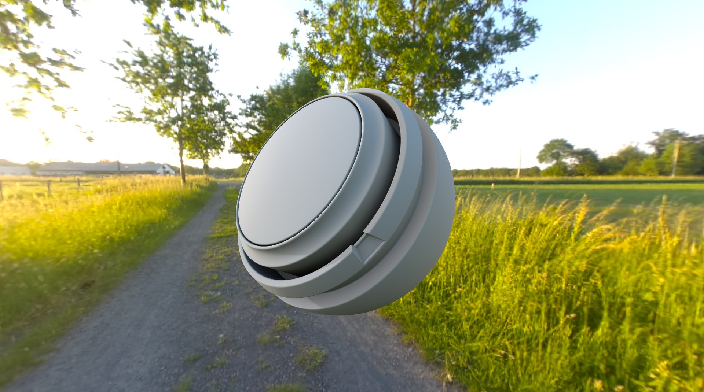
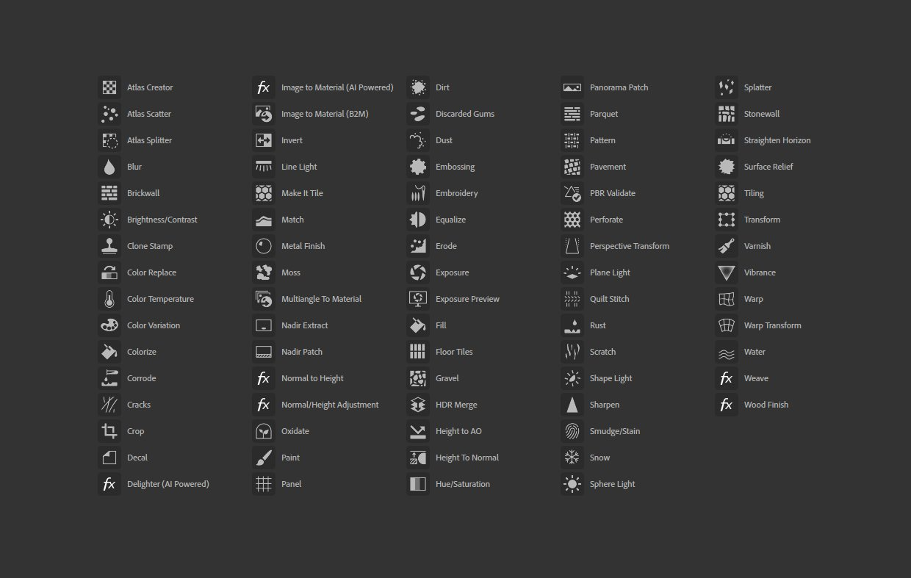
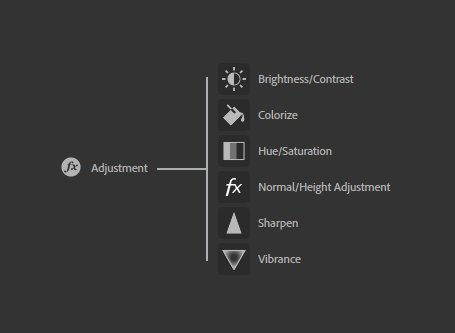
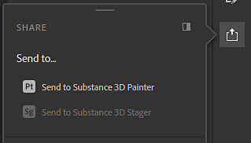

# Version 3.0

**Substance 3D Sampler 3.0.0** is the new name for Substance Alchemist now that it's connected to Adobe Creative Cloud. It brings a complete UI rework, support for creating Environment Lights, fully reworked and new filters, Send To functionality and ASM shader support.

Release date: *23 June 2021*

## Major features

### New interface and panel management

With a new name, comes a new look. Sampler's UI has been completely revamped to allow for more customization and easier access.

{width="600px"}

Panels can be docked and undocked, letting you fully utilize a dual screen set up.

### New Project workflow

Sampler now works with projects. The[ Project panel ](../../../interface/panels/project-panel/project-panel.md)lets you manage and group your assets per project. Projects are stored in Substance Sampler files, easily shared.

### New Assets panel

The[ asset panel ](../../../interface/panels/assets-panel/assets-panel.md)is a new and common design of the Resources panel, combined with your collections.

* 3 Sections: Starter Assets + Your Assets + Connected local folders
* New Asset types support: filters and images
* Narrow/Wide view
* Filter and search filters

### New Environment Light authoring

{width="600px"}

Sampler now lets you make more than just materials. Environment Lights are a new type of asset with their [own set of filters](../../../filters/hdri-tools/hdri-tools.md). Start from [bracketed 360 photo's](../../../filters/hdri-tools/hdr-merge/hdr-merge.md), build an environment light [from scratch](../../../filters/hdri-tools/shape-light/shape-light.md), or [edit an existing HDR file](../../../filters/hdri-tools/nadir-patch/nadir-patch.md).

### Reworked and new filters

{width="600px"}

All existing filters have been reworked:

* Support for spec/gloss channels.
* Support for custom masks
* Standardized parameter names
* Icons for nearly every filter

The Adjustment Filter has been split into separate filters based on functionality, to mimic Photoshop:

A few new filters have been added:

* [Warp Transform](../../../filters/tools/warp-transform/warp-transform.md)
* [Weave](../../../filters/generators/weave/weave.md)
* [Panel](../../../filters/generators/panel/panel.md)

### New Send To Functionality

Sampler can now [easily share materials and light environments ](../../../interface/panels/share-panel/share-panel.md)with Substance 3D Painter and Stager, in just a single click.

### New Real-time Rendering Engine

* Support of ASM materials, enabling consistent looks between applications with more material channels.
* Switch between 2 [Real time engines](https://helpx.adobe.com/substance-3d/unlisted/documentation/sadoc/viewer-settings-188973164.html)
* Ability to control default textures on a mesh

### General improvements

* New languages
* Application responsiveness
* Non-square textures support
* Tools Undo/Redo
* Assign custom usages to images in the Image Import Layer
* Reset a parameter value
* Export progress in Windows' taskbar

## Tutorials

Below are our video tutorials covering the new features:

## Release notes

### 3.0.0 Waffle

*(Released June 23, 2021)*

**Added:**

* &#91;Branding&#93; Substance Alchemist becomes Adobe Substance 3D Sampler
* &#91;Branding&#93; New application icons
* &#91;UI&#93; New User Experience and User Interface
* &#91;UI&#93; New Splashscreen
* &#91;UI&#93; Panels are undockable and dockable in the interface
* &#91;UI&#93; Dock up to 3 panels in the same column
* &#91;UI&#93; Dock up to 3 panels in the same panel (Tabs)
* &#91;UI&#93; Undock panels to create a separate window in the same or a different screen
* &#91;UI&#93; Closed panels pop-over when clicking on their icons
* &#91;UI&#93; Re-arrange your left and right bar by moving panels icons
* &#91;UI&#93; New toolbar to access directly specific filters (Crop, Transform, Perspective Transform, Clone Stamp)
* &#91;UI&#93; New "Get Content" button in the left bar
* &#91;UI&#93; Import files directly in your assets with the Get Content button
* &#91;UI&#93; Import files directly to your Layers with the Get Content button
* &#91;UI&#93; Access directly Adobe Substance 3D Assets website with the Get Content button
* &#91;UI&#93; Resolution widget is now directly accessible in the viewport
* &#91;UI&#93; All UI elements now are loaded dynamically
* &#91;UI&#93; Shortcut - Use "2" to toggle the visibility of the 2D view
* &#91;UI&#93; Shortcut - Use "3" to toggle the visibility of the 3D view
* &#91;Welcome Screen&#93; Create a project in one-click with the New button
* &#91;Welcome Screen&#93; New artwork banner
* &#91;Project&#93; All projects are now associated to a unique file
* &#91;Project&#93; New project file extension .ssa
* &#91;Project&#93; Save as a project will ask you to select where to save your project
* &#91;Project&#93; Closing Sampler will ask you to save your project if not saved
* &#91;Project&#93; Closing Sampler will ask you to save your project if there are modifications since the last save
* &#91;Project&#93; The name of your project is displayed above the viewport
* &#91;Project&#93; The project name is in italics with a star if it is not saved or if it contains modifications since the last save
* &#91;Project&#93; Open a .ssa project file directly from your OS explorer
* &#91;Project&#93; Open a .sbsar from your OS explorer will launch Sampler with a new project with this .sbsar file ready to use
* &#91;Project&#93; Open a .alch (legacy Substance Alchemist file) from your OS explorer
* &#91;Project Panel&#93; New panel that will contain all assets created within a project
* &#91;Project Panel&#93; Create an asset (material or environment light) using the + icon
* &#91;Project Panel&#93; Right-click on asset opens a context menu
* &#91;Project Panel&#93; From the right-click context menu, you can delete an asset
* &#91;Project Panel&#93; From the right-click context menu, you can duplicate an asset
* &#91;Project Panel&#93; From the right-click context menu, you can rename an asset
* &#91;Project Panel&#93; Switching between assets won't lose modifications
* &#91;Resolution&#93; You can now set non-square resolution for all your assets
* &#91;Resolution&#93; The resolution value is saved by asset within a project
* &#91;Environment Light&#93; Create environment light within Substance 3D Sampler
* &#91;Environment Light&#93; When creating an environment light, dragging and dropping image(s) will display the Environment Light Creation Template Window
* &#91;Environment Light&#93; In the Environment Light Creation Template, select Environment Import to assign your image to the environment in the 3D view
* &#91;Environment Light&#93; In the Environment Light Creation Template, select HDR merge to create an environment light from several 360-degrees images with different exposure
* &#91;Environment Light&#93; In the Environment Light Creation Template, select "Use as bitmap" to edit your image(s) before creating an environment light
* &#91;Environment Light&#93; Assign the environment usage in the Image Import layer to directly assign the image to the environment in the 3D view
* &#91;Environment Light&#93; In the 2D view for the environment channel, there is an automatic color correction to have the rendering appear the same as in the 3D view
* &#91;Environment Light&#93; New dedicated content for environment light creation
* &#91;Assets Panel&#93; The Resources and Filters panels are merged in a new Assets panel
* &#91;Assets Panel&#93; The Assets panel now supports the following asset types: materials, filters and images
* &#91;Assets Panel&#93; All Starter Assets are accessible in the Starter Assets section
* &#91;Assets Panel&#93; Starter Assets section is read-only
* &#91;Assets Panel&#93; New "Your Assets" section
* &#91;Assets Panel&#93; "Your Assets" section is the place where you can import all your resources
* &#91;Assets Panel&#93; All assets in "Your assets" are added in a specific folder in your Documents
* &#91;Assets Panel&#93; Connect local folders in the Assets panel to add new sections
* &#91;Assets Panel&#93; The search will search in the current folder and its subfolders
* &#91;Assets Panel&#93; Navigate between folders and subfolders with breadcrumbs
* &#91;Assets Panel&#93; Filter the current folder by material, by filter or by image
* &#91;Assets Panel&#93; Combine several filters to get only materials and images
* &#91;Assets Panel&#93; Change the display by switching between a grid or a list
* &#91;Assets Panel&#93; Filters are represented with their icon
* &#91;Assets Panel&#93; Images are represented with their preview
* &#91;Assets Panel&#93; Increasing the width will change the layout of the panel with a specific view to navigate between folders
* &#91;Assets Panel&#93; On non read-only sections, delete an asset by dragging an dropping it on the bin icon
* &#91;Assets Panel&#93; Right-click on asset opens a context menu
* &#91;Assets Panel&#93; From the right-click context menu, access the asset metadata (name, category, location)
* &#91;Assets Panel&#93; From the right-click context menu, delete the asset (only available on non read-only sections)
* &#91;Assets Panel&#93; From the right-click context menu, browse your asset in Adobe Bridge
* &#91;Layers Panel&#93; New icon to directly add a base material on top of your layers
* &#91;Layers Panel&#93; Shortcut - Shift + B will add a base material on top of your layers
* &#91;Layers Panel&#93; Layers now have a thumbnail preview (Material thumbnail, filter icon or Image preview)
* &#91;Properties Panel&#93; New design of the Properties panel title with the asset name and the asset thumbnail
* &#91;Properties Panel&#93; Filter Layers now support presets
* &#91;Properties Panel&#93; On Image Import Layer, right-click on the image preview to edit the image in Photoshop
* &#91;Adobe Bridge&#93; Browse your Asset in Adobe Bridge, will launch Bridge at the location of the asset
* &#91;Adobe Photoshop&#93; Edit in Adobe Photoshop will open the image in Photoshop ready to be edited
* &#91;Adobe Photoshop&#93; At each save in Adobe Photoshop, the edited image will be reloaded in Sampler
* &#91;Substance 3D Designer&#93; Assets sent from Adobe Substance 3D Designer will arrive directly in the "Your Assets" section of the Assets panel
* &#91;Export&#93; Send assets directly to Adobe Substance 3D Painter and Adobe Substance 3D Stager
* &#91;Export&#93; Send materials and environment lights to Adobe Substance 3D Painter
* &#91;Export&#93; Send environment lights to Adobe Substance 3D Stager
* &#91;Rendering&#93; New material properties are now supported and rendered in 3D
* &#91;Rendering&#93; Adding Sheen support (Sheen color, Sheen opacity and Sheen roughness)
* &#91;Rendering&#93; Adding Coating support (Coat color, Coat Roughness, Coat Normal, Coat Specular Level and Coat IOR)
* &#91;Rendering&#93; Adding Anisotropy support (Anisotropy Level and Anisotropy Angle)
* &#91;Rendering&#93; Adding Specular Edge Color support
* &#91;Rendering&#93; Activate these new properties in the Channel Settings panel
* &#91;Rendering&#93; Introduction of a new Realtime Engine (2021) renderer in Beta
* &#91;Rendering&#93; Switch between the two Renderer versions in the Viewer Settings panel
* &#91;Rendering&#93; The Realtime Engine (2021) renderer supports translucency, absorption and scattering material properties
* &#91;Rendering&#93; The Realtime Engine (2021) renderer introduces a new way to compute shadows from the environment light
* &#91;Rendering&#93; The Realtime Engine (2021) renderer computes in realtime the irradiance of the environment light
* &#91;Shader Settings Panel&#93; New Shader Settings panel to tweak specific material shader parameters
* &#91;Shader Settings Panel&#93; New parameters (Normal scale, height scale, height level, Emission intensity, IOR, Coat normal intensity and Coat IOR)
* &#91;Shader Settings Panel&#93; Specific parameters for the Realtime Engine 2021 (Subsurface Scattering, Scattering Distance, Red Shift and Rayleigh Scattering)
* &#91;Shader Settings Panel&#93; The settings values are saved per asset
* &#91;Viewer Settings Panel&#93; Added a preview of the default environment lights
* &#91;Viewer Settings Panel&#93; Added a preview of the default meshes
* &#91;Viewer Settings Panel&#93; New environment opacity parameter
* &#91;Viewer Settings Panel&#93; New environment blur parameter (specific to the Realtime Engine 2021 renderer)
* &#91;Localization&#93; New translations in German and French
* &#91;Content&#93; New default starter materials
* &#91;Content&#93; New default environment lights
* &#91;Content&#93; All filters have been updated, cleaned, and optimized
* &#91;Content&#93; The Adjustment filter has been split into several filters
* &#91;Content&#93; New Brightness/Contrast filter
* &#91;Content&#93; New Hue/Saturation filter
* &#91;Content&#93; New Vibrance filter
* &#91;Content&#93; New Sharpen filter
* &#91;Content&#93; New Normal/Height adjustment
* &#91;Content&#93; New Panels filter
* &#91;Content&#93; New Smudge filter
* &#91;Content&#93; New Weaves filter
* &#91;Content&#93; New Warp transform filter
* &#91;Content&#93; New Height to AO filter
* &#91;Content&#93; New Height to Normal filter
* &#91;Content&#93; Color Replace - Replace in new supported channels (Sheen, Coating, Anisotropy,...)
* &#91;Content&#93; Color variation - Manual mode to select exactly the colors to change
* &#91;Content&#93; Tiling - option to visualize the seams cut
* &#91;Content&#93; Tiling - option to paint the seams cut for a perfect tiling
* &#91;Content&#93; Match - option to add a material to match its color and its roughness
* &#91;Content&#93; Match - it now works on images to match the color of another image
* &#91;Content&#93; Environment ligth - New Color Temperature filter
* &#91;Content&#93; Environment ligth - New Exposure filter
* &#91;Content&#93; Environment ligth - New Exposure Preview filter
* &#91;Content&#93; Environment ligth - New Nadir Patch filter
* &#91;Content&#93; Environment ligth - New Nadir Extract filter
* &#91;Content&#93; Environment ligth - New Lights filters (Sphere, Line, Shape, Plane)
* &#91;Content&#93; Environment ligth - New Panorama Patch filter
* &#91;Content&#93; Environment ligth - New Straighten Horizon filter
* &#91;Content&#93; Environment ligth - New HDR merge filter

**Known Issues:**

* &#91;Realtime Engine 2021&#93; Changing the layout, crash the application
* &#91;Realtime Engine 2021&#93; Heavy computation, crash the application
* &#91;Panels&#93; MacOS - Undocked panels are in front of all applications
* &#91;Widgets&#93; Transform and Positions widgets can disappear. Hide and Unhide the layer to make them appear.
* &#91;Export&#93; SBSAR export of an environment light loses the 32bit depth precision
* &#91;Assets Panel&#93; Assets can be highlighted when opening a folder
* &#91;Properties Panel&#93; Resetting the parameters doesn't reset the combobox UI
* &#91;Localization&#93; Changing language doesn't affect the project panel until it's recreated
