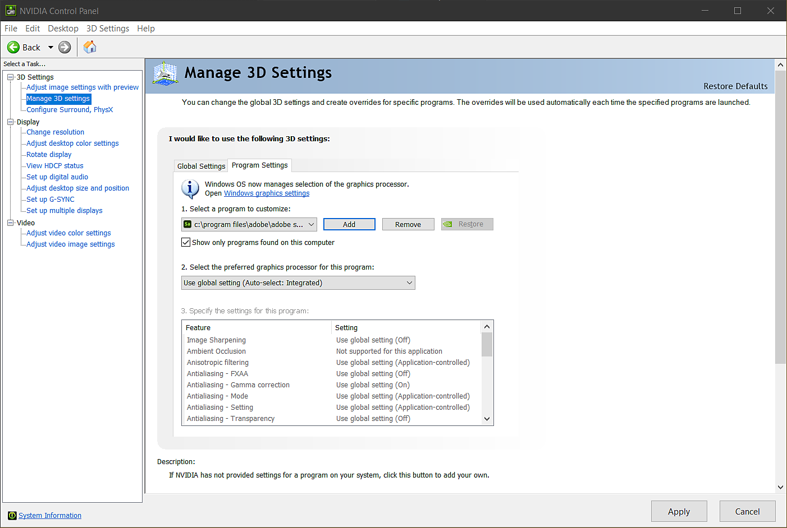

# NVIDIA Driver Settings

If you are using an NVIDIA GPU but find that performance is sluggish, there are two common causes:

1. Drivers are missing or not up to date
1. Sampler is using the incorrect GPU

## Update Drivers

To update your NVIDIA drivers:

1. Go to NVIDIA's driver download page - <https://www.nvidia.com/Download/index.aspx?lang=en-us>
1. Select your GPU model and download the drivers.
1. Install the drivers with the downloaded file.

Once the latest drivers are installed, open Sampler to see if performance has improved. If performance is slow, Sampler may be using the incorrect GPU.

## Configure Sampler

To check which GPU Sampler is using, do the following:

1. Open the NVIDIA Control Panel. To open the NVIDIA Control Panel, do one of the following:
   1. Search for NVIDIA Control Panel using the Start Menu
   1. In the system tray, right click the Geforce icon and select NVIDIA Control Panel.
1. In the NVIDIA Control Panel, select Manage 3D Settings in the left menu.
1. Select the Program Settings tab.
1. Under Select a Program to Customize, use the dropdown to find Sampler.
1. If Sampler is not listed in the dropdown, use Add.
   1. Browse to find Sampler's install location (The default install location is **C:/Program Files/Adobe/Adobe Substance 3D Sampler**).
   1. Select **Adobe Substance 3D Sampler.exe** from the install location.
1. With Sampler selected, under "Select the preferred graphics processor for this program:" select "High Performance NVIDIA Processor".
1. Click Apply.

Once you have followed this process, open Sampler to see if performance has improved.
