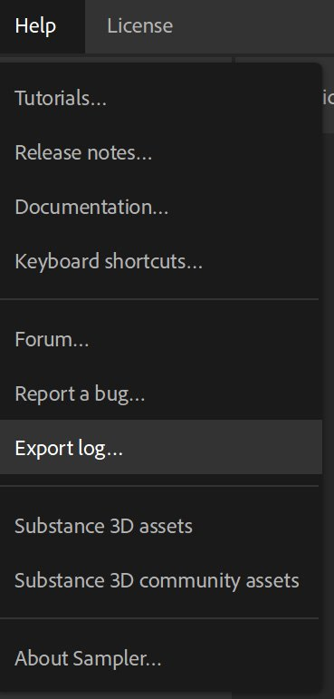
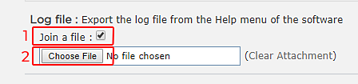

# Exporting the log file

When you need support regarding Substance 3D Sampler, it is always good to share your log file as it gives context about your computer configuration.

## Exporting the log file from the application

The log file can be directly exported from Substance3D Sampler by going to the **Help** menu and selecting the **Export log file** item.

## Retrieving the log file manually on the disk

If you are unable to launch Substance 3D Sampler, you can retrieve the log file manually by going in the following folder:

Adobe version:

* **Windows**: C:\Users\**username**\AppData\Local\Adobe\Adobe Substance 3D Sampler\log.txt
* **Mac OS**: Macintosh &gt; Users &gt; **username** &gt; Library &gt; Application Support &gt; Adobe&gt; Adobe Substance 3D Sampler &gt; log.txt

Substance3D version:

* **Windows**: C:\Users\**username**\AppData\Local\Allegorithmic\Adobe Substance 3D Sampler\log.txt
* **Mac OS**: Macintosh &gt; Users &gt; **username** &gt; Library &gt; Application Support &gt; Allegorithmic &gt; Adobe Substance 3D Sampler &gt; log.txt
* **Linux**: /home/**username**/.local/share/Allegorithmic/Adobe Substance 3D Sampler/log.txt

>[!NOTE]
>
> On **Windows** "Appdata" is a hidden folder.  
> On **Mac OS** "library" is a hidden folder.  
> On **Linux** ".local" is a hidden folder.

## Attaching your log file to a forum post

When asking for support on the forum, a log file is required. Here is how to attach a log file to your message:

1. Check the "**Join a file**" setting
1. Click on the "**Choose File**" button and locate your log file
1. Click on "**Post**" when your message is ready to post and upload your log file

