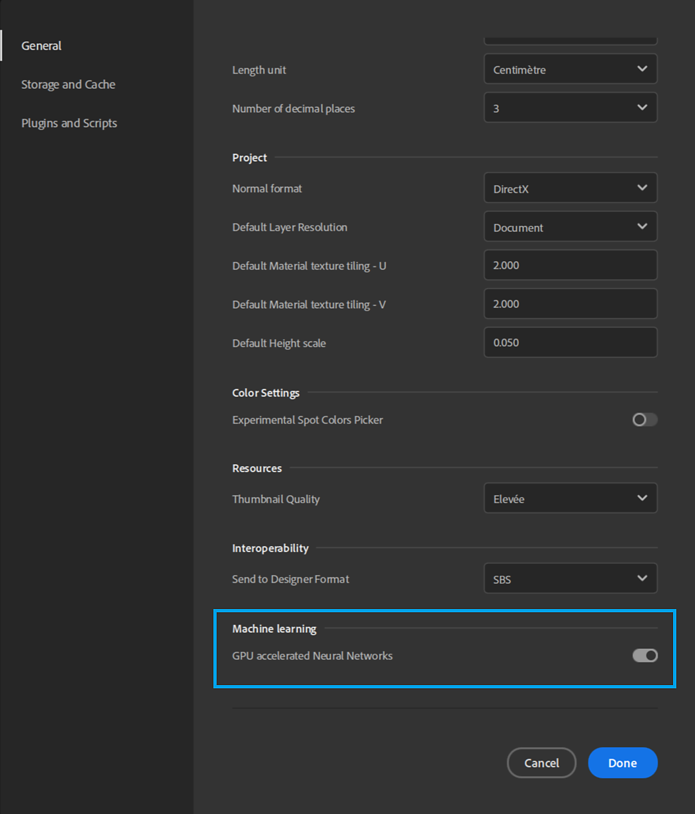

# Image to Material visual artefacts

The <b>Image to Material (AI Powered)</b> results can sometimes be altered (wrong colors mostly).

Enable or disable the *GPU accelerated Neural Networks* in the<b> Machine learning</b> section of the Preferences of Substance 3D Sampler to solve the issue.

